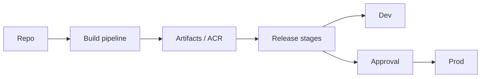

import { ConceptTemplate } from '@/features/kb/components/templates/ConceptTemplate'
import { Callout } from '@/features/kb/components/mdx/Callout'
import { ComparisonTable } from '@/features/kb/components/mdx/ComparisonTable'

export default function Layout({ children }) {
  return (
    <ConceptTemplate title="Azure DevOps">
      {children}
    </ConceptTemplate>
  )
}

**Azure DevOps (AzDO)** is a suite: work tracking (Boards), Git (Repos), CI/CD (Pipelines), package feeds (Artifacts), and Test Plans. It is not “the only way to deploy to Azure” and it is not Azure DevOps Server unless you said on-prem. GitHub Actions is the sibling product; many orgs run both.

## 1. Deep Dive and Mechanics

**Organization and projects.** An org is the tenant-shaped container. Projects isolate repos and boards. Team-level area paths slice Boards without a new project for every squad — do not explode project count.

**Pipelines.** YAML in the repo is the current contract. Stages, jobs, steps; Microsoft-hosted or self-hosted agents. Environments and checks (approvals, business hours, Azure Policy) gate production.

**Service connections.** Workload identity federation to Azure (OIDC) beats a long-lived service principal secret in a variable group. GitHub, Docker, and Kubernetes connections are the same idea.

**Environments and gates.** A deploy job targets an environment. Approvals and status checks run before the agent starts. That is your change-management hook.

**Classic vs YAML.** Classic release “click pipelines” still exist. New work should be YAML so the pipeline is reviewed with the code.

<Callout icon="warning" title="Variable groups are not a vault">
Secret variables are masked, not isolated. Prefer Key Vault-linked groups and OIDC. Anyone who can edit the pipeline can usually exfiltrate a secret with a one-line script.
</Callout>

## 2. Mathematical / Theoretical Foundation

A pipeline is a DAG of jobs with an agent as the worker. Parallelism is limited by purchased parallel jobs plus agent capacity. Hosted agents are a queue; burst latency is a scheduling problem, not a compile problem.

Approvals convert a continuous deploy into a gated Markov step: the artifact is immutable, the environment check is the only remaining random variable.

<ComparisonTable
  headers={['Product', 'Repos', 'CI/CD']}
  rows={[
    ['Azure DevOps', 'Azure Repos or GitHub', 'Azure Pipelines'],
    ['GitHub', 'GitHub', 'Actions'],
    ['GitLab', 'GitLab', 'GitLab CI'],
    ['Jenkins', 'Bring your own', 'Jenkinsfile'],
  ]}
/>

## 3. Real-World Implementation

```yaml
trigger:
  branches: { include: [main] }
pool:
  vmImage: ubuntu-latest
steps:
  - task: AzureCLI@2
    inputs:
      azureSubscription: 'oidc-prod'
      scriptType: bash
      scriptLocation: inlineScript
      inlineScript: az group list -o table
```

Use templates (`extends`) so product teams cannot skip the security stage.

## 4. Visualizations



## 5. Interview Prep

**Q: Azure DevOps vs GitHub Actions?**
**A:** Same company, different UX and billing. AzDO Boards plus Pipelines is still common in enterprises that started on TFS. Actions wins on public OSS and GitHub-native reviews. Federation works on both.

**Q: Hosted vs self-hosted agents?**
**A:** Hosted for clean, generic Linux/Windows. Self-hosted for private VNets, licensed software, or cheaper high volume. Patch the self-hosted images; they are cattle with a patch story.

**Q: How do you stop a pipeline from deploying to prod?**
**A:** Environment approvals, branch checks, and a required template. Not a comment that says “please do not.”

## 6. Production Use Cases

- Multi-stage Bicep deploy with a what-if on the PR and apply on main.
- Artifact feeds for internal NuGet and npm with retention.
- Boards integrated with Azure Repos PRs for audit-friendly work items.

<Callout icon="tip" title="OIDC service connections">
Create the Azure app with federated credentials for the pipeline. Rotate becomes “delete the old federation,” not “hunt a password in five variable groups.”
</Callout>
