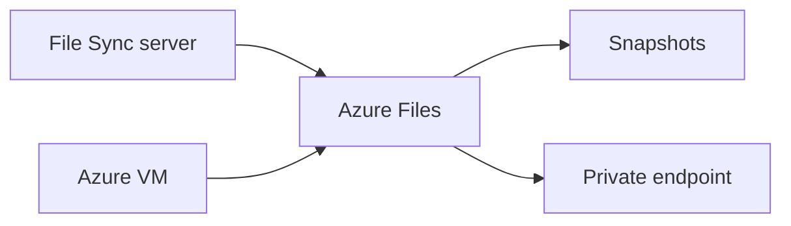

import { ConceptTemplate } from '@/features/kb/components/templates/ConceptTemplate'
import { Callout } from '@/features/kb/components/mdx/Callout'
import { ComparisonTable } from '@/features/kb/components/mdx/ComparisonTable'

export default function Layout({ children }) {
  return (
    <ConceptTemplate title="Azure Files">
      {children}
    </ConceptTemplate>
  )
}

**Azure Files** is a fully managed file share. Clients mount SMB 3.x (Windows, Linux, macOS) or NFS 4.1 (Linux, premium). The share lives in a storage account, so redundancy (LRS/ZRS/GRS) and identity (Entra, AD DS) are account-level choices. It is the cloud analogue of a file server, not of Blob.

## 1. Deep Dive and Mechanics

**Tiers.** Standard (HDD-backed, transaction-heavy billing) vs Premium (SSD, provisioned GiB and IOPS). Transaction costs on Standard surprise people who treat it like a local disk.

**Identity.** Access keys are the emergency brake. Production SMB should use identity: on-prem AD DS, Microsoft Entra Domain Services, or Entra Kerberos for hybrid identities. NTFS-style ACLs then apply.

**Private access.** Private endpoints on the `file` sub-resource. Disable public network access. Mounting from Azure VMs is easy; mounting from on-prem needs VPN/DX plus DNS for the private name.

**Azure File Sync.** A Windows Server becomes a cache: cloud is the source of truth, hot files stay local. Useful for branch offices that cannot tolerate WAN latency on every open.

**Snapshots and backup.** Share snapshots are crash-consistent. Azure Backup (MARS-style via the Files vault) handles longer retention.

<Callout icon="warning" title="SMB over the open internet">
Port 445 is blocked by many ISPs. Even when it is not, do not hang a share on a public endpoint with an account key. Private endpoint plus identity, or File Sync.
</Callout>

## 2. Mathematical / Theoretical Foundation

SMB latency is chatty: metadata RPCs scale with small-file workloads. A share at 40 ms RTT feels like a broken disk for Visual Studio and node_modules. Premium plus proximity (same region, private endpoint) is the lever; GRS does not help a chatty open.

NFS on premium is POSIX-ish; it is not a drop-in for every on-prem NetApp feature. Test locks and uid mapping.

<ComparisonTable
  headers={['Store', 'Protocol', 'Best for']}
  rows={[
    ['Azure Files', 'SMB / NFS', 'Shared lift-and-shift disks'],
    ['Blob', 'HTTPS / HDFS-like', 'Objects, lakes'],
    ['Azure NetApp Files', 'NFS / SMB', 'High IOPS, SAP, EDA'],
    ['Disk (managed)', 'Attached block', 'Single VM'],
  ]}
/>

## 3. Real-World Implementation

```bash
az storage share-rm create \
  --resource-group prod \
  --storage-account stfilesprod \
  --name team \
  --quota 1024
```

Then join identity and mount with `//stfilesprod.file.core.windows.net/team` over the private endpoint hostname.

## 4. Visualizations



## 5. Interview Prep

**Q: Files vs Blob vs NetApp Files?**
**A:** Blob for objects and analytics. Files for SMB/NFS apps that will not be rewritten. NetApp Files when you need enterprise NAS performance and features Files will not give you.

**Q: Why is Standard Files expensive at low capacity?**
**A:** Transactions. A build agent that stats a million files will outspend the GiB charge. Premium or a cache (File Sync) can be cheaper.

**Q: Can AKS mount Azure Files?**
**A:** Yes, via CSI. Watch mount options and whether you need ReadWriteMany. For POSIX-heavy workloads, consider NFS premium or Azure NetApp Files.

## 6. Production Use Cases

- Lift a department share with File Sync in each office.
- Shared config or reports for a farm of IaaS VMs.
- CI agents caching NuGet on a premium share in-region (measure before you bless it).

<Callout icon="tip" title="Soft delete on the account">
Turn on share soft delete. Accidental `az storage share delete` is a popular Friday event.
</Callout>
