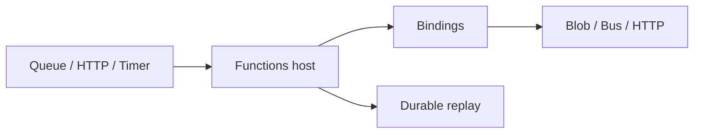

import { ConceptTemplate } from '@/features/kb/components/templates/ConceptTemplate'
import { Callout } from '@/features/kb/components/mdx/Callout'
import { ComparisonTable } from '@/features/kb/components/mdx/ComparisonTable'

export default function Layout({ children }) {
  return (
    <ConceptTemplate title="Azure Functions">
      {children}
    </ConceptTemplate>
  )
}

**Azure Functions** is a hosted functions runtime. You write a trigger plus optional input/output **bindings** so the code barely mentions storage SDKs. Plans decide cold start, VNet, and timeout: Consumption, Flex Consumption, Premium, and Dedicated (App Service plan). Isolated worker process (.NET) is the current default for new .NET apps.

## 1. Deep Dive and Mechanics

**Triggers and bindings.** HTTP, Timer, Service Bus, Event Hubs, Blob, Event Grid, Cosmos, Kafka. Bindings inject a blob stream or a queue message as a parameter. They are conveniences; messy retries still need your care.

**Hosting.** Consumption: scale to zero, limited timeout and VNet. Flex Consumption: newer scale model, better networking. Premium: pre-warmed workers, VNet, longer run. Dedicated: you already paid for a plan.

**Scale-out.** Event-driven scale controllers watch queue depth and HTTP concurrency. A single noisy partition or a bad host.json can pin you at one instance or explode to the cap.

**Durable Functions.** An extension that gives orchestrations, activities, and entities (stateful actors). Orchestrator code must be deterministic — no extra I/O inside the orchestrator function.

**Identity.** Managed identity to Key Vault, Storage, and SQL. The storage account behind the function app is part of the platform (leases, triggers); lock it down.

<Callout icon="error" title="The function storage account is sacred">
Blob triggers and the host lease live there. Using the same account as your data lake, or opening it to the internet with a key, is a reliability and security bug.
</Callout>

## 2. Mathematical / Theoretical Foundation

Billing on Consumption is GB-seconds plus executions. A chatty 1-second function at huge RPS loses to a small always-on Premium or Container Apps service.

Cold start is a tail-latency term: P99 includes provision + JIT + your init. Pre-warmed instances truncate that tail at a fixed cost.

Durable orchestrations are event-sourced: each await replays history. Non-deterministic orchestrator code (UTC now, random, extra IO) corrupts replay.

<ComparisonTable
  headers={['Plan', 'Scale to zero', 'VNet / timeout']}
  rows={[
    ['Consumption', 'Yes', 'Limited'],
    ['Flex Consumption', 'Yes', 'Improved networking'],
    ['Premium', 'No (pre-warm)', 'First-class VNet, longer'],
    ['Dedicated', 'No', 'The App Service plan'],
  ]}
/>

## 3. Real-World Implementation

```csharp
[Function("OnOrder")]
public async Task Run(
    [ServiceBusTrigger("orders", Connection = "Bus")] string body,
    [Blob("receipts/{rand-guid}.json", FileAccess.Write)] Stream outBlob)
{
    await outBlob.WriteAsync(JsonSerializer.SerializeToUtf8Bytes(body));
}
```

Set `host.json` concurrency and use poison-message handling on queues. HTTP functions belong behind APIM or Front Door, not as a public anonymous trigger.

## 4. Visualizations



## 5. Interview Prep

**Q: Functions vs Container Apps vs Logic Apps?**
**A:** Functions for code-centric events. Container Apps when you already have a container and want KEDA scale. Logic Apps for low-code connectors and business workflows.

**Q: Why is my blob trigger late?**
**A:** Polling interval, poison blobs, or a storage account too far / too throttled. Event Grid on blob create is the faster pattern.

**Q: In-process vs isolated?**
**A:** Isolated runs your code in a separate worker, versions the runtime independently, and is the supported path for modern .NET. In-process is legacy.

## 6. Production Use Cases

- Service Bus consumers that write to SQL with a managed identity.
- Nightly timers that kick a Durable fan-out over blobs.
- HTTP webhooks behind APIM with Premium to avoid cold starts.

<Callout icon="tip" title="One function app per blast radius">
Sharing an app shares host.json, scale, and deploy. Split noisy Event Hub processors from latency-sensitive HTTP.
</Callout>
