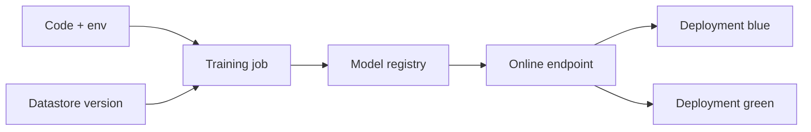

import { ConceptTemplate } from '@/features/kb/components/templates/ConceptTemplate'
import { Callout } from '@/features/kb/components/mdx/Callout'
import { ComparisonTable } from '@/features/kb/components/mdx/ComparisonTable'

export default function Layout({ children }) {
  return (
    <ConceptTemplate title="Azure Machine Learning">
      {children}
    </ConceptTemplate>
  )
}

**Azure ML** is a workspace: datastores, environments (Docker + conda), jobs, pipelines, models, and online/batch endpoints. Compute is attached (clusters, compute instances, attached AKS or Azure Arc). The point is to turn “a notebook on a VM” into a logged, repeatable job with a lineage of data and code.

## 1. Deep Dive and Mechanics

**Workspace.** One per team or product is common. It owns Key Vault, Storage, and Application Insights it created — do not delete those supporting resources by hand.

**Jobs and compute.** Submit a command job or a pipeline to a cluster that scales to zero. Use spot VMs for training with a retry story. Compute instances are for interactive work; they should auto-shut down.

**Environments.** Curated images plus your conda or a full Dockerfile. Pin hashes. “Works on my compute instance” is not an environment.

**Endpoints.** Managed online endpoints: blue/green deployments, traffic split, auth via key or Entra. Batch endpoints run jobs over files. MLflow is the model logging API.

**Responsible AI and registries.** Cross-workspace registries share models. Data labeling, RAI dashboards, and prompt flow exist for LLM work — treat them as products with their own cost.

<Callout icon="warning" title="Idle GPU compute instances">
A forgotten NC-series instance is a monthly bill with no model to show. Auto-shutdown plus a budget alert on the workspace RG is mandatory.
</Callout>

## 2. Mathematical / Theoretical Foundation

A training job is a function from (code hash, data snapshot, env hash, hyperparameters) to metrics and artifacts. If any input is “latest” without a version, you cannot reproduce the AUC.

Online endpoints are just autoscaled containers. Tail latency is max(queue, model, cold replica). Traffic splitting is A/B on a percentage, not a statistically magical experiment framework unless you add one.

<ComparisonTable
  headers={['Surface', 'Role', 'AWS cousin']}
  rows={[
    ['Azure ML jobs', 'Train / pipeline', 'SageMaker Training'],
    ['Online endpoints', 'Real-time infer', 'SageMaker Endpoints'],
    ['Prompt flow', 'LLM graphs', 'Bedrock / Studio bits'],
    ['Databricks', 'Lakehouse Spark', 'EMR + SageMaker mix'],
  ]}
/>

## 3. Real-World Implementation

```python
from azure.ai.ml import MLClient, command
from azure.identity import DefaultAzureCredential

ml = MLClient(DefaultAzureCredential(), "sub-id", "rg", "mlw")
job = command(
    code="./src",
    command="python train.py --lr 1e-3",
    environment="env-train:2",
    compute="cpu-cluster",
    experiment_name="ranker",
)
ml.jobs.create_or_update(job)
```

Log params and metrics with MLflow so the job page is not a black box.

## 4. Visualizations



## 5. Interview Prep

**Q: Why not just a VM and a notebook?**
**A:** No lineage, no scale-to-zero cluster, no traffic-split deploy, and no workspace RBAC. Fine for exploration; not a production path.

**Q: Azure ML vs Databricks?**
**A:** Databricks owns Spark/lakehouse collaboration. Azure ML owns managed scoring endpoints and experiment tracking. Many shops train in Databricks and register in Azure ML — or pick one and commit.

**Q: How do you roll back a bad model?**
**A:** Shift endpoint traffic back to the previous deployment. Keep the old deployment warm until the new one is proven.

## 6. Production Use Cases

- Nightly retrains on a cluster with a pipeline that registers only if AUC beats a gate.
- Online endpoint behind APIM with Entra auth for an internal ranker.
- Batch endpoint scoring a lake of parquet into a results store.

<Callout icon="tip" title="Version data like code">
A datastore URI plus a dataset version beats “whatever is in the bronze folder today.” Reproducibility is a data problem first.
</Callout>
