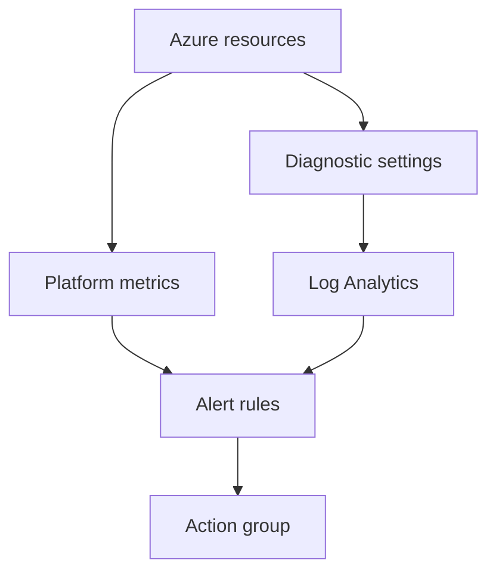

import { ConceptTemplate } from '@/features/kb/components/templates/ConceptTemplate'
import { Callout } from '@/features/kb/components/mdx/Callout'
import { ComparisonTable } from '@/features/kb/components/mdx/ComparisonTable'

export default function Layout({ children }) {
  return (
    <ConceptTemplate title="Azure Monitor">
      {children}
    </ConceptTemplate>
  )
}

**Azure Monitor** is the control plane for observability in Azure. **Metrics** are time series (platform and custom). **Logs** land in Log Analytics workspaces (KQL). **Alerts** fire from either. Application Insights, VM Insights, Container Insights, and Network Insights are packaged collectors on top of the same backend.

## 1. Deep Dive and Mechanics

**Metrics vs logs.** Platform metrics are 1-minute (or finer) time series with a short retention and cheap alerts. Logs are rows you query with KQL — diagnostic settings ship resource logs here. Do not send everything to logs “just in case.”

**Diagnostic settings.** Each resource can send logs/metrics to a workspace, Storage, or Event Hub (for SIEM). Categories are per resource type. Missing a category is a silent blind spot.

**Alerts.** Metric alerts are fast. Log alerts run KQL on a schedule and cost query + the alert rule. Activity log alerts catch ARM events (who deleted the NIC). Action groups page Slack, Teams, ITSM, or a webhook.

**Workbooks and dashboards.** Workbooks are the shareable KQL + viz. Grafana can read Azure Monitor as a data source.

**AMA.** The Azure Monitor Agent replaces MMA/OMS. Data collection rules (DCRs) decide what a VM sends.

<Callout icon="warning" title="Diagnostic settings are per resource">
A new App Service does not inherit the last one. Policy (deploy-if-not-exists) is how you keep every NIC and namespace shipping logs.
</Callout>

## 2. Mathematical / Theoretical Foundation

Alert quality is precision/recall on a time series. Threshold alerts assume stationarity; they fail on diurnal traffic. Dynamic thresholds (ML bands) reduce toil and also hide real level shifts if you do not review.

Ingestion cost ≈ bytes × days retained. Sampling and transformation (DCR, workspace transforms) are the only sustainable controls at scale.

<ComparisonTable
  headers={['Signal', 'Latency', 'Query']}
  rows={[
    ['Platform metrics', 'Seconds–minutes', 'Metric explorer / alerts'],
    ['Resource logs', 'Minutes', 'KQL'],
    ['Activity log', 'Minutes', 'ARM audit'],
    ['App Insights', 'Seconds–minutes', 'KQL + APM UX'],
  ]}
/>

## 3. Real-World Implementation

```kusto
AzureMetrics
| where ResourceId has "checkoutdb"
| where MetricName == "cpu_percent"
| summarize avg(Average) by bin(TimeGenerated, 5m)
```

Pair that with a metric alert for paging and a workbook for humans. Do not page from a 5-minute log alert if a metric alert exists.

## 4. Visualizations



## 5. Interview Prep

**Q: Metrics or logs for CPU alerts?**
**A:** Metrics. Logs are for “which query, which node, which request.” Paging on KQL for CPU is slower and more expensive.

**Q: One workspace or many?**
**A:** Few workspaces (per env or per compliance boundary). Too many fragments queries; one giant workspace mixes prod PII with playground noise and a single blast radius.

**Q: What is a DCR?**
**A:** A Data Collection Rule: which tables, which transforms, which workspace. The AMA without DCRs is an agent with no job.

## 6. Production Use Cases

- Policy-mandated diagnostic settings to a central workspace plus Event Hub to Sentinel.
- Composite alerts: metric fires, workbook explains.
- Budget alerts on workspace ingestion as a first-class SRE signal.

<Callout icon="tip" title="Alert the symptom the user sees">
Availability and latency on the front door beat a pile of VM CPU alerts. Use infrastructure metrics as diagnostics, not as the only page.
</Callout>
