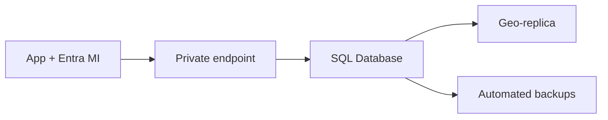

import { ConceptTemplate } from '@/features/kb/components/templates/ConceptTemplate'
import { Callout } from '@/features/kb/components/mdx/Callout'
import { ComparisonTable } from '@/features/kb/components/mdx/ComparisonTable'

export default function Layout({ children }) {
  return (
    <ConceptTemplate title="Azure SQL">
      {children}
    </ConceptTemplate>
  )
}

**Azure SQL** is Microsoft’s hosted SQL Server family. **SQL Database** is a database (or pool) you cannot RDP into. **Managed Instance** is near-full SQL Server in a VNet (SQL Agent, cross-db, linked servers). **SQL on a VM** is IaaS — you patch it. Pick the highest abstraction that still runs your features.

## 1. Deep Dive and Mechanics

**Purchasing models.** DTU (bundled, older) vs vCore (compute + storage + I/O unbundled). Provisioned vs serverless (auto-pause). Hyperscale for very large DBs and fast scale-out of replicas.

**Elastic pools.** Many small DBs share a pool of eDTUs or vCores. The noisy neighbor is the design trade: average utilization should be well below 100%.

**HA.** Zone-redundant replicas, failover groups for cross-region connection strings, and geo-replication. RPO/RTO are SKU and configuration, not slogans.

**Security.** Entra auth (prefer), TDE on by default, firewall rules plus **private endpoints**. Disable public access. Auditing to a storage account or Log Analytics.

**Compatibility.** Managed Instance is the lift target when you need Agent jobs or CLR. Database is cheaper and simpler when you are a single-DB app.

<Callout icon="error" title="Serverless pause drops connections">
Auto-pause is great for nights and brutal for a connection pool that expects the DB to always exist. Either disable pause in prod or make the app retry through a cold start of minutes.
</Callout>

## 2. Mathematical / Theoretical Foundation

vCore SKUs cap CPU, memory, and log/IOPS. Hitting IOPS looks like “SQL is slow” while CPU is idle. Hyperscale separates page servers from compute so size and compute scale independently.

Elastic pool sizing is a statistical multiplexing problem: provision for P95 of the sum, not the sum of P95s, or you overpay; provision too tight and one tenant wrecks the pool.

<ComparisonTable
  headers={['Offering', 'Surface', 'Lift fit']}
  rows={[
    ['SQL Database', 'One DB / pool', 'New cloud apps'],
    ['Elastic pool', 'Shared compute', 'SaaS per-tenant DBs'],
    ['Managed Instance', 'Near-full instance', 'Agent, cross-db'],
    ['SQL on VM', 'You own the OS', 'Unsupported features, strange collations'],
  ]}
/>

## 3. Real-World Implementation

```bash
az sql db create -g prod -s sql-prod -n checkout \
  --edition GeneralPurpose --capacity 4 --family Gen5 \
  --zone-redundant true
```

Point the app at the listener FQDN with Entra managed identity (`Active Directory Default` in the connection string). Skip SQL passwords.

## 4. Visualizations



## 5. Interview Prep

**Q: Database vs Managed Instance?**
**A:** Database if you can live with a single DB and Azure features. MI if you need instance-level SQL Server behavior inside a VNet. VMs if a vendor requires the full OS.

**Q: What does zone-redundant actually protect?**
**A:** An AZ outage in-region. It is not geo-DR. Failover groups cover region loss with a different RPO.

**Q: Why is my serverless bill high at idle?**
**A:** Minimum vCores, storage, and backup still bill. Pause only helps if it actually pauses — connection pings from health checks can keep it awake.

## 6. Production Use Cases

- Multi-tenant SaaS on an elastic pool with per-tenant DBs.
- Hyperscale for a large OLTP DB that outgrew General Purpose storage.
- MI as a landing zone for a factory of SQL Agent jobs.

<Callout icon="tip" title="Failover group in the connection string">
Apps should use the failover-group hostname, not the region server name. Otherwise “we failed over” is a code change.
</Callout>
