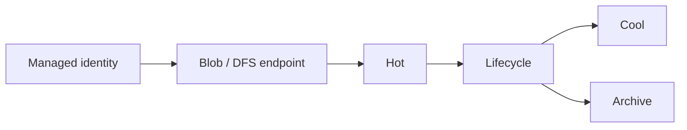

import { ConceptTemplate } from '@/features/kb/components/templates/ConceptTemplate'
import { Callout } from '@/features/kb/components/mdx/Callout'
import { ComparisonTable } from '@/features/kb/components/mdx/ComparisonTable'

export default function Layout({ children }) {
  return (
    <ConceptTemplate title="Azure Blob Storage">
      {children}
    </ConceptTemplate>
  )
}

**Blob Storage** holds unstructured objects: block blobs (files), append blobs (logs), and page blobs (the old VHD story). A **container** is the namespace. The account provides identity, redundancy, and the endpoint. With **hierarchical namespace** (Data Lake Gen2) you get real directories, POSIX-ish ACLs, and cheaper renames for analytics.

## 1. Deep Dive and Mechanics

**Tiers.** Hot, Cool, Cold, Archive. Archive is offline — rehydrate before read. Lifecycle policies move or expire. Early-delete penalties apply if you bounce tiers too fast.

**Auth.** Account keys are root. SAS tokens are scoped but leakable. Entra ID plus RBAC (Storage Blob Data Contributor) is the default for apps via managed identity. Access keys should be disabled once identity works.

**Public access.** Account-level “allow blob public access” plus container public level. Leave both off. CDN or Front Door can still front private blobs with a private origin.

**HNS.** Enable at account create (or through a migration). Spark and Synapse prefer HNS. Some features (certain object replication cases) differ with HNS on.

**Soft delete, versioning, immutability.** Versioning plus WORM policies for ransomware and legal hold. Without them, `delete` is delete.

<Callout icon="error" title="Public containers still happen">
A `$web` static website or a container set to blob public is a leak. Defender for Storage and the account public-access flag should be off unless you are hosting a true public asset.
</Callout>

## 2. Mathematical / Theoretical Foundation

Cost ≈ bytes × tier price × redundancy + operations + egress + retrieval. Small-file lakes die on transaction counts. Archive retrieval is a time-cost function: standard vs high-priority hours.

HNS rename is metadata; without HNS, “rename a directory” is a copy of every blob. That is why lakes want HNS.

<ComparisonTable
  headers={['Tier', 'Access', 'Gotcha']}
  rows={[
    ['Hot', 'Frequent', 'Highest storage price'],
    ['Cool / Cold', 'Infrequent', 'Min duration + retrieval'],
    ['Archive', 'Offline', 'Hours to rehydrate'],
    ['Premium block', 'Low latency', 'Different account kind'],
  ]}
/>

## 3. Real-World Implementation

```python
from azure.identity import DefaultAzureCredential
from azure.storage.blob import BlobClient

blob = BlobClient(
    account_url="https://stlakeprod.blob.core.windows.net",
    container_name="bronze",
    blob_name="dt=2026-09-06/part.parquet",
    credential=DefaultAzureCredential(),
)
blob.upload_blob(open("part.parquet", "rb"), overwrite=True)
```

Use the Data Lake filesystem client when HNS is on and you need directory ACLs.

## 4. Visualizations



## 5. Interview Prep

**Q: Blob vs ADLS Gen2?**
**A:** Gen2 is Blob plus hierarchical namespace on the same account kind. Same bits, better directory semantics. New lakes should turn HNS on at create.

**Q: SAS vs Entra?**
**A:** SAS for browser uploads and partner time-boxes. Entra for first-party apps. A SAS in a log file is a key.

**Q: How do you sync two regions?**
**A:** GRS/GZRS for account failover of storage, or object replication for container-level async copy. They are different RPO tools.

## 6. Production Use Cases

- Data lake bronze/silver/gold containers with HNS and lifecycle.
- Static assets behind Front Door with a private origin.
- Immutable legal hold on an evidence container.

<Callout icon="tip" title="Name containers like tables">
`bronze`, `silver`, `checkpoints` beat `test2`. RBAC and lifecycle rules attach cleanly to a stable namespace.
</Callout>
