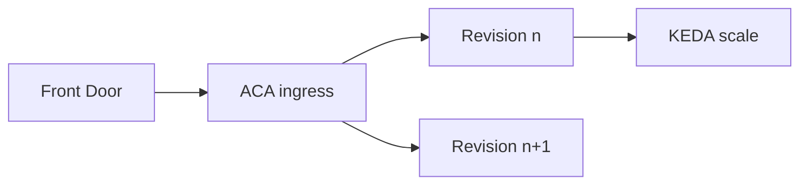

import { ConceptTemplate } from '@/features/kb/components/templates/ConceptTemplate'
import { Callout } from '@/features/kb/components/mdx/Callout'
import { ComparisonTable } from '@/features/kb/components/mdx/ComparisonTable'

export default function Layout({ children }) {
  return (
    <ConceptTemplate title="Azure Container Apps">
      {children}
    </ConceptTemplate>
  )
}

**Container Apps (ACA)** runs containers on a managed environment (Consumption or dedicated workload profiles). You get HTTP ingress, revisions (traffic split), secrets, and KEDA-based scale rules. There is no kubeconfig. If you need CRDs, DaemonSets, or a custom CNI, that is AKS.

## 1. Deep Dive and Mechanics

**Environment.** A boundary for networking and observability. Consumption is pay-per-use. Workload profiles pin compute for predictable noisy-neighbor isolation. The environment joins a VNet when you need private outbound or internal ingress.

**Revisions.** Each deploy can create a revision. Send 10 percent of traffic to the new one, then 100. Deactivate old revisions or they cost if min replicas is greater than zero.

**Scale.** HTTP concurrency, CPU, or KEDA scalers (Service Bus depth, Event Hubs). `minReplicas: 0` is the serverless story; the first request pays a cold start.

**Dapr (optional).** Sidecar for pub/sub and state. Useful if you already standardized on Dapr; not mandatory.

**Jobs.** Run-to-completion jobs (manual, schedule, or event) sit beside apps. Use them for workers that should not listen on 80.

<Callout icon="warning" title="Ingress is not a WAF">
External ingress is a public HTTPS endpoint. Put Front Door or Application Gateway with WAF in front for internet apps. Internal ingress for east-west only.
</Callout>

## 2. Mathematical / Theoretical Foundation

Scale-to-zero is a queueing system with setup time. Offered load λ with cold-start S makes P99 ≈ S when the app is idle. A min replica of 1 buys away S at the cost of always-on vCPU-seconds.

Traffic splitting is weighted random at the ingress, not session-sticky unless you turn affinity on — usually do not.

<ComparisonTable
  headers={['Service', 'Unit', 'Cluster API']}
  rows={[
    ['Container Apps', 'App / revision', 'Hidden'],
    ['Container Instances', 'Container group', 'None'],
    ['App Service', 'Site / plan', 'None'],
    ['AKS', 'Pod / Deployment', 'Full'],
  ]}
/>

## 3. Real-World Implementation

```bicep
resource app 'Microsoft.App/containerApps@2024-03-01' = {
  name: 'api-checkout'
  location: location
  properties: {
    environmentId: env.id
    configuration: {
      ingress: { external: false, targetPort: 8080 }
    }
    template: {
      containers: [{ name: 'api', image: 'acrprod.azurecr.io/api:1.4.2' }]
      scale: { minReplicas: 1, maxReplicas: 20 }
    }
  }
}
```

Pull from ACR with a managed identity on the app. Do not put a pull secret in env vars.

## 4. Visualizations



## 5. Interview Prep

**Q: ACA vs AKS?**
**A:** ACA when the unit is a container and you want scale-to-zero, revisions, and no node pools. AKS when you need Kubernetes itself.

**Q: ACA vs Functions?**
**A:** Functions if the programming model is triggers and bindings. ACA if you already have a Dockerfile and an HTTP server.

**Q: Why is my app billed while idle?**
**A:** minReplicas greater than zero, or a probe that keeps HTTP scale above zero. Check replica count, not just “we set scale to zero.”

## 6. Production Use Cases

- Public API: Front Door → ACA with min 2 in prod.
- Queue workers scaled on Service Bus depth.
- Preview revisions for a mobile API with a 5 percent traffic canary.

<Callout icon="tip" title="One environment per network story">
Do not dump every team into one environment unless you intended shared logs and one VNet. Isolation is an environment (or a workload profile), not a naming prefix.
</Callout>
