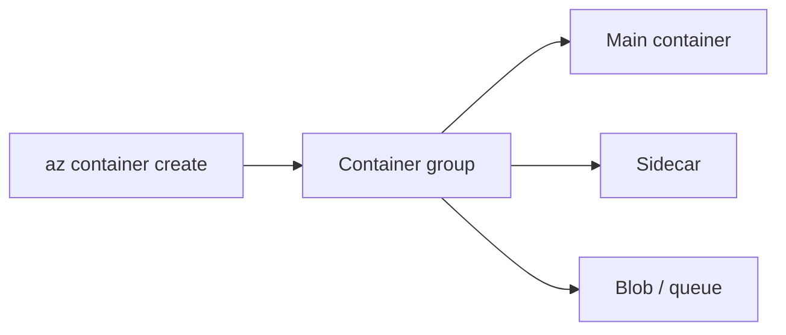

import { ConceptTemplate } from '@/features/kb/components/templates/ConceptTemplate'
import { Callout } from '@/features/kb/components/mdx/Callout'
import { ComparisonTable } from '@/features/kb/components/mdx/ComparisonTable'

export default function Layout({ children }) {
  return (
    <ConceptTemplate title="Azure Container Instances">
      {children}
    </ConceptTemplate>
  )
}

**ACI** starts a **container group** (one or more containers that share a network and lifecycle) in seconds. You pick CPU, memory, optional GPU, and either a public IP or a delegated subnet. There is no scheduler, no restart budget across a fleet, and no service discovery beyond what you build. It is a VM-shaped primitive that happens to run containers.

## 1. Deep Dive and Mechanics

**Groups.** Sidecars in the same group share localhost. If the group dies, every container dies. Restart policy: Always, OnFailure, Never.

**Networking.** Public IP with optional DNS label, or VNet injection via a delegated subnet (`Microsoft.ContainerInstance/containerGroups`). Windows and Linux groups are separate.

**Identity.** Managed identity can pull from ACR and talk to Azure APIs. Prefer that over embedding a pull secret.

**Limits.** Quotas on cores per region. Not all SKUs and availability zones are equal. ACI is not zone-redundant as a platform — you place groups.

**Virtual nodes on AKS.** The ACI virtual kubelet bursts pods to ACI when the cluster is full. It is a compatibility layer with sharp edges (no full pod spec).

<Callout icon="warning" title="ACI is not your production orchestrator">
No rolling deploy, no HPA, no PodDisruptionBudget. A single group is a single failure domain. Use ACA or AKS for services; use ACI for jobs and labs.
</Callout>

## 2. Mathematical / Theoretical Foundation

Billing is vCPU-seconds × memory-seconds plus GPU if any. A group that sleeps still pays if it exists. For always-on HTTP, ACA or App Service usually wins on features; ACI wins when the duty cycle is minutes.

Start latency is image pull + create. Large images from a far registry dominate. ACR in-region plus a small base image is the only lever.

<ComparisonTable
  headers={['Need', 'Pick', 'Why']}
  rows={[
    ['One-off job', 'ACI', 'No cluster to keep'],
    ['Scale to zero HTTP', 'Container Apps', 'Ingress + KEDA'],
    ['Fleet + CRDs', 'AKS', 'Kubernetes'],
    ['Simple web app', 'App Service', 'Slots and plans'],
  ]}
/>

## 3. Real-World Implementation

```bash
az container create -g jobs -n etl-once \
  --image acrprod.azurecr.io/etl:9 \
  --cpu 2 --memory 4 \
  --assign-identity \
  --restart-policy Never \
  --subnet aci --vnet vnet-jobs
```

Pass work via env (non-secret) and Key Vault; write output to Blob; let the group exit.

## 4. Visualizations



## 5. Interview Prep

**Q: ACI vs Container Apps?**
**A:** ACI is a group you create and delete. ACA is a service with ingress, revisions, and scale rules. If you are building a long-lived API, ACA.

**Q: Can I put ACI on a VNet?**
**A:** Yes, delegated subnet. Plan IP count; each group takes at least one address.

**Q: What breaks with AKS virtual nodes?**
**A:** HostPath, privileged, and some probes. Treat burst-to-ACI as best-effort overflow, not the home of stateful pods.

## 6. Production Use Cases

- Pipeline agents or one-shot ETL invoked from Azure DevOps.
- CI preview environments that die with the PR.
- Burst overflow from AKS virtual nodes for embarrassingly parallel workers.

<Callout icon="tip" title="Always set restart-policy Never for jobs">
Always + a crash loop is a bill that never ends. Jobs should exit and be deleted by a reaper or a short TTL pattern you own.
</Callout>
