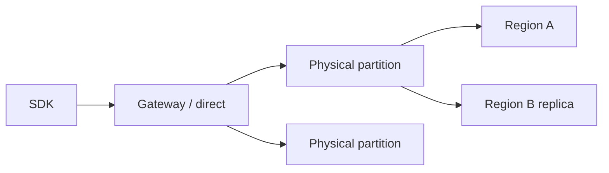

import { ConceptTemplate } from '@/features/kb/components/templates/ConceptTemplate'
import { Callout } from '@/features/kb/components/mdx/Callout'
import { ComparisonTable } from '@/features/kb/components/mdx/ComparisonTable'

export default function Layout({ children }) {
  return (
    <ConceptTemplate title="Azure Cosmos DB">
      {children}
    </ConceptTemplate>
  )
}

**Cosmos DB** is a multi-region, multi-model store. The workhorse is the **NoSQL (document) API**; there are also MongoDB, Cassandra, Gremlin, and Table APIs. You provision **RU/s** (or go serverless). Every read and write has an RU cost. The **partition key** is the scaling axis: pick it badly and one logical partition becomes the whole database.

## 1. Deep Dive and Mechanics

**Partitions.** A logical partition is all items with the same key. Physical partitions split as data or RU grow. Cross-partition queries fan out and cost more. Hot keys (one customer = 90 percent of traffic) cannot be fixed with more RU.

**Consistency.** Five levels: strong, bounded staleness, session (default), consistent prefix, eventual. Strong is single-region write. Session is the usual app compromise (your session sees its writes).

**Throughput.** Manual RU, autoscale RU (bills peak), or serverless (unpredictable, small). Reserved RU is per container or shared at the database.

**Indexing.** Default is everything — convenient and expensive on write-heavy containers. Custom index policy is how you cut RU.

**Change feed.** Ordered per partition; used for projections, Azure Functions triggers, and ETL.

<Callout icon="error" title="Hot partition keys">
`tenantId` when one tenant is 10x others, or `date` when all writes hit today, will 429 forever. Synthetic keys (tenant + bucket) exist for this. Design with a load sketch, not a UML field list.
</Callout>

## 2. Mathematical / Theoretical Foundation

RU is a normalized currency for CPU, IOPS, and memory. A 1 KB point read is ~1 RU; queries are a function of data scanned, not rows returned. Autoscale multiplies cost by the peak RU/s in the hour.

CAP: multi-region writes need conflict resolution (LWW or custom). Strong consistency plus multi-region writes is not on the menu.

<ComparisonTable
  headers={['Level', 'Stale reads', 'Typical']}
  rows={[
    ['Strong', 'No (single write region)', 'Ledgers, balances'],
    ['Bounded staleness', 'Bounded by K or T', 'Need a lag cap'],
    ['Session', 'Other sessions may lag', 'User apps'],
    ['Eventual', 'Unbounded', 'Telemetry, caches'],
  ]}
/>

## 3. Real-World Implementation

```python
from azure.cosmos import CosmosClient, PartitionKey
from azure.identity import DefaultAzureCredential

client = CosmosClient("https://shop.documents.azure.com:443/", DefaultAzureCredential())
db = client.create_database_if_not_exists("shop")
c = db.create_container_if_not_exists("orders", PartitionKey(path="/customerId"), offer_throughput=400)
c.upsert_item({"id": "1001", "customerId": "c-99", "total": 42})
```

Always include the partition key on point operations. A query without it is a cross-partition scan.

## 4. Visualizations



## 5. Interview Prep

**Q: How do you pick a partition key?**
**A:** High cardinality, even RU, and present on every hot query. If you always query by customer, `/customerId` beats `/id` alone only when id is not the access pattern — often `/id` is fine if it is the only key. Measure fan-out.

**Q: 429s mean what?**
**A:** You exceeded provisioned RU or a physical partition’s slice. More RU helps if the load is even. It does not help a hot key.

**Q: Cosmos vs Azure SQL?**
**A:** Cosmos for global distribution, flexible documents, and change feed. SQL for joins, transactions across many rows, and reporting. Do not put a relational schema into Cosmos “for scale” without a key design.

## 6. Production Use Cases

- Session-consistent user profiles with a region near the user.
- Event-sourced projections via change feed into Azure Functions.
- Multi-region product catalog with eventual consistency.

<Callout icon="tip" title="Turn off unused paths in the index">
A write-heavy telemetry container that indexes every property will spend RU on indexes you never query. Start from a sparse policy and add paths you filter on.
</Callout>
