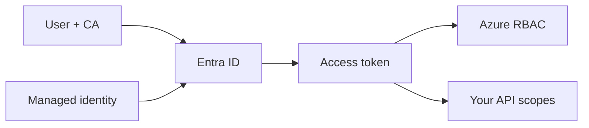

import { ConceptTemplate } from '@/features/kb/components/templates/ConceptTemplate'
import { Callout } from '@/features/kb/components/mdx/Callout'
import { ComparisonTable } from '@/features/kb/components/mdx/ComparisonTable'

export default function Layout({ children }) {
  return (
    <ConceptTemplate title="Microsoft Entra ID">
      {children}
    </ConceptTemplate>
  )
}

**Microsoft Entra ID** (formerly Azure Active Directory) is the cloud identity provider for Microsoft 365 and Azure. Users, groups, app registrations, enterprise apps, and workload identities live here. Azure RBAC decides what a token can do to a subscription. Entra decides whether you get a token at all — MFA, device state, risk, and PIM.

## 1. Deep Dive and Mechanics

**Apps.** An **app registration** is the identity (client id, keys, federation). An **enterprise app** (service principal) is that app in a tenant. Multi-tenant apps create a principal in each consumer tenant.

**Tokens.** OIDC/OAuth2: ID tokens for sign-in, access tokens for APIs, refresh tokens for silent renew. Audiences and scopes must match the API you call. “I have a token” is not authorization.

**Workload identity.** Managed identities on Azure resources federate to Entra without a secret. GitHub Actions and Kubernetes use OIDC federation the same way. Client secrets on service principals are the old way.

**Conditional Access.** Policy on user, app, location, device, risk. This is how you require MFA for Azure Portal but not for a break-glass account you store offline.

**PIM.** Privileged Identity Management: eligible roles activate for hours with approval. Standing Global Admin is a finding.

<Callout icon="error" title="Guest users and overbroad Graph consent">
An app that asks for Directory.ReadWrite.All and is consented tenant-wide is a persistence tool. Review enterprise app permissions and disable user consent in production tenants.
</Callout>

## 2. Mathematical / Theoretical Foundation

AuthN produces a signed assertion; AuthZ is a later intersection (CA + RBAC + resource policy). A leaked refresh token is a renewable session — lifetime and CA session controls bound the window.

Federation (SAML/OIDC) is a trust: the RP accepts the IdP’s signature. Misconfigured redirect URIs are the classic token theft primitive.

<ComparisonTable
  headers={['Identity', 'Secret', 'Use']}
  rows={[
    ['User + CA', 'Passwordless / MFA', 'Humans'],
    ['Managed identity', 'None you hold', 'Azure compute'],
    ['Federated app', 'OIDC to Entra', 'GitHub / Kubernetes'],
    ['Client secret SP', 'String in a vault', 'Legacy only'],
  ]}
/>

## 3. Real-World Implementation

```python
from azure.identity import DefaultAzureCredential
from azure.mgmt.resource import ResourceManagementClient

cred = DefaultAzureCredential()
rm = ResourceManagementClient(cred, subscription_id)
for g in rm.resource_groups.list():
    print(g.name)
```

On an Azure VM or Function, DefaultAzureCredential uses the managed identity. Locally it uses az login. No client secret in the repo.

## 4. Visualizations



## 5. Interview Prep

**Q: Entra ID vs Azure RBAC?**
**A:** Entra authenticates and issues tokens, and holds directory roles (Global Admin). Azure RBAC authorizes ARM actions on a subscription. You need both: a token and a role assignment.

**Q: App registration vs enterprise application?**
**A:** Registration is the definition (single-tenant or multi). Enterprise app is the instance in a tenant, where you assign users and see consented permissions.

**Q: How do you stop standing Global Admin?**
**A:** PIM eligible assignments, two break-glass accounts excluded from CA and stored offline, and an alert on any permanent Global Admin.

## 6. Production Use Cases

- Workforce sign-in to Azure Portal with CA + compliant device.
- Functions calling SQL and Key Vault with a user-assigned identity.
- External identities (Entra External ID) for customer-facing apps.

<Callout icon="tip" title="Prefer user-assigned identities for fleets">
System-assigned dies with the resource. User-assigned lets a scale set and a Function share one principal and one set of role assignments.
</Callout>
