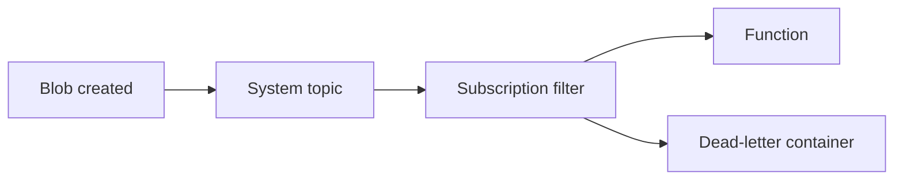

import { ConceptTemplate } from '@/features/kb/components/templates/ConceptTemplate'
import { Callout } from '@/features/kb/components/mdx/Callout'
import { ComparisonTable } from '@/features/kb/components/mdx/ComparisonTable'

export default function Layout({ children }) {
  return (
    <ConceptTemplate title="Azure Event Grid">
      {children}
    </ConceptTemplate>
  )
}

**Event Grid** is a pub/sub router for **events** (something happened), not a durable log. Azure resources (Blob created, Key Vault secret near expiry) and your custom topics publish a CloudEvents-shaped payload. Subscriptions filter and push to handlers. If the handler is down and retries exhaust, you need a dead-letter destination — there is no week-long rewind.

## 1. Deep Dive and Mechanics

**Topics.** System topics (built-in Azure), custom topics, partner topics, and **namespaces** (pull delivery, MQTT, more control). New designs should look at namespace topics if you need pull or MQTT.

**Delivery.** Push (webhook handshake, retries with backoff) or pull (namespace). Push to Functions, Logic Apps, Service Bus, Event Hubs, or a URL you own.

**Filters.** Subject begins-with, event type, and advanced filters on data fields. Filter at the subscription so Functions do not wake for every blob in the account.

**Dead letter.** A blob container for events that exhausted retries. Without it, failed events vanish.

**Idempotency.** At-least-once delivery. Handlers must tolerate duplicates.

<Callout icon="warning" title="Event Grid is not Event Hubs">
Hubs is a high-throughput log with partitions and consumer groups. Grid is a discrete event router. Blob-created → Function is Grid. Clickstream at 50k/s is Hubs.
</Callout>

## 2. Mathematical / Theoretical Foundation

Retries are a capped geometric backoff. Expected delivery delay under handler failure grows with attempt count; after the last attempt the event is dead-lettered or dropped.

Filter selectivity is the main cost control: P(wake) ≈ matching fraction. A subscription on an entire storage account is a self-DoS.

<ComparisonTable
  headers={['Service', 'Shape', 'Replay']}
  rows={[
    ['Event Grid', 'Discrete events', 'No (dead-letter only)'],
    ['Event Hubs', 'Stream / log', 'Retention window'],
    ['Service Bus', 'Commands / messages', 'Queue + DLQ'],
    ['Logic Apps trigger', 'Connector events', 'Run history'],
  ]}
/>

## 3. Real-World Implementation

```bicep
resource sub 'Microsoft.EventGrid/systemTopics/eventSubscriptions@2022-06-15' = {
  name: 'blob-to-fn'
  parent: systemTopic
  properties: {
    destination: {
      endpointType: 'AzureFunction'
      properties: { resourceId: fn.id }
    }
    filter: { includedEventTypes: ['Microsoft.Storage.BlobCreated'] }
    deadLetterDestination: {
      endpointType: 'StorageBlob'
      properties: { resourceId: dlq.id, blobContainerName: 'grid-dlq' }
    }
  }
}
```

Validate the webhook handshake if you use a custom URL. Functions bindings hide that.

## 4. Visualizations



## 5. Interview Prep

**Q: Grid vs Hubs vs Service Bus?**
**A:** Grid for react-to-Azure and fan-out of discrete facts. Hubs for telemetry streams. Service Bus for business commands, sessions, and transactions.

**Q: Push or pull?**
**A:** Classic topics push. Namespace topics can pull (you control concurrency). Pull is easier to make look like a queue consumer.

**Q: Why did my Function miss blobs?**
**A:** Filter too tight, no subscription on the right topic, or retries exhausted without a DLQ you watch.

## 6. Production Use Cases

- Image uploaded → Function generates thumbnails.
- Key Vault near-expiry events → rotate pipeline.
- Custom topic for “order placed” to several downstream Functions.

<Callout icon="tip" title="Always set a dead-letter container">
A subscription without dead-letter is optimism. Alert on blob count in that container the way you alert on a queue DLQ.
</Callout>
