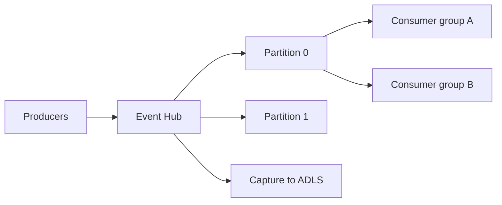

import { ConceptTemplate } from '@/features/kb/components/templates/ConceptTemplate'
import { Callout } from '@/features/kb/components/mdx/Callout'
import { ComparisonTable } from '@/features/kb/components/mdx/ComparisonTable'

export default function Layout({ children }) {
  return (
    <ConceptTemplate title="Azure Event Hubs">
      {children}
    </ConceptTemplate>
  )
}

**Event Hubs** is a partitioned append log. Producers send events; consumers read by offset or timestamp. **Consumer groups** each have their own cursor. Capture can dump the log to Blob/ADLS. The Kafka endpoint lets existing Kafka clients talk to a hub instead of a broker you patch.

## 1. Deep Dive and Mechanics

**Throughput units / processing units / capacity units.** SKU (Standard, Premium, Dedicated) changes isolation and quotas. Partition count is the parallelism ceiling for a consumer group — you cannot have more concurrent ordered readers than partitions.

**Partition keys.** Same key → same partition → order. No key → round-robin. Rebalancing consumers is cheap; changing partition count on a live hub is not something you do weekly.

**Checkpoints.** The SDK checkpoints offsets (often in Blob). Lose the checkpoint store and you replay or skip.

**Capture.** Time or size windows write Avro (or your format) to a lake. That is the cheap archive path.

**Schema.** Schema Registry (Premium/Dedicated stories) keeps producers and consumers honest. Without it you invent JSON folklore.

<Callout icon="warning" title="One partition is a single file">
A hub with one partition is easy to reason about and will not scale. Start with enough partitions for 2–3 years of peak, not for today’s laptop demo.
</Callout>

## 2. Mathematical / Theoretical Foundation

Order is per partition, not global. Throughput ≈ partitions × per-partition limits, capped by TU/PU. Lag is latest_offset − committed_offset; alert on lag seconds, not only on CPU.

Kafka compatibility is protocol-level, not “every Kafka feature.” Test compacted topics, transactions, and exactly-once assumptions.

<ComparisonTable
  headers={['Product', 'Model', 'Order']}
  rows={[
    ['Event Hubs', 'Log + consumer groups', 'Per partition'],
    ['Service Bus', 'Queues / topics', 'Sessions optional'],
    ['Event Grid', 'Push events', 'None'],
    ['Kafka (IaaS)', 'You run brokers', 'Per partition'],
  ]}
/>

## 3. Real-World Implementation

```python
from azure.eventhub import EventHubProducerClient, EventData
from azure.identity import DefaultAzureCredential

prod = EventHubProducerClient(
    fully_qualified_namespace="ns.servicebus.windows.net",
    eventhub_name="clicks",
    credential=DefaultAzureCredential(),
)
batch = prod.create_batch()
batch.add(EventData(b'{"id":"1"}'))
prod.send_batch(batch)
```

Consumers use `EventHubConsumerClient` with a Blob checkpoint store. Scale out to at most the partition count.

## 4. Visualizations



## 5. Interview Prep

**Q: Event Hubs vs Kafka?**
**A:** Hubs is managed; Kafka protocol is available. You give up some broker features and cluster knobs. If you need Cruise Control and every Kafka API, run Kafka (or Confluent). If you want a log in Azure with less ops, Hubs.

**Q: How many consumer groups?**
**A:** One per independent downstream. Do not share a group across two apps — they will steal partitions from each other.

**Q: What is Capture for?**
**A:** Cheap, automatic lake ingest. Analytics should read the lake, not slam the live hub with a new consumer that needs 90 days of replay.

## 6. Production Use Cases

- Clickstream or IoT ingest with Capture to a Synapse/Databricks lake.
- Kafka-protocol migration: change bootstrap servers, keep clients.
- Fan-out: several consumer groups (realtime fraud, batch ETL, audit).

<Callout icon="tip" title="Checkpoint before you crash-loop">
A consumer that processes then crashes before checkpoint will redeliver. Make handlers idempotent and checkpoint after a durable side effect, not after a log line.
</Callout>
