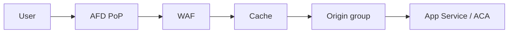

import { ConceptTemplate } from '@/features/kb/components/templates/ConceptTemplate'
import { Callout } from '@/features/kb/components/mdx/Callout'
import { ComparisonTable } from '@/features/kb/components/mdx/ComparisonTable'

export default function Layout({ children }) {
  return (
    <ConceptTemplate title="Azure Front Door">
      {children}
    </ConceptTemplate>
  )
}

**Azure Front Door (AFD)** is a global HTTP(S) entry point. Users hit an anycast IP; Microsoft’s edge terminates TLS, runs WAF, caches if you ask, and forwards to origins (App Service, ACA, Application Gateway, public IPs, or Private Link origins). Standard and Premium SKUs differ on WAF, Private Link, and bot rules. Classic Front Door is legacy.

## 1. Deep Dive and Mechanics

**Profiles, endpoints, routes.** A profile holds endpoints. Routes map path patterns to origin groups. Origin groups have health probes and weighted/priority origins for failover.

**Private Link origins.** Premium can reach an internal load balancer or a PaaS private endpoint so the origin is not on the public internet. This is the correct “no public App Service” pattern.

**WAF and bot manager.** Custom and managed rules at the edge — cheaper than letting junk hit the region. Tune in detection, then prevention.

**Caching and rules.** Cache by path, query string behavior, and compression. Rules engine rewrites headers and URLs. Do not cache authenticated HTML unless you like leaking sessions.

**TLS.** Managed certs for `*.azurefd.net` and custom domains (CNAME + validate). HTTP to HTTPS redirect lives here.

<Callout icon="warning" title="Origin still needs a lock">
Front Door is not magic identity. If the origin is public, attackers bypass AFD and hit it directly. Restrict the origin to Front Door (header + ID, Private Link, or service tag) or you have two front doors.
</Callout>

## 2. Mathematical / Theoretical Foundation

Anycast maps a client to a nearby PoP; RTT to origin is PoP-to-region, not client-to-region. Cache hit ratio h reduces origin load to (1-h) of GETs. Health probes are a failure detector with false positives if the probe path is wrong.

Failover is not instant globally; DNS/anycast and probe thresholds add tens of seconds.

<ComparisonTable
  headers={['Service', 'Scope', 'Typical origin']}
  rows={[
    ['Front Door', 'Global L7', 'Any HTTP origin'],
    ['Application Gateway', 'Regional L7', 'VNet backends'],
    ['CDN (Microsoft)', 'Cache-heavy', 'Static blobs'],
    ['Traffic Manager', 'DNS only', 'Any endpoint'],
  ]}
/>

## 3. Real-World Implementation

```bicep
resource afd 'Microsoft.Cdn/profiles@2023-05-01' = {
  name: 'afd-prod'
  location: 'global'
  sku: { name: 'Premium_AzureFrontDoor' }
}
```

Point a custom domain CNAME at the endpoint hostname. Attach a WAF policy on Premium. Lock App Service to the Front Door ID header and disable public access if you use Private Link.

## 4. Visualizations



## 5. Interview Prep

**Q: Front Door vs Application Gateway?**
**A:** Front Door is global edge. Gateway is regional, VNet-native, and often the next hop (AFD → AGW → AKS) when you need a private regional WAF or path routing inside the VNet.

**Q: Front Door vs Traffic Manager?**
**A:** Traffic Manager is DNS: no TLS, no WAF, no cache. Use it for non-HTTP or as a coarse failover. HTTP apps want Front Door.

**Q: Standard or Premium?**
**A:** Premium for Private Link origins, bot manager, and the fuller WAF. Standard for simpler public origins.

## 6. Production Use Cases

- Global API hostname with active-passive origin groups across two regions.
- Static + API on one domain: cache `/static/*`, bypass `/api/*`.
- Private App Service origin via Private Link so the only public IP is Front Door.

<Callout icon="tip" title="Probe a cheap 200">
A probe that runs a full business query will flap and fail you over. `/healthz` that checks process liveness, not the entire dependency graph, belongs on the origin.
</Callout>
