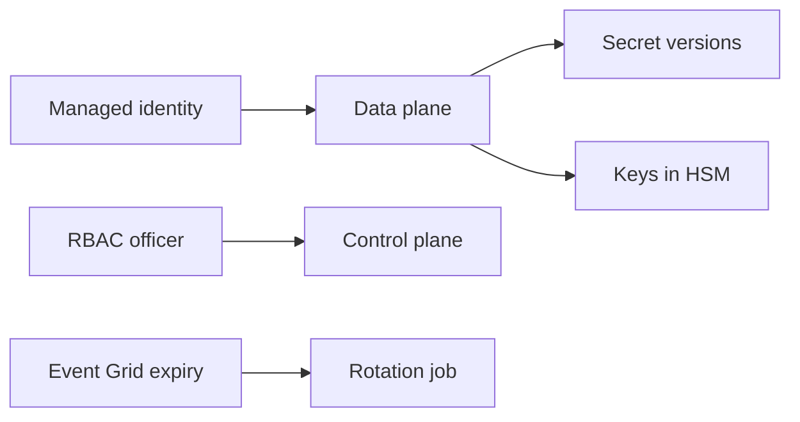

import { ConceptTemplate } from '@/features/kb/components/templates/ConceptTemplate'
import { Callout } from '@/features/kb/components/mdx/Callout'
import { ComparisonTable } from '@/features/kb/components/mdx/ComparisonTable'

export default function Layout({ children }) {
  return (
    <ConceptTemplate title="Azure Key Vault">
      {children}
    </ConceptTemplate>
  )
}

**Key Vault** stores **secrets** (strings), **keys** (RSA/EC for crypto ops), and **certificates**. Two planes: ARM (who can create the vault) and data plane (who can Get Secret). **RBAC** on the data plane is the current model; vault access policies are the legacy parallel. Soft delete and purge protection are how you survive a `delete`.

## 1. Deep Dive and Mechanics

**SKUs.** Standard vs Premium (HSM-backed keys). Managed HSM is a separate, single-tenant pool for regulated key control.

**Auth.** Apps get tokens via managed identity and call the data plane. App Service Key Vault references inject secrets at start. Rotation means a new version; consumers must not cache forever.

**Network.** Public access off + private endpoint. Firewall “allow Azure services” is coarse. The vault’s public diagnostic is a favorite exfil path if left open.

**Certificates.** Key Vault can issue from a partner CA or import PFX. App Gateway and Front Door can reference certs. Expiry events go to Event Grid.

**RBAC vs policies.** Do not mix on the same vault. RBAC roles: Secrets User, Crypto User, Officer, etc. Officers manage, users consume.

<Callout icon="error" title="A secret in app settings is still a secret in ARM">
Key Vault references help, but a slot setting that pasted the value is visible to anyone with read on the site. Grant Key Vault Secrets User to the app identity and never dump Get Secret output into logs.
</Callout>

## 2. Mathematical / Theoretical Foundation

Authorization is ARM role ∩ data-plane role ∩ network. Missing any one looks like 403. Soft-delete retention T gives a recover window; purge protection forbids skipping T.

Crypto: apps should call wrap/unwrap or sign in the vault (or Managed HSM) so the private key never enters the process. A downloaded PEM is no longer a vault key.

<ComparisonTable
  headers={['Store', 'Rotation', 'HSM option']}
  rows={[
    ['Key Vault', 'Versions + Event Grid', 'Premium / Managed HSM'],
    ['App settings', 'Manual', 'No'],
    ['Azure Files share', 'None', 'No'],
    ['Git', 'Incident', 'No'],
  ]}
/>

## 3. Real-World Implementation

```python
from azure.identity import DefaultAzureCredential
from azure.keyvault.secrets import SecretClient

c = SecretClient("https://kv-prod.vault.azure.net", DefaultAzureCredential())
pw = c.get_secret("checkout-sql").value
```

Cache with a short TTL and refresh on 401 from the database. Prefer references in App Service so the process never prints the value at boot in custom code.

## 4. Visualizations



## 5. Interview Prep

**Q: Access policy or RBAC?**
**A:** RBAC for new vaults. It audits like the rest of Azure and works with PIM. Access policies are hard to review at scale.

**Q: Key Vault vs Managed HSM?**
**A:** Vault is multi-tenant with Premium HSM keys. Managed HSM is dedicated, higher bar for FIPS and isolation, more ops. Most apps need a vault.

**Q: Why private endpoint and not just firewall IPs?**
**A:** IP lists miss scale-out PaaS and leak when someone adds 0.0.0.0/0 “to test.” Private endpoint plus public access disabled is the default.

## 6. Production Use Cases

- App Service / ACA pull connection strings via identity.
- CMK for Storage and SQL with a key in Premium or Managed HSM.
- Certificate auto-renew for a custom domain on Application Gateway.

<Callout icon="tip" title="One vault per environment, not per app">
A vault explosion creates RBAC sprawl. Isolate prod from dev; share inside an environment with prefix-named secrets and tight role assignments.
</Callout>
