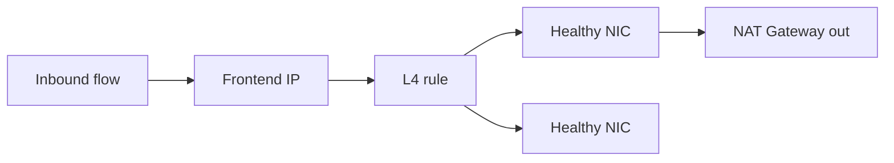

import { ConceptTemplate } from '@/features/kb/components/templates/ConceptTemplate'
import { Callout } from '@/features/kb/components/mdx/Callout'
import { ComparisonTable } from '@/features/kb/components/mdx/ComparisonTable'

export default function Layout({ children }) {
  return (
    <ConceptTemplate title="Azure Load Balancer">
      {children}
    </ConceptTemplate>
  )
}

**Azure Load Balancer (ALB here, not Application Gateway)** is a Layer-4 (TCP/UDP) pass-through. It does not terminate TLS and does not read HTTP paths. A **frontend** IP (public or private), a **backend pool**, and **rules** map ports. Standard SKU is zone-aware and required for production; Basic is legacy.

## 1. Deep Dive and Mechanics

**Public vs internal.** Public fronts internet traffic. Internal fronts VNet traffic (often the next hop after a gateway or for east-west).

**HA ports.** A single rule on protocol “all” for NVAs and firewalls. Normal apps use explicit port rules.

**Health probes.** TCP or HTTP. A failed probe removes the NIC from rotation. Probe from the Azure host — NSGs must allow AzureLoadBalancer.

**SNAT.** Outbound connections from the backend use SNAT ports on the frontend (or a NAT Gateway, preferred). Port exhaustion looks like intermittent outbound failures.

**Outbound rules vs NAT Gateway.** Do not rely on default outbound access (it is being retired). Attach a NAT Gateway or explicit outbound rules.

<Callout icon="warning" title="SNAT port exhaustion">
Each frontend IP has a finite SNAT pool. Many short HTTPS calls to the same destination eat ports. NAT Gateway or more outbound IPs, plus connection reuse, fix it — not “add another VM.”
</Callout>

## 2. Mathematical / Theoretical Foundation

L4 balancing is per-flow (5-tuple). Persistence options pin a tuple; they fight even spread. Throughput is a function of flow count and NIC limits, not HTTP request size.

Probe failure detection time ≈ interval × unhealthy threshold. Set too tight and you flap; too loose and you send traffic to a dead node.

<ComparisonTable
  headers={['Service', 'Layer', 'TLS']}
  rows={[
    ['Load Balancer', 'L4', 'Pass-through'],
    ['Application Gateway', 'L7', 'Terminates'],
    ['Front Door', 'L7 global', 'Terminates at edge'],
    ['Traffic Manager', 'DNS', 'None'],
  ]}
/>

## 3. Real-World Implementation

```bicep
resource lb 'Microsoft.Network/loadBalancers@2023-09-01' = {
  name: 'lb-int-prod'
  location: location
  sku: { name: 'Standard' }
  properties: {
    frontendIPConfigurations: [
      { name: 'fe', properties: { subnet: { id: subnetId } } }
    ]
  }
}
```

Put VMSS NICs in the backend pool. Use an HTTP probe on `/healthz`. Attach a NAT Gateway to the subnet for outbound.

## 4. Visualizations



## 5. Interview Prep

**Q: Why Standard SKU?**
**A:** Zones, HA ports, better diagnostics, and Basic is retired from new designs. Standard is deny-by-default on the public frontend until you add an NSG allow.

**Q: Load Balancer vs Application Gateway?**
**A:** L4 vs L7. If you need host/path routing or WAF, you are not on Load Balancer.

**Q: What is the AzureLoadBalancer tag?**
**A:** Probe source. If the NSG blocks it, every backend looks dead.

## 6. Production Use Cases

- Internal LB in front of a VMSS of TCP services.
- Public LB for a game or SIP workload that is not HTTP.
- NVA sandwich using HA ports.

<Callout icon="tip" title="Prefer NAT Gateway for outbound">
Outbound rules work; NAT Gateway scales SNAT without inventing more public frontends. It is the default recommendation for VMSS subnets.
</Callout>
