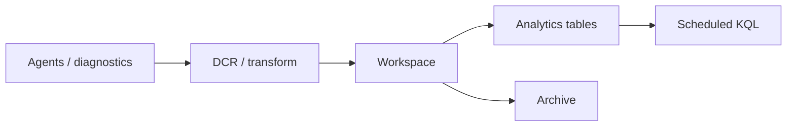

import { ConceptTemplate } from '@/features/kb/components/templates/ConceptTemplate'
import { Callout } from '@/features/kb/components/mdx/Callout'
import { ComparisonTable } from '@/features/kb/components/mdx/ComparisonTable'

export default function Layout({ children }) {
  return (
    <ConceptTemplate title="Azure Log Analytics">
      {children}
    </ConceptTemplate>
  )
}

A **Log Analytics workspace** is a columnar-ish log database. Diagnostic settings, agents, and Application Insights write tables (`Heartbeat`, `AzureDiagnostics`, `requests`). You query with **KQL**. Commitment tiers, basic vs analytics tables, and retention days are the cost knobs. Sentinel sits on top of a workspace when you want SIEM.

## 1. Deep Dive and Mechanics

**Tables.** Analytics (interactive KQL, pricier), Basic (cheap ingest, limited query), Auxiliary (archive-style). Pick per table. Not every log needs 90-day interactive.

**Ingestion.** DCRs and diagnostic settings. Transformations at ingest can drop fields or rows. Once ingested, you pay.

**Access.** Workspace RBAC plus table-level RBAC. Resource-context queries let an app owner see logs for their resource without workspace-wide read.

**Saved searches and functions.** Reuse KQL. Alerts are scheduled queries. A bad join at 2 AM is a surprise bill and a timeout.

**Linked storage / archive.** Long retention can move to archive. Restore or search jobs cost extra when you actually need the year-old incident.

<Callout icon="warning" title="Verbose verbose verbose">
Container Insights and verbose App Insights can dominate the invoice. Sample, filter namespaces, and set a daily cap on non-prod workspaces.
</Callout>

## 2. Mathematical / Theoretical Foundation

Cost ≈ ingest_GB × price + retention_GB-months + query/scan on cheap tiers. A 10× cardinality explosion in a custom field is a 10× ingest tax.

KQL is a pipe of relational operators. High-cardinality joins (`union` of everything) time out. Time filters first is not style — it is the only way the engine prunes.

<ComparisonTable
  headers={['Table plan', 'Query', 'Use']}
  rows={[
    ['Analytics', 'Full KQL', 'Hot ops, alerts'],
    ['Basic', 'Limited', 'High-volume debug'],
    ['Auxiliary / archive', 'Search jobs', 'Compliance years'],
    ['Metrics', 'Not KQL', 'Cheap CPU/RAM series'],
  ]}
/>

## 3. Real-World Implementation

```kusto
AppRequests
| where TimeGenerated > ago(1h)
| where Success == false
| summarize failures=count() by ResultCode, Name
| order by failures desc
```

Pin that to a workbook. Alert when failures exceed a baseline, not when any row exists.

## 4. Visualizations



## 5. Interview Prep

**Q: Workspace vs Application Insights resource?**
**A:** Workspace-based App Insights writes to the workspace. The AI resource is the APM UX and ikey/connection string. Queries can join `AppRequests` with VM logs in one place.

**Q: How do you stop a runaway ingest?**
**A:** Daily cap (blunt), DCR transforms, table plan changes, and turning off categories you do not read. Caps drop data — pair with an alert on the cap.

**Q: Sentinel needs what?**
**A:** A workspace plus the Sentinel solution. Security tables and analytics rules live there. Do not casually grant workspace-wide write.

## 6. Production Use Cases

- Central ops workspace per environment with table-level RBAC.
- Security workspace for Sentinel, isolated from app debug noise.
- Join AKS Container Insights with App Insights on `operation_Id` for a single incident.

<Callout icon="tip" title="TimeGenerated first">
Every production query should constrain time before a join. The engine is fast; unbounded scans are how you learn about query pricing.
</Callout>
