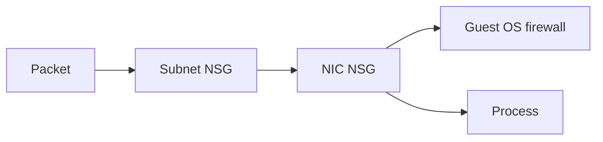

import { ConceptTemplate } from '@/features/kb/components/templates/ConceptTemplate'
import { Callout } from '@/features/kb/components/mdx/Callout'
import { ComparisonTable } from '@/features/kb/components/mdx/ComparisonTable'

export default function Layout({ children }) {
  return (
    <ConceptTemplate title="Network Security Groups">
      {children}
    </ConceptTemplate>
  )
}

An **NSG** is a stateful 5-tuple firewall you attach to a subnet, a NIC, or both. Rules have priority (lower number wins), direction, protocol, source, destination, and port. **Service tags** (`VirtualNetwork`, `AzureLoadBalancer`, `Storage`) stand in for Microsoft-owned prefixes. **ASGs** let you name sets of NICs and use those names as sources.

## 1. Deep Dive and Mechanics

**Effective rules.** Subnet NSG plus NIC NSG both apply — a deny in either drops the packet. Always read “Effective security rules” on the NIC when debugging.

**Defaults.** Azure adds default allows (VNet inbound, internet outbound, load balancer probes) and a deny-all inbound. Your rules sit among these priorities.

**Stateful.** An allowed inbound connection may reply without an extra outbound rule. Like AWS SGs, long-idle flows can drop.

**Flow logs + NSG insights.** Traffic Analytics (via a Network Watcher flow log to a workspace) is how you prove a rule is unused before you delete it.

**Azure Firewall vs NSG.** NSGs are distributed L3/L4. Azure Firewall is a centralized L3–L7 appliance with FQDN and threat intel. Many hubs use both.

<Callout icon="warning" title="NSG on the subnet and the NIC">
Two layers of overlapping priorities is how you create a deny you cannot see in one blade. Prefer subnet NSGs for the estate and NIC NSGs only for exceptions.
</Callout>

## 2. Mathematical / Theoretical Foundation

Evaluation is first-match on priority (unique per direction). Capacity is rule count × flow setup rate. ASGs keep rule count O(roles) instead of O(IPs).

Defense in depth: NSG ∩ Firewall policy ∩ route. An NSG allow cannot create a UDR that does not exist.

<ComparisonTable
  headers={['Control', 'Layer', 'Scope']}
  rows={[
    ['NSG', 'L3/L4 stateful', 'Subnet or NIC'],
    ['Azure Firewall', 'L3–L7 central', 'Hub'],
    ['WAF', 'HTTP', 'AFD / AGW'],
    ['ASG', 'Alias for NICs', 'Used inside NSGs'],
  ]}
/>

## 3. Real-World Implementation

```bicep
resource nsg 'Microsoft.Network/networkSecurityGroups@2023-09-01' = {
  name: 'nsg-app'
  location: location
  properties: {
    securityRules: [
      {
        name: 'allow-agw'
        properties: {
          priority: 100
          direction: 'Inbound'
          access: 'Allow'
          protocol: 'Tcp'
          sourceAddressPrefix: 'GatewayManager'
          destinationPortRange: '65200-65535'
        }
      }
    ]
  }
}
```

Use ASGs (`sourceApplicationSecurityGroups`) for app-to-db instead of subnet CIDRs when NICs move.

## 4. Visualizations



## 5. Interview Prep

**Q: NSG vs AWS Security Group?**
**A:** Both stateful. NSGs can deny and attach to subnets; AWS SGs are allow-only on ENIs. Azure also has ASGs; AWS references other SGs by id.

**Q: Why must I allow AzureLoadBalancer?**
**A:** Health probes come from that tag. Block it and the LB marks every backend down.

**Q: Can an NSG filter FQDNs?**
**A:** No. Use Azure Firewall, a proxy, or Private DNS + private endpoints. NSGs see IPs.

## 6. Production Use Cases

- Subnet NSGs: deny RDP/SSH from internet, allow only the bastion or Private Link.
- ASG triplets: web, app, data roles without rewriting CIDRs.
- Flow logs into Sentinel for rejected inbound 3389.

<Callout icon="tip" title="Leave gaps in priorities">
100, 110, 200 beat 1, 2, 3. You will insert a rule at 2 a.m.
</Callout>
