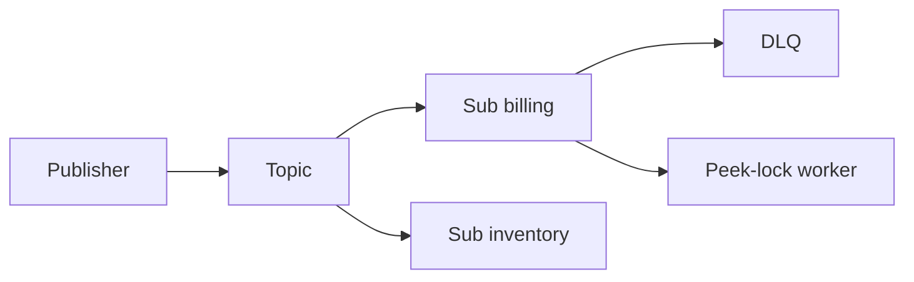

import { ConceptTemplate } from '@/features/kb/components/templates/ConceptTemplate'
import { Callout } from '@/features/kb/components/mdx/Callout'
import { ComparisonTable } from '@/features/kb/components/mdx/ComparisonTable'

export default function Layout({ children }) {
  return (
    <ConceptTemplate title="Azure Service Bus">
      {children}
    </ConceptTemplate>
  )
}

**Service Bus** is a managed broker. **Queues** compete consumers. **Topics** fan out to subscriptions with filters. Premium adds isolation, VNet, and larger quotas. This is the place for business commands, sagas, and exactly-once-ish workflows with **sessions** and **transactions** — not for 100k click events per second (that is Event Hubs).

## 1. Deep Dive and Mechanics

**Peek-lock vs receive-and-delete.** Peek-lock gives a token; you complete or abandon. Lock duration must exceed processing time or a second consumer gets the same message.

**Max delivery and DLQ.** After N failures the message goes to `$DeadLetterQueue`. Alert on DLQ length. Poison messages do not retry forever unless you configured it that way.

**Sessions.** `SessionId` forces ordered handling per session (one owner at a time). Checkout per order id is the usual example.

**Transactions and duplicate detection.** A window of message-id dedupe. Transactions can span send/complete in Premium/Standard with caveats — test your SDK.

**Autoforward and filters.** Subscription SQL or correlation filters. Autoforward into a queue to isolate a slow consumer.

<Callout icon="warning" title="Lock duration vs processing time">
If work takes 90 seconds and the lock is 60, another worker will process the same command. Renew the lock or make the handler faster and idempotent.
</Callout>

## 2. Mathematical / Theoretical Foundation

At-least-once is the default. Exactly-once is “dedupe window + idempotent handler + peek-lock complete,” not a law of physics.

Throughput on Standard is a shared namespace. Premium is messaging units. Sessions reduce parallelism to one consumer per live session id.

<ComparisonTable
  headers={['Service', 'Guarantee', 'Use']}
  rows={[
    ['Service Bus', 'Commands, sessions, DLQ', 'Business workflows'],
    ['Event Hubs', 'Log, high ingest', 'Telemetry'],
    ['Event Grid', 'Discrete react', 'Blob created'],
    ['Storage queues', 'Cheap, simple', 'Tiny jobs'],
  ]}
/>

## 3. Real-World Implementation

```csharp
var sender = client.CreateSender("orders");
await sender.SendMessageAsync(new ServiceBusMessage(body)
{
    SessionId = orderId,
    MessageId = orderId,
});
```

Consumers use `AcceptNextSessionAsync` for session queues. Complete only after the DB commit.

## 4. Visualizations



## 5. Interview Prep

**Q: Queue or topic?**
**A:** Queue when one consumer group should process each message. Topic when several independent downstreams need a copy (or a filtered copy).

**Q: Service Bus vs Event Hubs?**
**A:** Bus for commands and worker patterns. Hubs for streams and replay. If you say “consumer group” and “offset,” you wanted Hubs.

**Q: What is the DLQ for?**
**A:** Messages that exceeded delivery count or failed validation. A human or a poison processor inspects them. Ignoring DLQ is how orders vanish.

## 6. Production Use Cases

- Order pipeline with sessions so line items stay ordered per order.
- Topic per domain event, subscription per bounded context.
- Transactional outbox: write SQL + send in a careful pattern (or use change feed).

<Callout icon="tip" title="Name MessageId for dedupe">
A stable business id as MessageId plus duplicate detection saves you from publisher retries. Random GUIDs make dedupe useless.
</Callout>
