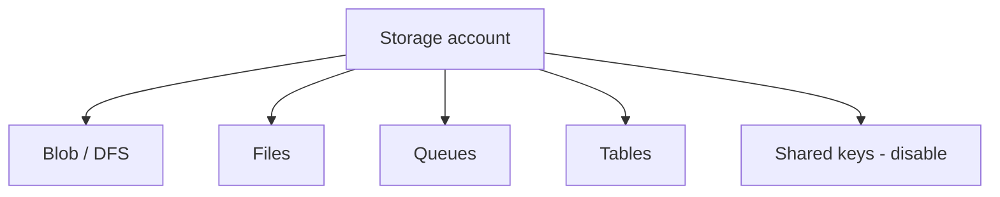

import { ConceptTemplate } from '@/features/kb/components/templates/ConceptTemplate'
import { Callout } from '@/features/kb/components/mdx/Callout'
import { ComparisonTable } from '@/features/kb/components/mdx/ComparisonTable'

export default function Layout({ children }) {
  return (
    <ConceptTemplate title="Azure Storage Accounts">
      {children}
    </ConceptTemplate>
  )
}

A **storage account** is the ARM resource that hosts Blob, Azure Files, Queues, and Tables (and the DFS endpoint when HNS is on). Kind and SKU (Standard_LRS, ZRS, GRS, GZRS, Premium) apply to the account. The name is a global DNS label. Keys and the connection string are root credentials for every service inside.

## 1. Deep Dive and Mechanics

**Redundancy.** LRS (three copies, one region, one zone). ZRS (zones). GRS/GZRS add a paired region. RA-GRS lets you read the secondary. Failover is not a client retry — it is an account operation with data-loss risk if GRS lag is behind.

**Endpoints.** `account.blob.core.windows.net`, `file`, `queue`, `table`, `dfs`. Private endpoints are per sub-resource. Disable public network access when they exist.

**Identity.** Shared key, SAS, Entra RBAC. Disable shared key after migration. “Allow storage account key access” should be off in prod.

**Kinds.** StorageV2 is the default. BlockBlobStorage premium for low-latency blobs. FileStorage premium for Files. Do not create legacy v1.

**Management plane vs data plane.** Contributor on the account can list keys. Data-plane Blob Contributor cannot. Confusing those two is a common over-grant.

<Callout icon="error" title="One account key opens everything">
A leaked key reads blobs, files, queues, and tables. Rotate keys, disable key auth, and use user-delegation SAS or Entra. Never check in a connection string.
</Callout>

## 2. Mathematical / Theoretical Foundation

Durability targets differ by SKU; none of them replace versioning and soft delete against accidental delete. GRS RPO is async — design for minutes of missing data on a regional failover.

Name + region + SKU are hard to change. Migration is copy + cutover. Pick ZRS in regions that support it if you care about AZ loss.

<ComparisonTable
  headers={['SKU', 'AZ', 'Paired region']}
  rows={[
    ['LRS', 'No', 'No'],
    ['ZRS', 'Yes', 'No'],
    ['GRS / RA-GRS', 'No', 'Yes'],
    ['GZRS / RA-GZRS', 'Yes', 'Yes'],
  ]}
/>

## 3. Real-World Implementation

```bash
az storage account create -g prod -n stshopprod001 \
  --sku Standard_ZRS --kind StorageV2 \
  --min-tls-version TLS1_2 \
  --allow-blob-public-access false \
  --allow-shared-key-access false
```

Then assign `Storage Blob Data Contributor` to the app identity. Create private endpoints for `blob` and `dfs` if HNS is on.

## 4. Visualizations



## 5. Interview Prep

**Q: Why not one giant account for the company?**
**A:** Blast radius, throttling (account-level limits), and lifecycle. Split by env and by workload (lake vs app vs logs).

**Q: LRS or ZRS?**
**A:** ZRS if the region supports it and you cannot tolerate an AZ outage. LRS is cheaper and is one building’s fire.

**Q: Storage account vs Blob only?**
**A:** There is no free-floating Blob resource. Blob is a service on an account. The account choices (HNS, SKU, network) constrain Blob.

## 6. Production Use Cases

- App account: private, no public blobs, Entra-only, ZRS.
- Lake account: HNS on, GZRS if DR requires it, lifecycle on containers.
- Logs account: cheap LRS, short retention, locked from app identities.

<Callout icon="tip" title="Name is forever">
`st` + app + env + region + a digit stays inside the 24-char global namespace. Cute names collide. Rename is a new account.
</Callout>
