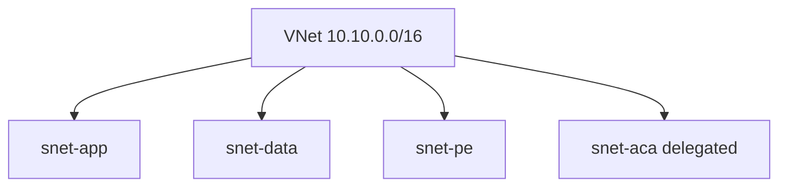

import { ConceptTemplate } from '@/features/kb/components/templates/ConceptTemplate'
import { Callout } from '@/features/kb/components/mdx/Callout'
import { ComparisonTable } from '@/features/kb/components/mdx/ComparisonTable'

export default function Layout({ children }) {
  return (
    <ConceptTemplate title="Azure Subnets">
      {children}
    </ConceptTemplate>
  )
}

An Azure **subnet** is a CIDR inside a VNet. NICs, private endpoints, and some PaaS injections consume addresses. **Delegation** hands a subnet to a service (ACI, Container Apps, NetApp, API Management) so that service can place NICs you do not fully own. Unlike AWS, a subnet is not pinned to one availability zone — the VNet/subnet is regional; zone placement is on the VM or scale set.

## 1. Deep Dive and Mechanics

**Reserved IPs.** Azure reserves the first four and the last address in each subnet. A `/27` is small once you add private endpoints.

**Delegation.** A delegated subnet cannot host arbitrary VMs. Plan dedicated subnets for App Service VNet integration, ACA environments, and firewalls.

**Service endpoints vs private endpoints.** Service endpoints lock a PaaS firewall to your subnet IDs (still a public VIP). Private endpoints put a NIC in the subnet and keep traffic on the Microsoft backbone with private DNS. Prefer private endpoints.

**NSG and route table.** Both attach at subnet scope (UDR). A subnet without an NSG still has no magic deny — add one.

**NAT Gateway.** Attach at subnet for predictable outbound SNAT. One NAT Gateway can serve several subnets in the VNet.

<Callout icon="error" title="Private endpoint sprawl">
Each private endpoint eats at least one IP plus DNS records. A `/24` of app VMs plus fifty endpoints fills. Give PE a dedicated subnet.
</Callout>

## 2. Mathematical / Theoretical Foundation

Usable IPv4 ≈ 2^(32-prefix) − 5. Growth is NICs + PE + service injection, not “VM count on day one.”

Zone-redundant VMSS spread across AZs from the same regional subnet. You do not need an AWS-style subnet-per-AZ unless you choose to.

<ComparisonTable
  headers={['Pattern', 'IPs live in', 'Public VIP']}
  rows={[
    ['Service endpoint', 'PaaS public', 'Yes, filtered'],
    ['Private endpoint', 'Your subnet NIC', 'No'],
    ['Delegation', 'Service-managed NICs', 'Depends'],
    ['Plain VM subnet', 'Your NICs', 'If you attach a PIP'],
  ]}
/>

## 3. Real-World Implementation

```bicep
resource subnet 'Microsoft.Network/virtualNetworks/subnets@2023-09-01' = {
  parent: vnet
  name: 'snet-pe'
  properties: {
    addressPrefix: '10.10.16.0/20'
    privateEndpointNetworkPolicies: 'Disabled'
  }
}
```

Disable private endpoint network policies on PE subnets (classic requirement). Put NSGs on app subnets, not as a way to “secure” a PE you already isolated.

## 4. Visualizations



## 5. Interview Prep

**Q: Are Azure subnets zonal like AWS?**
**A:** No. The subnet is regional. Zone is a property of the compute you place. You can still design zonal isolation with zonal VMs.

**Q: Delegation vs private endpoint?**
**A:** Delegation lets a service inject many NICs (the service runs in your subnet). A private endpoint is one NIC that fronts a PaaS instance.

**Q: Why did my App Service integration fail?**
**A:** The integration subnet must be delegated and empty of unexpected NICs, and large enough for scale-out. Read the docs for the SKU’s IP math.

## 6. Production Use Cases

- Hub-spoke: subnets for firewall, shared PE, and gateway in the hub; app/data in spokes.
- Dedicated `/20` for private endpoints.
- Delegated subnet for Container Apps consumption environment.

<Callout icon="tip" title="Draw the IP plan before the first VNet">
Azure IPAM or a spreadsheet with reserved blocks per spoke. Expanding a live subnet is possible but painful; adding a second prefix is cleaner if you planned space.
</Callout>
