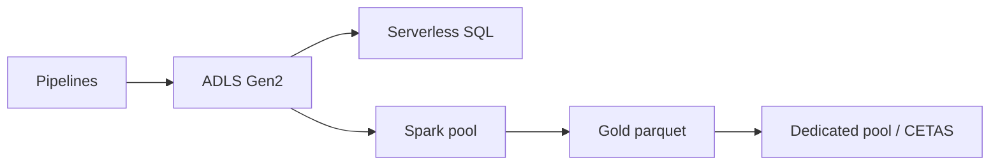

import { ConceptTemplate } from '@/features/kb/components/templates/ConceptTemplate'
import { Callout } from '@/features/kb/components/mdx/Callout'
import { ComparisonTable } from '@/features/kb/components/mdx/ComparisonTable'

export default function Layout({ children }) {
  return (
    <ConceptTemplate title="Azure Synapse Analytics">
      {children}
    </ConceptTemplate>
  )
}

**Synapse** is a workspace: **dedicated SQL pools** (the old SQL DW MPP), **serverless SQL** (T-SQL over files in ADLS), **Spark pools**, and **pipelines** (ADF-shaped). Linked services point at lakes, Cosmos, and on-prem. Microsoft also pushes Microsoft Fabric; Synapse remains in production estates and interviews.

## 1. Deep Dive and Mechanics

**Dedicated SQL pool.** Distributed tables (hash, round-robin, replicate), DWUs, pause/resume. Pause stops compute billing; storage stays. Data lives in the pool unless you export.

**Serverless SQL.** Pay per TB scanned. External tables over parquet/CSV in the lake. A missing partition filter is a credit-card event.

**Spark.** Notebooks and jobs for transforms. Pools have autoscale and idle pause. Keep libraries in a workspace package, not “pip install in a cell” folklore.

**Pipelines and integration runtime.** Copy activity, mapping data flows, and self-hosted IR for on-prem. This is ADF living inside the workspace.

**Security.** Managed VNet, private endpoints, and Entra pass-through. Workspace MSI needs RBAC on the lake (not just a storage key).

<Callout icon="warning" title="Serverless SQL scans what you ask">
`SELECT * FROM openrowset(...)` on an unpartitioned folder will read it all. Partition by date, project columns, and use CETAS for frequent extracts.
</Callout>

## 2. Mathematical / Theoretical Foundation

MPP dedicated pools shard by distribution. A join on a non-distribution column shuffles — the tax that looks like “SQL is slow.” Replicate small dimensions; hash large facts on the join key.

Serverless cost is bytes scanned after format and predicate pushdown. Columnar parquet + partition elimination is the only viable math.

<ComparisonTable
  headers={['Engine', 'Bill', 'Home']}
  rows={[
    ['Dedicated SQL', 'DWU hours', 'Canned warehouse'],
    ['Serverless SQL', 'TB scanned', 'Ad-hoc over the lake'],
    ['Spark', 'vCore hours', 'Transforms, ML prep'],
    ['Fabric / Databricks', 'Capacity / DBU', 'Newer lakehouse bets'],
  ]}
/>

## 3. Real-World Implementation

```sql
SELECT CustomerId, SUM(Amount) AS Revenue
FROM OPENROWSET(
  BULK 'https://stlake.dfs.core.windows.net/gold/sales/dt=*/*.parquet',
  FORMAT = 'PARQUET'
) AS rows
WHERE dt >= '2026-01-01'
GROUP BY CustomerId;
```

Push the date filter so the wildcard does not become a full lake scan. Better: a partitioned external table.

## 4. Visualizations



## 5. Interview Prep

**Q: Dedicated or serverless?**
**A:** Dedicated for predictable, high-concurrency warehouse queries and stored procedures. Serverless for discovery and light BI over files you already have.

**Q: Synapse vs Databricks vs Fabric?**
**A:** Databricks is Spark-native and lakehouse-centric. Synapse is Microsoft’s all-in-one (SQL + Spark + ADF). Fabric is the newer bundled SaaS. Pick based on skills and existing contracts, not a tweet.

**Q: Why pause dedicated pools?**
**A:** DWU bills while running. Nightly ETL can resume, load, serve, pause — if the SLA allows the resume delay.

## 6. Production Use Cases

- Nightly load from ADLS into a dedicated pool for SSRS-style BI.
- Analyst T-SQL over gold parquet without a warehouse.
- Hybrid: Spark cleanses, serverless validates, dedicated serves.

<Callout icon="tip" title="Treat the lake as the system of record">
Dedicated pools that are the only copy of a fact table become a hostage. CETAS or copy back to ADLS so you can kill the pool.
</Callout>
