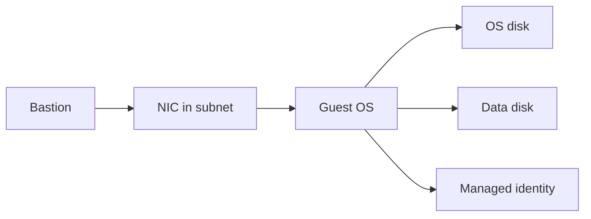

import { ConceptTemplate } from '@/features/kb/components/templates/ConceptTemplate'
import { Callout } from '@/features/kb/components/mdx/Callout'
import { ComparisonTable } from '@/features/kb/components/mdx/ComparisonTable'

export default function Layout({ children }) {
  return (
    <ConceptTemplate title="Azure Virtual Machines">
      {children}
    </ConceptTemplate>
  )
}

An **Azure VM** is a guest OS on Azure’s hypervisor: a **size** (vCPU, RAM, NIC, temp disk), one or more **managed disks**, a **NIC** in a subnet, and optional public IP. You own patching, agents, and the application. Azure owns the host, the fabric, and (if you buy it) the SLA that depends on how you place the VM.

## 1. Deep Dive and Mechanics

**Sizes.** Families: D (general), E (memory), F (CPU), L (storage), N (GPU), H (HPC). Constrained vCPU SKUs exist for licensing. Temp disks are ephemeral — not for data.

**Disks.** OS + data managed disks: Standard HDD/SSD, Premium SSD, Premium SSD v2, Ultra. Caching and bursting differ. Host cache settings on Premium can lie to apps that expected fsync.

**Availability.** Availability Set (fault/update domains, legacy). **Availability Zones** (buildings). **VMSS** (scale sets) for fleets, with flexible orchestration as the modern default. A single VM has a weaker SLA than two VMs in zones behind a load balancer.

**Identity and access.** Managed identity, Entra login (Linux/Windows), and no inbound 22/3389 — use Bastion or SSH certs over a private IP.

**Spot and reservations.** Spot for interruptible batch. Reserved instances / savings plans for steady fleets.

<Callout icon="error" title="A public IP plus 3389 is a scanner magnet">
Disable public IPs on workloads. Bastion in a hub, or JIT plus NSG, or neither if you have Serial Console and an agent. Patch week one.
</Callout>

## 2. Mathematical / Theoretical Foundation

SLA math is placement: one VM < set < zone-redundant pair. Disk IOPS and throughput caps are SKU + disk size (except v2/Ultra, which provision independently). An undersized disk looks like a “slow VM.”

Spot eviction is a hazard rate; expected work completed is (1 − P_evict) × batch. Checkpoint or the job is waste.

<ComparisonTable
  headers={['Placement', 'Failure domain', 'Typical']}
  rows={[
    ['Single VM', 'Host + AZ', 'Labs'],
    ['Availability Set', 'FD / UD', 'Legacy pairs'],
    ['Two+ zonal VMs', 'AZ', 'Pets with an SLA'],
    ['VMSS Flexible', 'Zones + scale', 'Fleets'],
  ]}
/>

## 3. Real-World Implementation

```bash
az vm create -g prod -n vm-app-1 --image Ubuntu2204 \
  --size Standard_D4s_v5 --zone 1 \
  --nsg nsg-app --public-ip-address "" \
  --assign-identity \
  --os-disk-size-gb 64 --storage-sku Premium_LRS
```

Attach a data disk for state. Use cloud-init or an image pipeline (Image Builder / Packer), not SSH snowflakes.

## 4. Visualizations



## 5. Interview Prep

**Q: VM vs App Service vs AKS?**
**A:** VM when you need a custom OS, strange kernel modules, or a vendor installer. PaaS otherwise. AKS when the unit is a container fleet.

**Q: What does the SLA actually require?**
**A:** Read the current compute SLA. Two or more VMs in an availability set or two zones behind a load balancer is the usual bar. One VM is best-effort-ish.

**Q: Premium SSD vs Ultra?**
**A:** Premium for most databases. Ultra (or Premium v2) when you must dial IOPS independently of size. Price follows.

## 6. Production Use Cases

- Lift-and-shift vendor appliances that will not containerize.
- GPU VMs for burst inference with a scale set.
- Domain controllers or other “needs a Windows VM” infrastructure.

<Callout icon="tip" title="Golden images, not apt on Monday">
Build images in a pipeline, version them, and rotate VMSS. Configuration drift on pets is how patch status lies.
</Callout>
