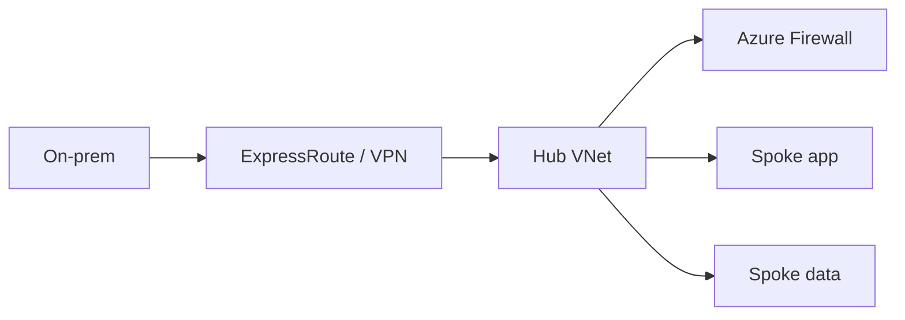

import { ConceptTemplate } from '@/features/kb/components/templates/ConceptTemplate'
import { Callout } from '@/features/kb/components/mdx/Callout'
import { ComparisonTable } from '@/features/kb/components/mdx/ComparisonTable'

export default function Layout({ children }) {
  return (
    <ConceptTemplate title="Azure Virtual Networks">
      {children}
    </ConceptTemplate>
  )
}

A **VNet** is your private IPv4/IPv6 space in one Azure region (plus optional global peering). Subnets carve it. **Peering** joins two VNets (non-transitive by default). **Hub-spoke** puts shared firewalls, DNS, and gateways in a hub and apps in spokes. Overlapping CIDRs cannot peer — the same trap as AWS VPC.

## 1. Deep Dive and Mechanics

**Address space.** One or more prefixes. You can add a prefix later if you left room in the plan. Azure-reserved IPs still apply per subnet.

**Peering.** Regional or global. Gateway transit lets spokes use the hub VPN/ER gateway. UDR plus an NVA or Azure Firewall is how you force inspection (peering alone is a shortcut around the hub).

**DNS.** Azure-provided DNS is fine until private endpoints. Then you need Private DNS zones linked to the VNet (or a custom DNS that forwards to 168.63.129.16).

**Connectivity.** VPN Gateway, ExpressRoute, vWAN. vWAN is the managed hub fabric for many regions and branches.

**Service and private endpoints.** Already covered on the subnet page; they are VNet features. Private Link plus DNS is the modern PaaS pattern.

<Callout icon="error" title="Peering is not transitive">
Spoke A peered to hub and spoke B peered to hub does not mean A talks to B unless you route through an appliance or enable the patterns that do. Accidental any-to-any is also a risk if you mesh-peer everything.
</Callout>

## 2. Mathematical / Theoretical Foundation

A full mesh of n VNets is O(n^2) peerings. Hub-spoke is O(n) peerings plus a routing tax (extra hop). vWAN or Azure Route Server exists when BGP adjacency count becomes a job.

Overlapping CIDRs force NAT or rebuild. IPAM up front is cheaper than a year of NAT rules.

<ComparisonTable
  headers={['Join', 'Transitive', 'Typical']}
  rows={[
    ['VNet peering', 'No', 'Two VNets'],
    ['Hub + firewall', 'Via hub', 'Enterprise spokes'],
    ['vWAN', 'Via vWAN hub', 'Many regions / branches'],
    ['Private Link', 'N/A', 'PaaS without CIDR join'],
  ]}
/>

## 3. Real-World Implementation

```bash
az network vnet create -g net -n vnet-hub --address-prefix 10.0.0.0/16 \
  --subnet-name AzureFirewallSubnet --subnet-prefix 10.0.1.0/26
az network vnet peering create -g net -n spoke1-to-hub \
  --vnet-name vnet-spoke1 --remote-vnet vnet-hub \
  --allow-vnet-access --allow-forwarded-traffic
```

Set UDRs on spoke subnets to `0.0.0.0/0` → firewall if you intend inspection. Pair with the reverse peering.

## 4. Visualizations



## 5. Interview Prep

**Q: VNet vs AWS VPC?**
**A:** Same idea: isolated CIDR, subnets, routing. Azure subnets are regional (not zonal). Azure uses NSGs + ASGs; AWS uses SGs + NACLs. Peering non-transitivity is shared.

**Q: When do you need a hub?**
**A:** Shared DNS, firewall, and hybrid gateway. Two VNets in a lab can just peer.

**Q: What is 168.63.129.16?**
**A:** Azure’s virtual DNS/DHCP/health-probe address. Do not block it in NSGs if you want VMs to function.

## 6. Production Use Cases

- Enterprise landing zone: hub + many subscribed spokes.
- Dual-region: two hubs, global peering or vWAN, careful DNS.
- Isolated sandbox VNet with no peering to prod.

<Callout icon="tip" title="Private DNS zones are part of the VNet design">
A private endpoint without the zone linked is a resource that resolves to a public IP and then fails. Treat zone links as code beside the peering.
</Callout>
