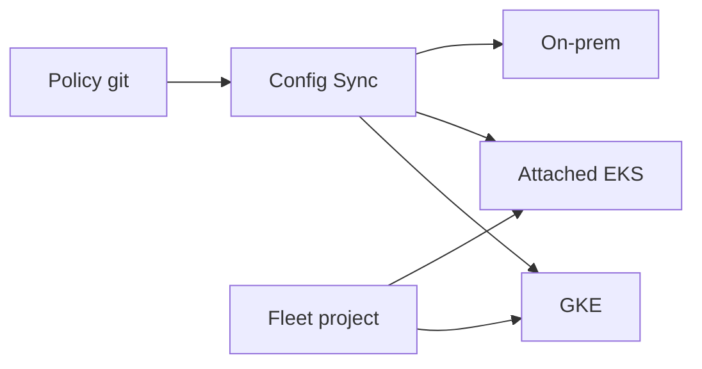

import { ConceptTemplate } from '@/features/kb/components/templates/ConceptTemplate'
import { Callout } from '@/features/kb/components/mdx/Callout'
import { ComparisonTable } from '@/features/kb/components/mdx/ComparisonTable'

export default function Layout({ children }) {
  return (
    <ConceptTemplate title="Google Anthos">
      {children}
    </ConceptTemplate>
  )
}

**Anthos** is Google’s multi-cluster Kubernetes platform: GKE on Google Cloud, GKE attached clusters on AWS/Azure, and Anthos on VMware/bare metal. You buy a subscription and get **fleet** management, **Config Sync** (Git as desired state), **Policy Controller** (OPA Gatekeeper), and optional **Cloud Service Mesh** (Istio-derived). The pitch is one operating model. The cost is complexity you must staff.

## 1. Deep Dive and Mechanics

**Fleets.** Clusters register to a fleet host project. Identity, namespaces, and mesh trust can span the fleet. A cluster that is not registered is just Kubernetes.

**Config Sync.** A Git repo of YAML is reconciled onto clusters (root and namespace repos). Drift is overwritten. This is GitOps with a Google agent.

**Policy Controller.** ConstraintTemplates enforce labels, registries, and ingress rules. Same idea as Gatekeeper on any cluster — here it is licensed and supported as part of the pack.

**Service Mesh.** Sidecars or ambient-style mesh for mTLS and traffic policy across clusters. Certificate and trust-domain setup is the hard part.

**Binary Authorization.** Deploy-time attestation so only signed images run. Useful if you already sign in CI.

<Callout icon="warning" title="Anthos is an operating model, not a checkbox">
Attaching an EKS cluster does not delete the EKS bill or the node upgrade job. You added a fleet control plane. If you only have one GKE cluster, you probably wanted GKE Autopilot, not Anthos.
</Callout>

## 2. Mathematical / Theoretical Foundation

A fleet of n clusters has n upgrade cadences and one policy repo. Config Sync convergence is eventual: Git SHA vs cluster SHA. Conflict (two repos, two agents) is a split-brain you design away.

Mesh identity is a PKI problem: workload identity × trust domain. Mis-aligned domains look like “mTLS is broken.”

<ComparisonTable
  headers={['Need', 'Anthos', 'Simpler bet']}
  rows={[
    ['One GKE cluster', 'Overkill', 'GKE Autopilot'],
    ['GitOps + policy', 'Config Sync + PC', 'Argo CD + Gatekeeper'],
    ['Multi-cloud K8s', 'Attached clusters', 'One cloud, or Crossplane'],
    ['On-prem K8s + Google ops', 'Anthos BM / VMware', 'OpenShift / vanilla'],
  ]}
/>

## 3. Real-World Implementation

```yaml
apiVersion: configsync.gke.io/v1beta1
kind: RootSync
metadata:
  name: root-sync
  namespace: config-management-system
spec:
  git:
    repo: https://git.example.com/fleet-root
    branch: main
    auth: gcpserviceaccount
```

Keep root repos tiny (namespaces, quotas, policies). App charts belong in team repos with RepoSync.

## 4. Visualizations



## 5. Interview Prep

**Q: Anthos vs GKE?**
**A:** GKE is the Google-managed cluster. Anthos is the fleet + hybrid product that includes GKE and more. You can use GKE without Anthos.

**Q: Why Config Sync instead of Argo CD?**
**A:** Support contract, fleet integration, and Google’s opinion. Argo is more common in the wild. Do not run both as roots on the same objects.

**Q: What failed in early Anthos deals?**
**A:** Licensing cost vs “we already run Kubernetes,” plus mesh complexity. Succeeds when a platform team already exists and hybrid is a real requirement.

## 6. Production Use Cases

- Bank with GKE plus on-prem clusters under one policy repo.
- Multi-cloud exit strategy: same mesh and config, different IaaS.
- Guardrails: Policy Controller blocks privileged pods on every registered cluster.

<Callout icon="tip" title="Start with fleet + policy, add mesh last">
mTLS across three clouds is a year. Config Sync and Policy Controller pay off in a month if Git is already law.
</Callout>
