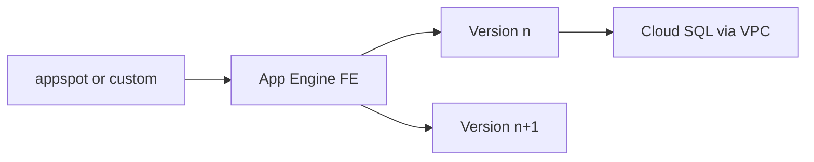

import { ConceptTemplate } from '@/features/kb/components/templates/ConceptTemplate'
import { Callout } from '@/features/kb/components/mdx/Callout'
import { ComparisonTable } from '@/features/kb/components/mdx/ComparisonTable'

export default function Layout({ children }) {
  return (
    <ConceptTemplate title="Google App Engine">
      {children}
    </ConceptTemplate>
  )
}

**App Engine** is Google’s classic PaaS. **Standard** runs your code in a language sandbox (automatic scaling, often scale-to-zero, request-based). **Flexible** runs a container on Compute Engine VMs (more files, background threads, slower scale). Services, versions, and traffic splitting are the deploy model. New greenfield HTTP containers usually pick **Cloud Run** instead.

## 1. Deep Dive and Mechanics

**Services and versions.** An app has services (microservices). Each deploy creates a version. Split traffic 10/90 for canaries. Migrate traffic when warm.

**Standard vs Flexible.** Standard: instance classes, request timeouts, no arbitrary background work on the old runtimes. Flexible: SSH-able VM under you, always-on min instances, Dockerfile.

**app.yaml.** Runtime, handlers, scaling (automatic, basic, manual), inbound services. This file is the contract.

**Identity.** App Engine default service account. Prefer a custom SA with least privilege. Connect to VPC via Serverless VPC Access for Standard.

**Datastore/Memcache history.** App Engine’s original data story was Datastore and Memcache. Modern apps use Firestore, Cloud SQL, or Memorystore explicitly.

<Callout icon="warning" title="Flexible is not Standard">
Teams “just switch to Flexible” for a native lib and inherit VM patching, min instances, and a different bill. If you need a container, Cloud Run is the closer relative.
</Callout>

## 2. Mathematical / Theoretical Foundation

Automatic scaling is a queueing controller on request rate and latency. Min instances truncate cold start at a fixed cost. Standard instance hours plus outgoing bandwidth are the usual bill; Flexible looks like GCE plus a management tax.

Traffic splitting is weighted at the frontend, not sticky unless you enable session affinity (usually a smell).

<ComparisonTable
  headers={['Host', 'Unit', 'Scale to zero']}
  rows={[
    ['App Engine Standard', 'Runtime sandbox', 'Yes'],
    ['App Engine Flexible', 'VM + container', 'No'],
    ['Cloud Run', 'Container revision', 'Yes'],
    ['GKE', 'Pod', 'With extra work'],
  ]}
/>

## 3. Real-World Implementation

```yaml
runtime: python312
service: api
instance_class: F2
automatic_scaling:
  min_instances: 1
  max_instances: 20
handlers:
  - url: /.*
    script: auto
```

Deploy with `gcloud app deploy`. Use `gcloud app services set-traffic` to split versions.

## 4. Visualizations



## 5. Interview Prep

**Q: App Engine vs Cloud Run?**
**A:** Cloud Run is the container-native successor: any binary, faster iteration, clearer billing. App Engine Standard still fits some first-party runtimes and existing apps. Do not start a new Flexible app without a reason.

**Q: What is an App Engine service?**
**A:** A named component with its own versions and scaling. `default` must exist. Split a monolith into services only when you will scale and deploy them separately.

**Q: How do you get a VPC IP?**
**A:** Serverless VPC Access (Standard) or the Flexible VM’s network. Cloud SQL socket/connector is another path for databases.

## 6. Production Use Cases

- Long-lived Standard apps that still scale well and have no Docker story.
- Traffic-split migrations off a monolith service by service.
- Internal tools that already sit on `appspot.com` with IAP.

<Callout icon="tip" title="Turn on min_instances for user-facing Standard">
Cold starts on F1/F2 are real. One warm instance is cheaper than a support thread about “the first request of the day.”
</Callout>
