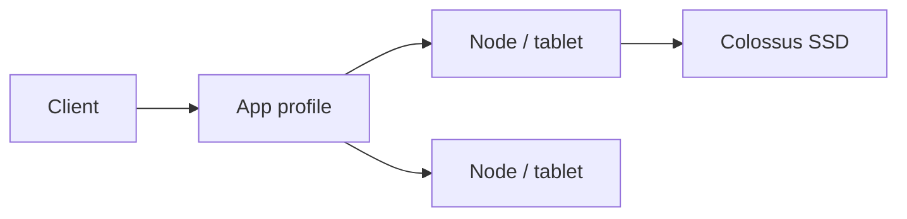

import { ConceptTemplate } from '@/features/kb/components/templates/ConceptTemplate'
import { Callout } from '@/features/kb/components/mdx/Callout'
import { ComparisonTable } from '@/features/kb/components/mdx/ComparisonTable'

export default function Layout({ children }) {
  return (
    <ConceptTemplate title="Google Cloud Bigtable">
      {children}
    </ConceptTemplate>
  )
}

**Bigtable** is a managed wide-column database (the public form of the system that inspired HBase). Data is one **table** per instance, rows keyed by a single string, grouped into **column families**. Storage splits into **tablets** on nodes. You buy nodes (or autoscaling) and SSD/HDD storage. It shines at time-series, IoT, and ad-tech — not at SQL joins.

## 1. Deep Dive and Mechanics

**Row key design.** The only access path is the key or a prefix scan. Reverse timestamps, hash prefixes, and bucket suffixes exist to avoid monotonic keys that hammer one tablet.

**Column families.** Group columns that are read together. Garbage collection rules (max versions, max age) are per family. Too many families is a smell.

**Instances.** Production vs development (the latter is cheaper and weaker). Replication across zones/regions for HA and read locality. App profiles route traffic (single-cluster vs multi-cluster routing).

**HBase API and cbt.** Existing HBase clients often work. The `cbt` tool and the official clients are the supported path.

**CDC and backups.** Change streams export mutations. Backups are table-level restore points.

<Callout icon="error" title="Monotonic row keys">
`timestamp#device` writes every new event to the latest tablet. Invert the timestamp or add a shard prefix. Hot tablets look like “Bigtable is slow” while CPU sits idle on other nodes.
</Callout>

## 2. Mathematical / Theoretical Foundation

A table is range-partitioned by key. Throughput scales with tablet count × node capacity, but only if keys are uniform. Hotspot fraction h means effective capacity ≈ (1 − h) of the cluster for that workload.

Reads of a wide row (millions of cells) become large RPCs. Tall/narrow vs wide design is a latency trade.

<ComparisonTable
  headers={['Store', 'Key', 'Joins']}
  rows={[
    ['Bigtable', 'One row key', 'No'],
    ['Spanner', 'Primary + interleave', 'SQL'],
    ['Firestore', 'Document path', 'Limited queries'],
    ['BigQuery', 'None (scan)', 'SQL warehouse'],
  ]}
/>

## 3. Real-World Implementation

```python
from google.cloud import bigtable

client = bigtable.Client(project="shop", admin=True)
inst = client.instance("iot")
table = inst.table("telemetry")
row = table.direct_row(b"dev42#9223372036854775807")
row.set_cell("m", b"temp", b"21.5")
row.commit()
```

The numeric piece is a reversed timestamp so new writes spread instead of always appending to the max key.

## 4. Visualizations



## 5. Interview Prep

**Q: Bigtable vs Spanner vs Firestore?**
**A:** Bigtable for huge, simple key access and time-series. Spanner for SQL and multi-row transactions at global scale. Firestore for document apps and mobile sync.

**Q: How many nodes?**
**A:** Start from throughput and disk, then add headroom for compaction and node loss. HDD is for large, scan-heavy, latency-tolerant data. SSD for serving.

**Q: What is an app profile?**
**A:** A routing and isolation knob: which cluster handles traffic and whether requests can failover. Separate profiles for batch vs serving so a scan cannot steal the user path.

## 6. Production Use Cases

- IoT telemetry with device-id + inverted time keys.
- Ad click logs with high write QPS and TTL GC.
- Feature store-style wide rows for online serving (with a strict key scheme).

<Callout icon="tip" title="Measure tablet hotness">
The key visualizer and CPU per node tell you if the key design failed. Adding nodes to a hotspot wastes money.
</Callout>
