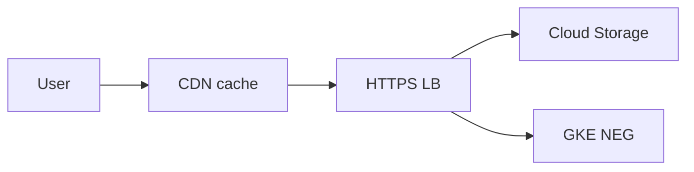

import { ConceptTemplate } from '@/features/kb/components/templates/ConceptTemplate'
import { Callout } from '@/features/kb/components/mdx/Callout'
import { ComparisonTable } from '@/features/kb/components/mdx/ComparisonTable'

export default function Layout({ children }) {
  return (
    <ConceptTemplate title="Google Cloud CDN">
      {children}
    </ConceptTemplate>
  )
}

**Cloud CDN** sits on an external HTTP(S) Application Load Balancer. When enabled on a backend, Google’s edge caches GET/HEAD responses according to cache keys and TTLs. It is a cache, not an origin. Origin is a Cloud Storage bucket, a GCE/GKE NEG, or an internet NEG.

## 1. Deep Dive and Mechanics

**Enablement.** Toggle on the backend service. Cloud Armor, IAP, and CDN can coexist; order of features matters for auth. Do not cache authenticated personalized HTML.

**Cache keys.** Host, path, query string include/exclude. A session id in the key explodes cardinality and misses. A missing query param in the key serves the wrong filtered page.

**TTLs.** Client TTL vs CDN TTL vs default. `Cache-Control: private` and `Set-Cookie` usually bypass. Negative caching (404 TTL) stops a missing asset from slamming origin.

**Signed URLs / cookies.** Time-limited access to private content without making the bucket public. Rotation of the signing key is a production task.

**Invalidation.** Path invalidations are eventual and cost money. Prefer versioned object names (`app.a1b2c3.js`) over purge-as-deploy.

<Callout icon="warning" title="Cache the wrong key, serve the wrong user">
If Authorization or cookie variance is not in the key (or you cache despite private), user A can receive user B’s page. Default to not caching anything with a cookie.
</Callout>

## 2. Mathematical / Theoretical Foundation

Hit ratio h reduces origin GETs to (1 − h). Byte hit ratio can differ from request hit ratio (large videos vs tiny HTML). Invalidation latency is not zero — versioned URLs are the CAP-friendly approach.

Signed URL validity window T is the leak window if the URL leaks.

<ComparisonTable
  headers={['Product', 'Role', 'Origin']}
  rows={[
    ['Cloud CDN', 'Cache on HTTPS LB', 'GCS / GCE / internet'],
    ['Cloud Load Balancing', 'Global anycast L7', 'Your backends'],
    ['Media CDN', 'Video-scale', 'Large objects'],
    ['Cloud Storage cache headers', 'Origin hints', 'Not an edge'],
  ]}
/>

## 3. Real-World Implementation

```bash
gcloud compute backend-services update web-be \
  --enable-cdn \
  --cache-mode CACHE_ALL_STATIC \
  --default-ttl 3600
```

Set objects in GCS to `Cache-Control: public, max-age=31536000, immutable` when the filename is hashed.

## 4. Visualizations



## 5. Interview Prep

**Q: CDN vs Load Balancer?**
**A:** The external HTTPS LB is the anycast entry and health-checked origin router. CDN is an optional cache on that path. You can have LB without CDN.

**Q: How do you cache private content?**
**A:** Signed URLs or signed cookies, short TTL, and an origin that checks the signature. Not a public bucket.

**Q: Cloud CDN vs Cloud Armor?**
**A:** Armor is WAF/DDoS policy. CDN is cache. Use both on the same LB: Armor first in the mental model, then cache.

## 6. Production Use Cases

- Static SPA and hashed assets from GCS behind a global LB.
- Image thumbnails with a long TTL and versioned paths.
- Signed URL downloads for paid media.

<Callout icon="tip" title="Hash the filename">
`main.js` plus purge is how you race a cache. `main.9f3a1.js` plus long TTL is how CDNs are supposed to work.
</Callout>
