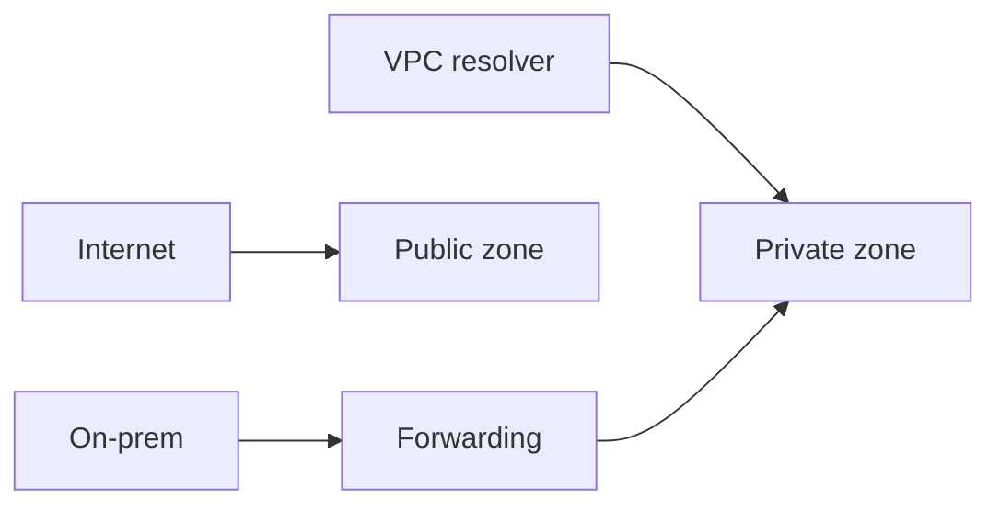

import { ConceptTemplate } from '@/features/kb/components/templates/ConceptTemplate'
import { Callout } from '@/features/kb/components/mdx/Callout'
import { ComparisonTable } from '@/features/kb/components/mdx/ComparisonTable'

export default function Layout({ children }) {
  return (
    <ConceptTemplate title="Google Cloud DNS">
      {children}
    </ConceptTemplate>
  )
}

**Cloud DNS** is Google’s authoritative DNS service. **Public zones** answer on the internet. **Private zones** answer only inside selected VPCs. Record sets are the usual A/AAAA/CNAME/MX/TXT plus routing policies (weighted, geolocation). It is not recursive DNS for the world; VMs still use the metadata resolver (169.254.169.254).

## 1. Deep Dive and Mechanics

**Zones.** A managed zone is a DNS suffix you own (public) or invent (private, e.g. `internal.shop.`). DNSSEC is available on public zones.

**VPC association.** Private zones bind to networks. **DNS peering** lets a consumer VPC query a producer’s private zone. **Inbound/outbound forwarding** talks to on-prem BIND.

**Routing policies.** Weighted round-robin and geo policies at the record set. This is coarse failover — health is not a full HTTP probe like Traffic Director.

**Service Directory and Cloud DNS.** Integrations exist so service names become records. GKE can register services.

**IAM.** Split who can mutate `prod.` vs `dev.`. A TXT record is how people hijack domain verification — lock production zones.

<Callout icon="warning" title="Private zone split-horizon">
The same FQDN in a public zone and a private zone answers differently inside the VPC. That is powerful and a debugging tax. Document which view a laptop VPN sees.
</Callout>

## 2. Mathematical / Theoretical Foundation

DNS TTL is a cache lease. Failover time ≥ TTL + resolver cache. Lower TTL increases QPS on Cloud DNS (and on you when you are the target of a storm).

Authoritative vs recursive: Cloud DNS publishes; clients recurse via Google or their ISP. You cannot “flush the internet.”

<ComparisonTable
  headers={['Zone', 'Who can query', 'Use']}
  rows={[
    ['Public', 'Internet', 'Customer names'],
    ['Private', 'Selected VPCs', 'Internal APIs'],
    ['Peered private', 'Consumer VPCs', 'Shared services'],
    ['Forwarding', 'On-prem or GCP', 'Hybrid names'],
  ]}
/>

## 3. Real-World Implementation

```bash
gcloud dns managed-zones create internal-shop \
  --dns-name=internal.shop. \
  --visibility=private \
  --networks=vpc-prod

gcloud dns record-sets create sql.internal.shop. \
  --zone=internal-shop --type=A --ttl=300 \
  --rrdatas=10.10.2.4
```

Automate record sets in Terraform or a pipeline. Click-ops DNS is how stale IPs survive a migration.

## 4. Visualizations



## 5. Interview Prep

**Q: Cloud DNS vs Cloud Load Balancing?**
**A:** DNS names a VIP. The LB is the VIP and the health-checked hop. DNS failover alone is slow and dumb about HTTP 500s.

**Q: How do hybrid names work?**
**A:** Outbound forwarding from GCP to on-prem for `corp.local`, inbound forwarding so on-prem can resolve `internal.shop`. Overlapping suffixes are pain.

**Q: What is DNS peering?**
**A:** A consumer network is allowed to query a producer’s private zones without copying records. Shared-services host project pattern.

## 6. Production Use Cases

- Public zone for `example.com` with IAM-restricted editors.
- Private zone per environment, peered to app VPCs.
- Weighted records for a coarse blue/green at DNS (know the TTL).

<Callout icon="tip" title="Delegate with NS, do not copy records">
A subdomain (`gcp.example.com`) as its own zone keeps IAM and Terraform scoped. One giant zone file is a merge conflict factory.
</Callout>
