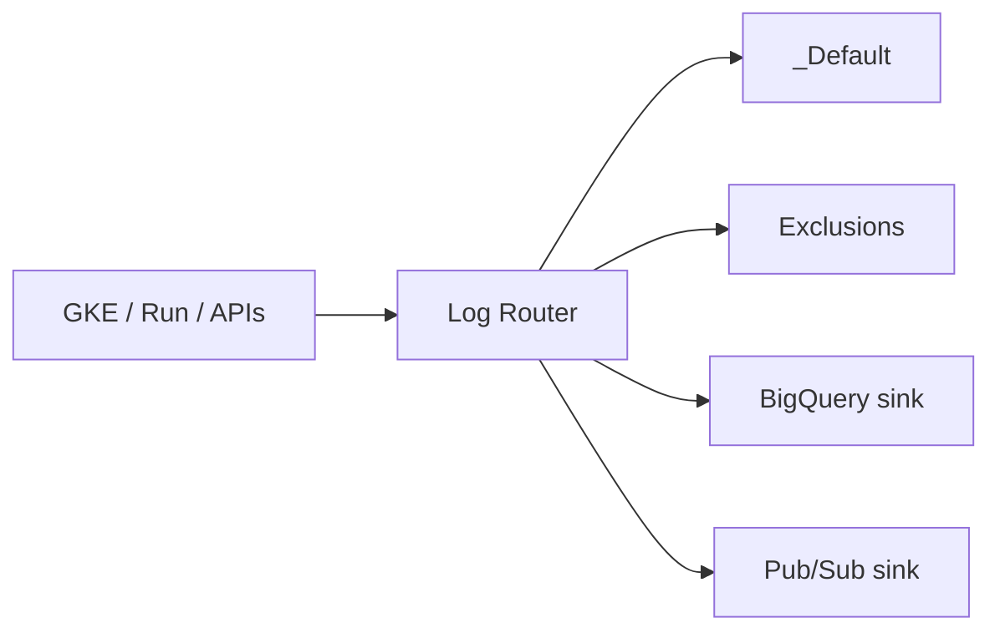

import { ConceptTemplate } from '@/features/kb/components/templates/ConceptTemplate'
import { Callout } from '@/features/kb/components/mdx/Callout'
import { ComparisonTable } from '@/features/kb/components/mdx/ComparisonTable'

export default function Layout({ children }) {
  return (
    <ConceptTemplate title="Google Cloud Logging">
      {children}
    </ConceptTemplate>
  )
}

**Cloud Logging** (formerly Stackdriver Logging) ingests logs from GCP APIs, GCE agents, GKE, and apps (via the logging API or stdout on Cloud Run). The **Log Router** evaluates sinks. Default buckets `_Required` and `_Default` retain platform and general logs. You add sinks to **user-managed buckets**, BigQuery, Pub/Sub, or another project.

## 1. Deep Dive and Mechanics

**Log entries.** Payload (text or JSON), resource type, severity, labels, trace. Structured JSON is how you query fields without regex.

**Sinks and exclusions.** A sink has a filter. Exclusions drop volume before ingest billing. Order: exclusions can keep `_Default` from storing what you already send to a cheap bucket.

**Buckets and views.** Buckets have retention and CMEK. Views restrict who sees which logs (security vs app). Log Analytics (SQL in a bucket) is optional.

**Log-based metrics and alerts.** Counters from filters. Good for “5xx rate.” Bad as a SIEM.

**VPC and audit logs.** Data Access audit logs are huge and off by default. Turn on selectively; they are the only record of who read a bucket.

<Callout icon="warning" title="Data Access logs will dominate the bill">
Enable them on the projects and service types that need forensics, not org-wide on day one. Pair with a sink to a locked project.
</Callout>

## 2. Mathematical / Theoretical Foundation

Ingest cost ≈ bytes after exclusions. A debug logger in a hot loop is O(QPS × line size). Sampling at the app is cheaper than ingest-and-exclude.

Retention is a step function per bucket. `_Default` at 30 days for everything is the expensive default posture.

<ComparisonTable
  headers={['Destination', 'Good for', 'Query']}
  rows={[
    ['_Default bucket', 'Ops, 30-day', 'Logs Explorer'],
    ['User bucket', 'Long retain / CMEK', 'Explorer / Analytics'],
    ['BigQuery sink', 'Warehouse joins', 'SQL'],
    ['Pub/Sub sink', 'SIEM / stream', 'Downstream'],
  ]}
/>

## 3. Real-World Implementation

```bash
gcloud logging sinks create bq-errors \
  bigquery.googleapis.com/projects/shop/datasets/logs \
  --log-filter='severity>=ERROR'
```

Grant the sink’s writer identity permission on the dataset. Add an exclusion on `_Default` for the same filter if you do not want to pay twice.

## 4. Visualizations



## 5. Interview Prep

**Q: What is the Log Router?**
**A:** The filter engine that copies or excludes entries to sinks. It is why “I turned on a sink” does not automatically delete `_Default` storage.

**Q: Audit logs vs application logs?**
**A:** Admin Activity is on and free-ish. Data Access is detailed and costly. App logs are what your process writes. Different IAM and different questions.

**Q: How do you give a team only their logs?**
**A:** Bucket views or a dedicated sink to their project. Project-wide Logging Viewer is too broad in a shared project.

## 6. Production Use Cases

- Org-level aggregated sink to a security project for Admin Activity.
- Error-only BigQuery sink for weekly analysis.
- GKE stdout as JSON with a trace id that Cloud Trace already set.

<Callout icon="tip" title="JSON payload, not printf">
`jsonPayload.httpRequest.status` is filterable. A single text line is a grep tax and a missed alert.
</Callout>
