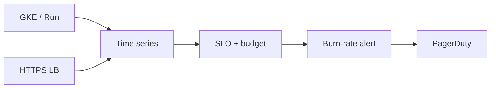

import { ConceptTemplate } from '@/features/kb/components/templates/ConceptTemplate'
import { Callout } from '@/features/kb/components/mdx/Callout'
import { ComparisonTable } from '@/features/kb/components/mdx/ComparisonTable'

export default function Layout({ children }) {
  return (
    <ConceptTemplate title="Google Cloud Monitoring">
      {children}
    </ConceptTemplate>
  )
}

**Cloud Monitoring** (formerly Stackdriver Monitoring) stores time series from GCP, GKE, and custom metrics (OpenTelemetry, Monitoring API). You build **dashboards**, **alerting policies**, **uptime checks**, and **SLOs** (error budgets). It is the metrics half of operations; Cloud Logging is the log half. They join on resource labels and trace ids.

## 1. Deep Dive and Mechanics

**Metrics.** Metric type + resource type + labels = a time series. Cardinality explosions (a label per user id) will hurt. PromQL-ish MQL and PromQL queries exist depending on the UI path.

**Alerting.** Condition + duration + notification channel (email, PagerDuty, Pub/Sub, Slack). Aligners and reducers matter: alerting on raw 1s noise is a flap machine.

**SLOs.** Request-based or windows-based. Burn-rate alerts page when the budget is dying, not when a single 5-minute blip happens.

**Uptime checks.** Synthetic HTTPS from Google regions. They prove the edge is reachable, not that a deep dependency is healthy.

**Managed Service for Prometheus.** PromQL, collectors, and the same backend. GKE often goes this way.

<Callout icon="warning" title="User-id labels">
A custom metric with `user_id` as a label is millions of series. Aggregate in the app. Monitoring is not a warehouse.
</Callout>

## 2. Mathematical / Theoretical Foundation

An SLO of 99.9 percent over 30 days is a budget of 0.1 percent failed (or slow) requests. A 14.4-minute 100 percent outage spends the monthly budget. Burn-rate alerting compares short-window fail rate to that budget.

Alert precision/recall: longer alignment windows raise precision and miss short incidents. Pick based on MTTD vs noise.

<ComparisonTable
  headers={['Tool', 'Question', 'Not for']}
  rows={[
    ['Metrics + SLO', 'Are we burning budget?', 'Full request body'],
    ['Uptime check', 'Is the URL up from a PoP?', 'Deep SQL health'],
    ['Logs', 'Which request failed?', 'Cheap CPU paging'],
    ['Trace', 'Where did time go?', 'Fleet-wide SLO'],
  ]}
/>

## 3. Real-World Implementation

```yaml
displayName: checkout-5xx
conditions:
  - displayName: 5xx ratio
    conditionThreshold:
      filter: 'metric.type="loadbalancing.googleapis.com/https/request_count"'
      comparison: COMPARISON_GT
      thresholdValue: 0.02
      duration: 300s
```

Prefer a ratio of failed/total, not an absolute count that scales with traffic.

## 4. Visualizations



## 5. Interview Prep

**Q: Monitoring vs Logging?**
**A:** Monitoring is numeric series and SLOs. Logging is events. Alert on metrics; diagnose with logs and traces.

**Q: What is an error budget?**
**A:** The allowed unreliability in the SLO window. Features freeze or rollbacks when the budget is gone — if you actually run that process.

**Q: Why did my alert flap?**
**A:** No duration, no aligner, or a threshold in raw units on a bursty metric. Use ratios and 5–15 minute windows for pages.

## 6. Production Use Cases

- LB 5xx and latency SLOs on the customer hostname.
- GKE HPA still uses metrics; pages go to burn-rate, not HPA events.
- Uptime checks from three continents on the marketing site.

<Callout icon="tip" title="Page on symptoms">
Checkout error rate beats “pod CPU > 80 percent.” CPU is a diagnostic chart, not a reason to wake a human at 3 a.m.
</Callout>
