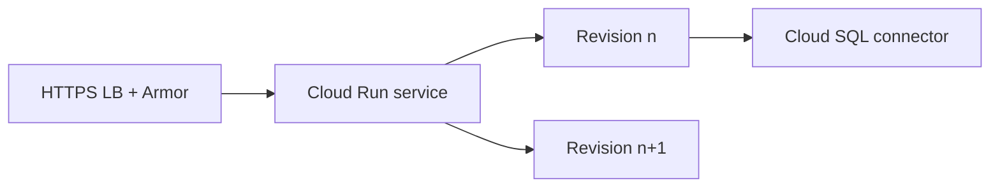

import { ConceptTemplate } from '@/features/kb/components/templates/ConceptTemplate'
import { Callout } from '@/features/kb/components/mdx/Callout'
import { ComparisonTable } from '@/features/kb/components/mdx/ComparisonTable'

export default function Layout({ children }) {
  return (
    <ConceptTemplate title="Google Cloud Run">
      {children}
    </ConceptTemplate>
  )
}

**Cloud Run** runs a container behind an HTTPS endpoint (or internally). Each deploy is a **revision**. The platform scales instances from zero to a max, and each instance can handle many concurrent requests (default 80). You pay when handling requests (or for min instances). **Cloud Run jobs** are run-to-completion. **Cloud Run functions** is the functions experience on the same engine.

## 1. Deep Dive and Mechanics

**Services vs jobs.** Services listen on `$PORT` (8080 by convention). Jobs exit. Do not run a cron loop inside a service instance you hope stays up.

**Concurrency.** One instance × concurrency = request parallelism. CPU-bound work wants low concurrency. I/O-bound can go higher. This is the main knob people leave at default and then wonder about tail latency.

**CPU allocation.** CPU only during request vs always allocated (needed for background threads). Always-allocated costs more.

**Networking.** Direct VPC egress or VPC connector for private IPs. Ingress: all, internal, internal-and-cloud-load-balancing. Put an external HTTPS LB + Armor in front of public apps.

**Identity.** Service account per service. Cloud SQL Auth Proxy / connector is the usual DB path. Secrets from Secret Manager as env or volume.

<Callout icon="warning" title="Scale to zero vs a connection pool">
A SQL instance seeing 100 Cloud Run instances each open 10 connections is 1000 connections after a spike. Limit max instances and pool size, or use a proxy/pgbouncer pattern.
</Callout>

## 2. Mathematical / Theoretical Foundation

Cold start S appears in P99 when min instances is 0 and arrival is sparse. Min instances = 1 buys S away.

Bill ≈ (vCPU-seconds × memory-seconds while serving) + requests. Idle min instances bill continuously.

Concurrency c means instance count ≈ ceil(in-flight / c). Wrong c over-provisions or overloads a single container.

<ComparisonTable
  headers={['Host', 'API', 'Scale to zero']}
  rows={[
    ['Cloud Run', 'Container + HTTP', 'Yes'],
    ['Cloud Functions', 'Entrypoint', 'Yes'],
    ['GKE', 'Kubernetes', 'With add-ons'],
    ['App Engine Flex', 'VM container', 'No'],
  ]}
/>

## 3. Real-World Implementation

```bash
gcloud run deploy api --image=gcr.io/shop/api:1.4.2 \
  --service-account=api@shop.iam.gserviceaccount.com \
  --concurrency=20 --min-instances=1 --max-instances=50 \
  --ingress=internal-and-cloud-load-balancing \
  --region=us-central1
```

Pin the SA and ingress. Let the global HTTPS LB be the public edge.

## 4. Visualizations



## 5. Interview Prep

**Q: Cloud Run vs GKE?**
**A:** Run when the unit is a stateless container and you do not want nodes. GKE when you need DaemonSets, sidecars-as-platform, or custom scheduling.

**Q: What is a revision?**
**A:** An immutable deploy (image + env + knobs). Traffic can split between revisions. Rollback is “route 100 percent to the last good revision.”

**Q: Why is my instance count huge?**
**A:** Concurrency too low, or a slow downstream holding requests, or a health check that never returns. Check request latency first.

## 6. Production Use Cases

- Public API: global LB → Cloud Run with min 1.
- Eventarc-triggered workers (same engine as Functions gen 2).
- Nightly Cloud Run jobs for ETL without an always-on pod.

<Callout icon="tip" title="One service account per service">
Shared default compute SA means every Run service can pull every secret. Split SAs the day you have two services.
</Callout>
