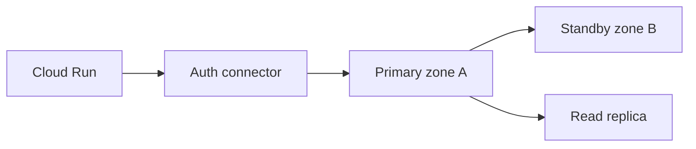

import { ConceptTemplate } from '@/features/kb/components/templates/ConceptTemplate'
import { Callout } from '@/features/kb/components/mdx/Callout'
import { ComparisonTable } from '@/features/kb/components/mdx/ComparisonTable'

export default function Layout({ children }) {
  return (
    <ConceptTemplate title="Google Cloud SQL">
      {children}
    </ConceptTemplate>
  )
}

**Cloud SQL** is Google’s hosted relational instances. You pick engine, tier (shared or dedicated vCPU), storage (SSD, optional increase), and HA (regional primary + standby). **Private IP** in a VPC is the default for apps. The Cloud SQL Auth Proxy / connector handles IAM auth and encryption without opening 5432 to the world.

## 1. Deep Dive and Mechanics

**HA.** A regional instance has a standby in another zone. Failover is automatic; you still get a brief outage. Read replicas (same or cross-region) are for read scale and DR, not for zero-RPO writes.

**Backups and PITR.** Automated backups plus transaction logs for point-in-time. Test restore. On-demand backups before risky migrations.

**Connectivity.** Private IP + private services access (or Private Service Connect). Public IP only with authorized networks is the old pattern. Auth Proxy from Cloud Run/GKE is table stakes.

**Maintenance.** A window you pick. HA reduces the pain; it does not eliminate it. Pin a major version; test upgrades on a clone.

**Flags and extensions.** Postgres extensions are a allow-list. Superuser is not yours in the MySQL/Postgres sense — `cloudsqlsuperuser` is close.

<Callout icon="error" title="Connection storms from serverless">
Cloud Run and Functions can open more connections than `max_connections`. Use the connector, a pooler, and max instances. The instance will otherwise refuse connections and look “down.”
</Callout>

## 2. Mathematical / Theoretical Foundation

HA RPO for sync replication is ~0 for acknowledged commits; failover RTO is minutes. Replica lag is asynchronous — read-your-writes needs the primary or session sticky.

Storage IOPS scale with size (and SSD). A tiny disk under a large vCPU tier is a self-inflicted bottleneck.

<ComparisonTable
  headers={['Need', 'Cloud SQL', 'Elsewhere']}
  rows={[
    ['Managed MySQL/PG', 'Yes', 'AlloyDB for PG-scale'],
    ['Global SQL', 'No', 'Spanner'],
    ['Serverless PG', 'No', 'AlloyDB Omni / others'],
    ['You want the VM', 'No', 'Compute Engine'],
  ]}
/>

## 3. Real-World Implementation

```bash
gcloud sql instances create shop-pg \
  --database-version=POSTGRES_16 \
  --tier=db-custom-4-16384 \
  --availability-type=REGIONAL \
  --network=projects/shop/global/networks/vpc-prod \
  --no-assign-ip
```

Apps use the connector with a service account that has `cloudsql.client`. Rotate passwords out of existence if you can use IAM login.

## 4. Visualizations



## 5. Interview Prep

**Q: Cloud SQL vs AlloyDB vs Spanner?**
**A:** Cloud SQL is vanilla managed engines. AlloyDB is Google’s PostgreSQL-compatible, more performance/HA features, higher floor price. Spanner is a different global SQL system, not a lift of your stored procedures.

**Q: Private IP vs Auth Proxy?**
**A:** Private IP is routing. The proxy/connector is auth + TLS + IAM. You usually want both: private path and connector.

**Q: How do you clone for a migration test?**
**A:** Clone instance (or PITR clone) into a sandbox, run the migration, measure. Do not discover a 4-hour rewrite on the primary.

## 6. Production Use Cases

- Regional HA Postgres for a Cloud Run API.
- Cross-region replica as a DR target you can promote (with a runbook).
- SQL Server when a vendor requires it and will not move.

<Callout icon="tip" title="Enable query insights before the incident">
Query Insights and slow query logs are how you find the missing index. Turning them on during an outage is late.
</Callout>
