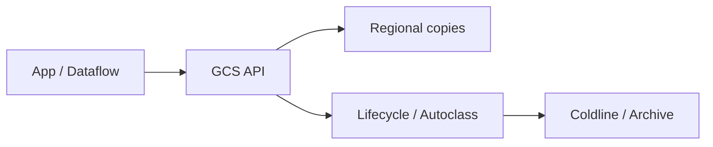

import { ConceptTemplate } from '@/features/kb/components/templates/ConceptTemplate'
import { Callout } from '@/features/kb/components/mdx/Callout'
import { ComparisonTable } from '@/features/kb/components/mdx/ComparisonTable'

export default function Layout({ children }) {
  return (
    <ConceptTemplate title="Google Cloud Storage">
      {children}
    </ConceptTemplate>
  )
}

**Cloud Storage (GCS)** is an object store. Bucket names are globally unique. Objects live under prefixes. Location is regional, dual-region, or multi-region. Classes (Standard, Nearline, Coldline, Archive) trade price for retrieval. Uniform bucket-level access plus IAM is the modern permission model; ACLs are legacy.

## 1. Deep Dive and Mechanics

**Consistency.** Strong consistency for overwrite and list in normal cases. Compose, rewrite, and generation numbers support safe concurrency (`ifGenerationMatch`).

**Autoclass and lifecycle.** Autoclass moves objects between classes from observed access. Lifecycle deletes or archives by age. Early-delete charges apply to cold classes.

**Access.** IAM on the bucket (or project). Signed URLs for browsers. Public access prevention should be on unless the bucket is a true public asset. HMAC keys are the S3-compatible path.

**HNS-like.** Hierarchical namespace (folders) is available for some lake/HPC cases; default is flat keys with `/` as a character.

**Transfer.** Storage Transfer Service, Transfer Appliance, and `gcloud storage` / `gcsfuse` for POSIX-ish mounts (with POSIX lies).

<Callout icon="error" title="Public buckets">
Public Access Prevention at the org plus uniform access would have prevented most “open GCS” headlines. `allUsers` on an object is still a thing if you allow it.
</Callout>

## 2. Mathematical / Theoretical Foundation

Durability is multi-copy within the location constraint. Multi-region is not a backup against `rm -r`. Versioning is.

Cost ≈ storage class × bytes + operations + retrieval + egress. Small-object PUT storms die on operation charges. Dual-region is a turbo-replication product with a price.

<ComparisonTable
  headers={['Class', 'Access', 'Min duration']}
  rows={[
    ['Standard', 'Hot', 'None'],
    ['Nearline', 'Monthly-ish', '30 days'],
    ['Coldline', 'Quarterly-ish', '90 days'],
    ['Archive', 'Yearly', '365 days'],
  ]}
/>

## 3. Real-World Implementation

```python
from google.cloud import storage

client = storage.Client()
bucket = client.bucket("shop-gold-us")
blob = bucket.blob("sales/dt=2026-09-06/part.parquet")
blob.upload_from_filename("part.parquet", if_generation_match=0)
```

`if_generation_match=0` creates only if absent — a cheap lock for a job output path.

## 4. Visualizations



## 5. Interview Prep

**Q: Regional vs multi-region?**
**A:** Regional for compute in one region (cheaper egress to that compute). Multi-region or dual-region for broader read locality and some extra durability story. Data residency may forbid multi-region.

**Q: GCS vs BigQuery storage?**
**A:** GCS is objects. BigQuery is a managed Capacitor table. BigLake / external tables can query GCS; a warehouse table is still a different lifecycle.

**Q: How do you sync to AWS?**
**A:** Storage Transfer Service or a job you own. There is no magic multi-cloud bucket.

## 6. Production Use Cases

- Data lake landing zone with lifecycle to Nearline.
- Static site or assets behind Cloud CDN (hashed names).
- Versioned artifacts with object hold for compliance.

<Callout icon="tip" title="Uniform bucket-level access">
Turn it on at create. Mixing ACLs and IAM is how a single object stays public after you “fixed the bucket.”
</Callout>
