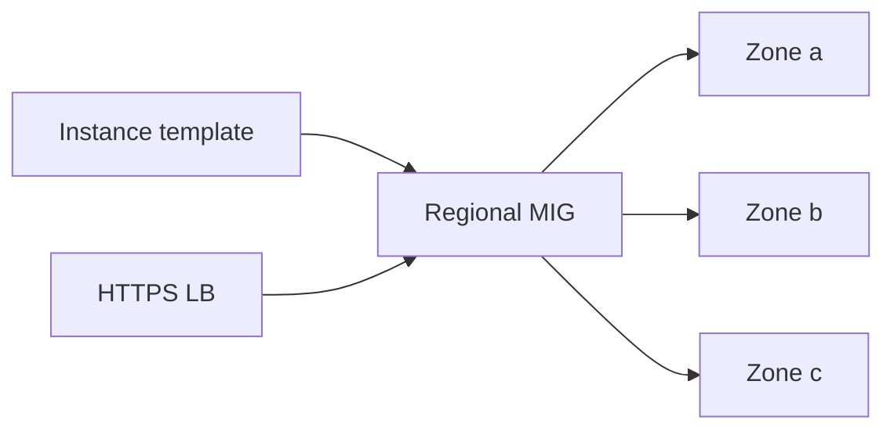

import { ConceptTemplate } from '@/features/kb/components/templates/ConceptTemplate'
import { Callout } from '@/features/kb/components/mdx/Callout'
import { ComparisonTable } from '@/features/kb/components/mdx/ComparisonTable'

export default function Layout({ children }) {
  return (
    <ConceptTemplate title="Compute Engine">
      {children}
    </ConceptTemplate>
  )
}

**Compute Engine (GCE)** is GCP’s IaaS VM. You pick a **machine family** (E2, N2, C3, M3, A3/GPU, …), optional **custom machine type**, boot and data **Persistent Disks** (or Hyperdisk), a VPC NIC, and placement (zone). **Managed Instance Groups (MIGs)** give autoscaling, autohealing, and rolling updates. Sole-tenant nodes exist for licensing and isolation.

## 1. Deep Dive and Mechanics

**Live migration.** Most VMs migrate off a host for maintenance instead of reboot. GPU and some spot/preemptible shapes do not. The SLA still wants more than one VM for availability.

**Disks.** pd-balanced / pd-ssd / Hyperdisk. Snapshots are incremental. Regional PDs attach to VMs in two zones for HA (with limits). The boot disk is not a backup.

**MIGs.** Regional MIGs spread across zones. Instance templates are immutable; a new template + rolling update is how you patch. Stateful MIGs keep disks across recreate.

**Spot / preemptible.** Cheap, evictable. Use for batch with checkpointing. A MIG can mix standard and spot with a target ratio.

**OS and identity.** OS Login (or OS Login + IAP) beats leftover SSH keys in project metadata. The metadata server issues tokens for the instance SA — do not use the default compute SA for prod.

<Callout icon="error" title="Project-wide SSH keys">
Metadata SSH keys apply to every VM that allows them. OS Login plus IAP TCP forwarding is the replacement. Public IPs on GCE are optional and usually wrong.
</Callout>

## 2. Mathematical / Theoretical Foundation

Custom machine types let you pick vCPU and RAM in a ratio band — useful when a stock SKU wastes RAM. Preemptible eviction is a hazard rate; expected completed work needs checkpoint interval ≪ mean lifetime.

Regional MIG capacity is sum of zonal quota. A single-zone stockout fails scale-out if the MIG is zonal.

<ComparisonTable
  headers={['Shape', 'Use', 'Notes']}
  rows={[
    ['E2', 'General, cheap', 'Shared-core options'],
    ['N2 / C3', 'Balanced / compute', 'Live migrate'],
    ['M3', 'Memory', 'In-memory DBs'],
    ['A3 / G2', 'GPU', 'No live migrate'],
  ]}
/>

## 3. Real-World Implementation

```bash
gcloud compute instance-templates create api-v12 \
  --machine-type=e2-standard-4 \
  --image-family=cos-stable --image-project=cos-cloud \
  --service-account=api@shop.iam.gserviceaccount.com \
  --no-address --tags=api

gcloud compute instance-groups managed create api-mig \
  --template=api-v12 --size=3 --region=us-central1
```

Put an HTTP health check on the MIG and a backend service on the HTTPS LB.

## 4. Visualizations



## 5. Interview Prep

**Q: GCE vs Cloud Run vs GKE?**
**A:** GCE when you need a VM (vendor software, custom kernel, GPU you manage). Cloud Run for stateless containers. GKE for Kubernetes.

**Q: What is a MIG?**
**A:** A controller that keeps N instances from a template healthy and can autoscale. It is the GCE analogue of an ASG / VMSS.

**Q: Live migrate vs terminate?**
**A:** Most standard VMs live-migrate for host maintenance. Preemptible and some GPU terminate. Design batch for terminate; design services for multi-zone MIGs.

## 6. Production Use Cases

- Regional MIG behind a global HTTPS LB.
- GPU training VMs with spot + checkpoint to GCS.
- Lift of a vendor appliance that ships a disk image.

<Callout icon="tip" title="COS or a golden image">
Container-Optimized OS plus a container is a lighter VM story than patching Ubuntu by hand. If you need Ubuntu, bake images with Packer and rotate the MIG.
</Callout>
