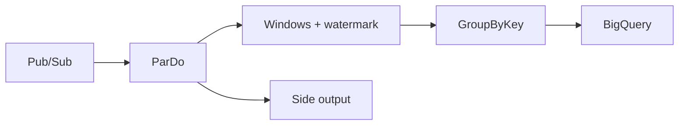

import { ConceptTemplate } from '@/features/kb/components/templates/ConceptTemplate'
import { Callout } from '@/features/kb/components/mdx/Callout'
import { ComparisonTable } from '@/features/kb/components/mdx/ComparisonTable'

export default function Layout({ children }) {
  return (
    <ConceptTemplate title="Google Cloud Dataflow">
      {children}
    </ConceptTemplate>
  )
}

**Dataflow** is Google’s fully managed **Apache Beam** runner. You write a pipeline once (Java, Python, Go) and run it as batch or streaming. Workers autoscale. Shuffle, streaming engine, and snapshots are service features. The same Beam program can run on Flink or Spark elsewhere — in GCP, Dataflow is the native execution.

## 1. Deep Dive and Mechanics

**Beam model.** PCollections, ParDo, GroupByKey, windowing, triggers, watermarks. Event time vs processing time is the streaming core. Late data is a watermark problem, not a bug in `GroupByKey`.

**Runner v2 / streaming engine.** Shuffle and state move off workers so autoscaling is less painful. Enable the recommended flags on new jobs.

**Templates.** Flex templates package a container you launch with parameters — the production way to let others start jobs without your Gradle env.

**SQL and notebooks.** Beam SQL and Dataflow Prime (vertical + horizontal autoscaling, right-fitting) exist. Prime is a SKU/feature set; read current docs for what your region supports.

**Dead letter.** Unprocessable elements should go to a side output (GCS or Pub/Sub), not crash the job.

<Callout icon="warning" title="Hot keys in GroupByKey">
One key with 5 percent of events becomes one worker’s nightmare. Fan-out with a shard suffix or pre-aggregate. Dataflow cannot invent a better key than you gave it.
</Callout>

## 2. Mathematical / Theoretical Foundation

Watermark W(t) is an estimate that no event with event-time less than W will arrive. Triggers fire panes; allowed lateness keeps state. Too much lateness is a memory bill.

Autoscaling is a feedback loop on backlog and CPU. A downstream sink with a tiny quota will look like “Dataflow is slow” while workers wait.

<ComparisonTable
  headers={['Runner', 'Ops', 'Portable Beam']}
  rows={[
    ['Dataflow', 'Fully managed', 'Yes'],
    ['Flink (GKE)', 'You run Flink', 'Yes'],
    ['Spark (Dataproc)', 'You run Spark', 'Via Beam Spark'],
    ['Dataform / SQL ETL', 'SQL graph', 'No'],
  ]}
/>

## 3. Real-World Implementation

```python
import apache_beam as beam
from apache_beam.options.pipeline_options import PipelineOptions

opts = PipelineOptions(["--runner=DataflowRunner", "--project=shop", "--region=us-central1"])
with beam.Pipeline(options=opts) as p:
    (
        p
        | beam.io.ReadFromPubSub(topic="projects/shop/topics/clicks")
        | beam.WindowInto(beam.window.FixedWindows(60))
        | beam.CombinePerKey(sum)
        | beam.io.WriteToBigQuery("shop.analytics.clicks_1m")
    )
```

Set a dead-letter side output on the BigQuery write for schema misses.

## 4. Visualizations



## 5. Interview Prep

**Q: Dataflow vs Dataproc?**
**A:** Dataflow is Beam-as-a-service (batch and stream). Dataproc is managed Hadoop/Spark clusters. If your code is Spark already, Dataproc (or Serverless Spark). If you want one model for stream+batch, Beam + Dataflow.

**Q: What is a watermark?**
**A:** The runner’s belief about event-time progress. Windows close as the watermark passes. Slow watermarks delay results; fast watermarks drop late data (unless you allow lateness).

**Q: Why Flex templates?**
**A:** Reproducible launch from Cloud Console or a scheduler without rebuilding the graph on a laptop. Parameters stay data, not code.

## 6. Production Use Cases

- Streaming click → minute aggregates in BigQuery.
- Nightly GCS → transform → BigQuery batch job.
- CDC from Datastream into Beam for custom joins.

<Callout icon="tip" title="Test with DirectRunner">
Unit-test DoFns and a tiny pipeline with the direct runner. Discovering a non-deterministic DoFn on a 200-worker job is expensive.
</Callout>
