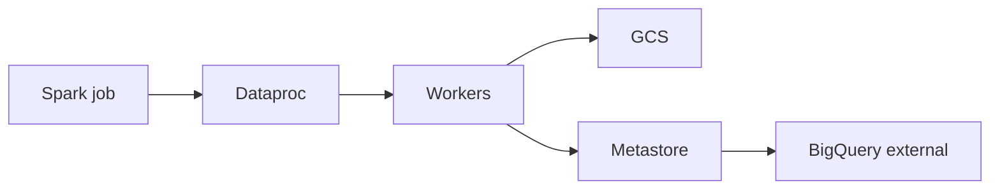

import { ConceptTemplate } from '@/features/kb/components/templates/ConceptTemplate'
import { Callout } from '@/features/kb/components/mdx/Callout'
import { ComparisonTable } from '@/features/kb/components/mdx/ComparisonTable'

export default function Layout({ children }) {
  return (
    <ConceptTemplate title="Google Cloud Dataproc">
      {children}
    </ConceptTemplate>
  )
}

**Dataproc** is GCP’s managed Spark/Hadoop/Flink (and friends) service. Classic mode: a **cluster** of GCE VMs with autoscaling and idle delete. **Dataproc Serverless** runs Spark batches/sessions without a cluster you size. A **Dataproc Metastore** (managed Hive metastore) shares tables with BigQuery and Spark. HDFS is usually replaced by GCS.

## 1. Deep Dive and Mechanics

**Ephemeral clusters.** Create, run a job, delete. Persistent HDFS on the cluster is how people lose data. Checkpoint and tables go to GCS.

**Images and optional components.** Pin an image version (Spark 3.x, etc.). Optional components add Jupyter, Ranger, Solr. Each is more to patch.

**Autoscaling vs Serverless.** Cluster autoscaling adds workers on YARN pending memory. Serverless Spark hides the cluster; you set batch resource knobs. Long-lived notebooks often still want a cluster or a serverless session.

**Initialization actions.** Startup scripts. They make clusters snowflakes. Prefer custom images.

**IAM and isolation.** Component gateway, Kerberos optional. Network: private cluster in your VPC. The default open-to-the-world cluster is a finding.

<Callout icon="warning" title="HDFS on an ephemeral cluster">
If the cluster dies, HDFS dies. `gs://` paths for input, output, and checkpoints. Treat local HDFS as scratch only.
</Callout>

## 2. Mathematical / Theoretical Foundation

Spark jobs are a DAG of stages; skew and shuffle dominate runtime. Adding workers helps if the job is parallel. A single hot key does not care about your autoscaling policy.

Cluster cost is VM-seconds plus idle time. Idle delete timers exist because humans forget `dataproc clusters delete`.

<ComparisonTable
  headers={['Mode', 'You manage', 'Fit']}
  rows={[
    ['Ephemeral cluster', 'Image + size + delete', 'Scheduled Spark'],
    ['Long-lived cluster', 'Same + users', 'Interactive, costly'],
    ['Serverless Spark', 'Batch spec', 'Jobs without YARN'],
    ['Dataflow', 'Beam graph', 'Not Spark-native'],
  ]}
/>

## 3. Real-World Implementation

```bash
gcloud dataproc jobs submit spark \
  --serverless \
  --region=us-central1 \
  --jar=gs://shop-art/etl.jar \
  -- \
  --in=gs://shop-bronze/dt=2026-09-06 \
  --out=gs://shop-gold/sales
```

Or submit to a named cluster if you still need Hive-on-YARN. Pin `--version` / image on clusters.

## 4. Visualizations



## 5. Interview Prep

**Q: Dataproc vs Dataflow vs BigQuery?**
**A:** Dataproc if the code is Spark/Hadoop. Dataflow if the code is Beam. BigQuery if it can be SQL on tables. Moving Spark SQL to BigQuery is often a win; not every RDD is SQL.

**Q: Why Serverless Spark?**
**A:** No cluster idle bill, no image babysitting. Limits and cold start exist. Heavy custom init still wants a cluster image.

**Q: How do you share tables with BigQuery?**
**A:** Metastore + BigLake or external tables on the same GCS. Agree on a warehouse database name so two engines do not invent two truths.

## 6. Production Use Cases

- Nightly Spark ETL from bronze to gold on Serverless.
- Lift of an on-prem Hadoop job with minimal rewrite (then shrink HDFS).
- Interactive Spark for a data science team on a sized cluster with idle delete.

<Callout icon="tip" title="Idle delete is a feature">
A 20-worker cluster left over a weekend is the Dataproc rite of passage. Scheduled delete plus budgets on the project.
</Callout>
