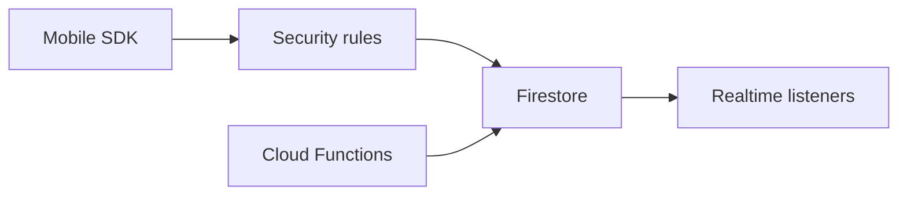

import { ConceptTemplate } from '@/features/kb/components/templates/ConceptTemplate'
import { Callout } from '@/features/kb/components/mdx/Callout'
import { ComparisonTable } from '@/features/kb/components/mdx/ComparisonTable'

export default function Layout({ children }) {
  return (
    <ConceptTemplate title="Google Cloud Firestore">
      {children}
    </ConceptTemplate>
  )
}

**Firestore** is a managed document store. **Native mode** is collections of documents, realtime snapshots, and mobile/web SDKs with security rules. **Datastore mode** is the App Engine Datastore API (kinds, ancestors) without those mobile features. You pick the mode at database create. Queries only use indexes you defined (or the automatic ones).

## 1. Deep Dive and Mechanics

**Documents and collections.** A document is a JSON-like map with a path `users/u1/orders/o9`. Subcollections do not blow the parent size limit. Document size is capped (1 MiB class).

**Queries.** Equality and range on indexed fields, with inequality limits. Composite indexes are required for many multi-field sorts. An unindexed query fails closed, which is a gift.

**Realtime and offline.** Listeners push diffs to clients. Security rules run on the server for mobile clients. This is why Firestore shows up in mobile architectures.

**Transactions and batches.** Optimistic transactions retry. Writes in a transaction must stay in a bounded entity group / document set. Not a multi-table SQL transaction.

**Locations.** Regional or multi-region. Multi-region costs more and helps HA. Standard vs Enterprise edition (current SKU names) changes limits and features — check the live SKU list.

<Callout icon="warning" title="Datastore mode vs Native">
You cannot flip a production database from Datastore mode to Native. Mobile realtime needs Native. A Datastore lift from App Engine should stay in Datastore mode unless you migrate.
</Callout>

## 2. Mathematical / Theoretical Foundation

Billing is reads + writes + deletes + storage + egress. A chatty listener on a hot document is a read generator. Fan-out “write a copy per subscriber” is a write amplifier of N.

Query cost is documents scanned/returned, not “SQL optimizer magic.” Pagination with cursors beats huge offsets.

<ComparisonTable
  headers={['DB', 'Model', 'Mobile realtime']}
  rows={[
    ['Firestore Native', 'Documents', 'Yes'],
    ['Firestore Datastore mode', 'Entities', 'No'],
    ['Cloud SQL', 'Relational', 'No'],
    ['Bigtable', 'Wide-column', 'No'],
  ]}
/>

## 3. Real-World Implementation

```javascript
import { getFirestore, doc, setDoc } from "firebase/firestore";

const db = getFirestore();
await setDoc(doc(db, "users", uid, "orders", orderId), {
  total: 42,
  status: "placed",
});
```

Security rules must check `request.auth.uid == uid`. A client that can write arbitrary paths is the database.

## 4. Visualizations



## 5. Interview Prep

**Q: Firestore vs Realtime Database?**
**A:** Realtime Database is the older JSON tree. Firestore is document + query + better scale story. New apps pick Firestore unless they are stuck on RTDB.

**Q: Why did my query need an index?**
**A:** Composite filters/sorts require a composite index. The error link creates it. Plan indexes in Terraform so prod is not click-ops.

**Q: Can I join collections?**
**A:** Not as SQL. Denormalize, or join in the client/function. That is the document-model contract.

## 6. Production Use Cases

- Mobile app state with offline cache and security rules.
- User profiles and presence-like documents with listeners.
- Cloud Functions on document create for email/side effects.

<Callout icon="tip" title="Count in aggregates, not in a counter document everyone writes">
A single `stats/global` document is a hotspot. Use distributed counters or BigQuery for analytics counts.
</Callout>
