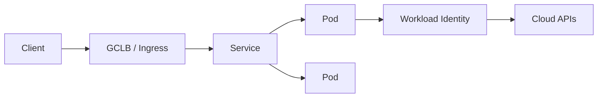

import { ConceptTemplate } from '@/features/kb/components/templates/ConceptTemplate'
import { Callout } from '@/features/kb/components/mdx/Callout'
import { ComparisonTable } from '@/features/kb/components/mdx/ComparisonTable'

export default function Layout({ children }) {
  return (
    <ConceptTemplate title="Google Kubernetes Engine (GKE)">
      {children}
    </ConceptTemplate>
  )
}

**GKE** is Google's managed Kubernetes. You get a control plane Google patches and a data plane you either run as **node pools** (Standard) or hand to Google (**Autopilot**). Pods get VPC-native IPs via alias ranges. Identity for workloads is **Workload Identity**, not a JSON key file in a Secret.

## 1. Deep Dive and Mechanics

**Modes.** Standard: you pick machine types, taints, and autoscaler min/max. Autopilot: you submit Deployments; Google sizes nodes and bills at the pod-request grain. Autopilot rejects some hostPath and privileged patterns on purpose.

**Networking.** VPC-native (alias IPs) is the default. Each pod is a routable VPC address. A VM outside the cluster can reach a pod without a second overlay. Dataplane V2 (eBPF) replaces kube-proxy for NetworkPolicy at scale.

**Identity.** Bind a Kubernetes ServiceAccount to a Google service account. The metadata server mints tokens. Node SA should be nearly empty; the workload SA holds the real roles.

**Lifecycle.** Release channels (Rapid, Regular, Stable) plus maintenance windows. Cluster autoscaler adds nodes; HPA/VPA change pod replicas and requests. They solve different equations.

<Callout icon="warning" title="Autopilot is not Standard with extra glue">
If you need DaemonSets that touch the node kernel, custom CNI, or GPU scheduling you fully own, stay on Standard. Autopilot trades those knobs for a smaller ops surface.
</Callout>

## 2. Mathematical / Theoretical Foundation

Scheduling is bin-packing under resource requests. Waste is `sum(requests) - used`. Autopilot prices the request, so over-request is a bill. Under-request is an OOMKill.

Availability: a regional cluster runs a multi-zone control plane and spreads nodes. A zonal cluster is cheaper and dies with that zone.

<ComparisonTable
  headers={['Mode', 'You manage', 'Bill grain']}
  rows={[
    ['Standard', 'Node pools + cluster', 'VMs + control plane'],
    ['Autopilot', 'Workloads + policy', 'Pod requests'],
    ['EKS', 'Nodes or Fargate + addons', 'Control plane + compute'],
    ['AKS', 'Node pools + addons', 'VMs + control plane'],
  ]}
/>

## 3. Real-World Implementation

```yaml
apiVersion: apps/v1
kind: Deployment
metadata:
  name: api
spec:
  replicas: 3
  selector:
    matchLabels:
      app: api
  template:
    metadata:
      labels:
        app: api
    spec:
      serviceAccountName: api-ksa
      containers:
        - name: api
          image: us-docker.pkg.dev/proj/api:1.4
          resources:
            requests:
              cpu: "250m"
              memory: "512Mi"
            limits:
              memory: "512Mi"
```

Bind `api-ksa` to a Google SA with least-privilege roles. Never mount a service-account JSON.

## 4. Visualizations



## 5. Interview Prep

**Q: Autopilot vs Standard?**
**A:** Autopilot if you want Kubernetes API without node babysitting and can live with its security constraints. Standard if you need node-level control, special hardware, or cheaper bin-packing you tune yourself.

**Q: Why VPC-native?**
**A:** Pods are first-class VPC IPs. Firewall and Private Service Connect rules apply without a second NAT hop. It is the GKE default for a reason.

**Q: How do pods call GCP APIs safely?**
**A:** Workload Identity. Node SA stays locked down. Keys in Secrets are a finding.

## 6. Production Use Cases

- Multi-service HTTP APIs with Ingress, HPA on CPU or custom metrics, and regional clusters.
- Batch / GPU training jobs on Standard node pools with taints.
- Shared platform clusters using namespaces, NetworkPolicy, and Binary Authorization.

<Callout icon="tip" title="Requests are the contract">
Set requests to what the process needs at p95, not the limit copypasta. Autopilot and the cluster autoscaler both plan from requests, not from hope.
</Callout>
