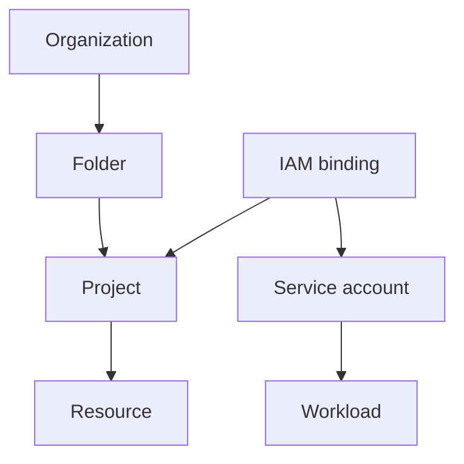

import { ConceptTemplate } from '@/features/kb/components/templates/ConceptTemplate'
import { Callout } from '@/features/kb/components/mdx/Callout'
import { ComparisonTable } from '@/features/kb/components/mdx/ComparisonTable'

export default function Layout({ children }) {
  return (
    <ConceptTemplate title="Google Cloud IAM">
      {children}
    </ConceptTemplate>
  )
}

**GCP IAM** answers three questions: who (member), what (role), where (resource). A **binding** attaches a role to members on a resource. Inheritance walks **Organization to Folder to Project to resource**. Deny policies and IAM Conditions add exceptions without rewriting every role.

## 1. Deep Dive and Mechanics

**Members.** Users, groups, domains, service accounts, and principals from Workforce or Workload Identity Federation. Prefer groups over individual emails so joiners and leavers are an IdP change.

**Roles.** Basic (Owner, Editor, Viewer) are too wide for prod. Predefined roles are the default. Custom roles are a allowlist of permissions you own forever.

**Service accounts.** Identities for code. A VM or Cloud Function **attaches** a SA; it does not store a key. Workload Identity Federation lets GitHub or AWS assume a SA without a downloaded JSON.

**Conditions.** CEL expressions on time, resource name, or source IP. Use them for break-glass and environment splits, not as a substitute for a tight role.

<Callout icon="error" title="User-managed SA keys">
A JSON key that left a laptop is a standing credential. Disable key creation with org policy. Use federation or attached SAs.
</Callout>

## 2. Mathematical / Theoretical Foundation

Effective permission is union of bindings on the resource and all ancestors, minus deny. That is why a Folder-level Editor is a blast radius, not a convenience.

Least privilege is a set-cover problem: smallest role set that still lets the job complete. Custom roles reduce extra permissions but increase maintenance when Google adds APIs.

<ComparisonTable
  headers={['Piece', 'GCP', 'AWS analog']}
  rows={[
    ['Identity for code', 'Service account', 'IAM role'],
    ['Policy unit', 'Role binding', 'Identity policy + resource policy'],
    ['Hierarchy', 'Org / folder / project', 'Org / OU / account'],
    ['No-key CI', 'Workload Identity Federation', 'OIDC to IAM role'],
  ]}
/>

## 3. Real-World Implementation

```bash
gcloud projects add-iam-policy-binding PROJECT_ID \
  --member="serviceAccount:api@PROJECT_ID.iam.gserviceaccount.com" \
  --role="roles/cloudsql.client"

gcloud iam service-accounts add-iam-policy-binding \
  api@PROJECT_ID.iam.gserviceaccount.com \
  --member="serviceAccount:PROJECT_ID.svc.id.goog[prod/api-ksa]" \
  --role="roles/iam.workloadIdentityUser"
```

The first line is what the app can do. The second is who may impersonate that SA. Both are required.

## 4. Visualizations



## 5. Interview Prep

**Q: How is GCP IAM simpler than AWS IAM?**
**A:** You usually bind a predefined role on a project or resource instead of writing a JSON action list per identity. AWS is more flexible and more verbose. Interviews want both facts.

**Q: Editor vs a predefined role?**
**A:** Editor is almost everything in the project. A predefined role is a named permission set. Prod bindings should be predefined or custom, never Editor.

**Q: What is impersonation?**
**A:** Principal A is allowed to mint tokens as SA B. CI and break-glass use this. Audit logs show the impersonator and the SA.

## 6. Production Use Cases

- Folder-level Viewer for a business unit, project-level tighter roles for on-call.
- GKE Workload Identity so pods never hold keys.
- GitHub Actions federating to a deploy SA with a Condition on the repo.

<Callout icon="tip" title="Treat groups as the only human members">
Bind roles to Google Groups. People move. Groups stay. Direct user bindings rot and never get reviewed.
</Callout>
