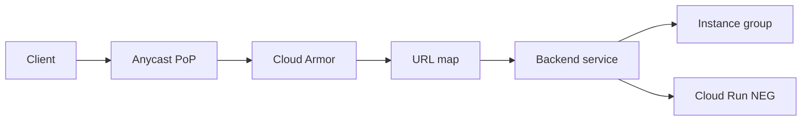

import { ConceptTemplate } from '@/features/kb/components/templates/ConceptTemplate'
import { Callout } from '@/features/kb/components/mdx/Callout'
import { ComparisonTable } from '@/features/kb/components/mdx/ComparisonTable'

export default function Layout({ children }) {
  return (
    <ConceptTemplate title="Google Cloud Load Balancing">
      {children}
    </ConceptTemplate>
  )
}

**Cloud Load Balancing** is Google's Andromeda-fronted proxy and passthrough fabric. A **global external HTTP(S)** balancer gives one anycast IP, terminates TLS at the edge, and picks a backend service by URL map. Regional and internal balancers exist when you need a single region or RFC1918 VIPs.

## 1. Deep Dive and Mechanics

**Proxy vs passthrough.** Application and proxy Network LBs terminate or proxy connections. External passthrough Network LB preserves client IP and is closer to a VIP plus Maglev. Choose by whether you need HTTP routing or source-IP fidelity.

**Backends.** Instance groups, zonal/internet NEGs, serverless NEGs (Cloud Run, App Engine, Cloud Functions), and Private Service Connect NEGs. Health checks are Google-origin probes; firewall them or backends look dead.

**Edge features.** Cloud CDN caches on the same HTTP(S) LB. Cloud Armor attaches WAF and rate-limit rules to the backend service. SSL policies pin TLS versions.

**Internal.** Internal HTTP(S) and regional internal passthrough serve VPC clients. Cross-region internal HTTP(S) is the newer global-private option.

<Callout icon="warning" title="Health-check source ranges">
If your firewall drops Google health checkers, the LB marks every instance unhealthy and serves 502s. Allow the documented ranges on the health-check port.
</Callout>

## 2. Mathematical / Theoretical Foundation

Anycast: the same VIP is announced from many PoPs. The internet's BGP decision is "closest announcement," not a DNS TTL. Failover is withdraw or drain, not a 60-second resolver cache.

Capacity: proxy LBs scale with Google's edge, not with a pre-warmed fleet of balancer VMs. You still have backend quotas, connection limits, and CDN cache-hit ratio as the real capacity knobs.

<ComparisonTable
  headers={['Type', 'Scope', 'Layer']}
  rows={[
    ['Global external HTTP(S)', 'Worldwide anycast', 'L7 proxy'],
    ['Regional external HTTP(S)', 'One region', 'L7 proxy'],
    ['External passthrough', 'Region / zonal', 'L4 VIP'],
    ['Internal HTTP(S)', 'VPC', 'L7 proxy'],
  ]}
/>

## 3. Real-World Implementation

```hcl
resource "google_compute_global_address" "vip" {
  name = "web-vip"
}

resource "google_compute_backend_service" "web" {
  name                  = "web"
  protocol              = "HTTP"
  load_balancing_scheme = "EXTERNAL_MANAGED"
  health_checks         = [google_compute_health_check.web.id]
  backend {
    group = google_compute_instance_group.web.self_link
  }
}
```

URL maps and target HTTPS proxies sit in front of this backend service. Terraform the whole chain; a console-only URL map is how environments drift.

## 4. Visualizations



## 5. Interview Prep

**Q: Why one IP for many regions?**
**A:** Anycast plus Google's backbone. Users hit the nearest PoP; the LB picks a healthy backend. AWS often combines Route 53, CloudFront, and regional ALBs for the same story.

**Q: Proxy vs passthrough?**
**A:** Proxy if you need HTTP routing, TLS offload, CDN, Armor. Passthrough if the app must see the real client IP and own the TCP stack.

**Q: Do I pre-warm?**
**A:** Not the Google frontend. You still load-test backends, connection draining, and CDN fill.

## 6. Production Use Cases

- Global HTTPS for a multi-region GCE or GKE frontend with Cloud CDN.
- Serverless NEG to Cloud Run so one VIP fronts many services.
- Internal HTTP(S) for east-west mesh entry without exposing a public IP.

<Callout icon="tip" title="Drain before you delete">
Connection draining on the backend service lets in-flight requests finish. Instantly removing an instance group is a user-visible 502 generator.
</Callout>
