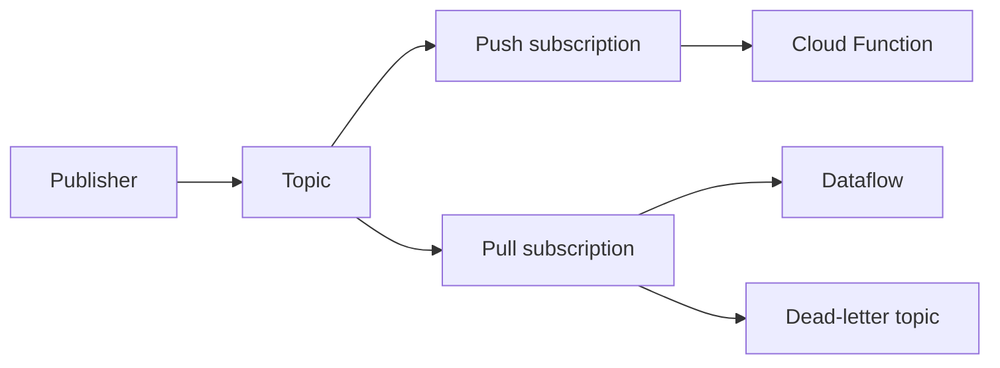

import { ConceptTemplate } from '@/features/kb/components/templates/ConceptTemplate'
import { Callout } from '@/features/kb/components/mdx/Callout'
import { ComparisonTable } from '@/features/kb/components/mdx/ComparisonTable'

export default function Layout({ children }) {
  return (
    <ConceptTemplate title="Google Cloud Pub/Sub">
      {children}
    </ConceptTemplate>
  )
}

**Pub/Sub** is a managed messaging bus. Producers publish to a **topic**. Each **subscription** gets its own copy of the stream. Pull consumers lease messages until they **ack**. Push subscriptions HTTP POST to an endpoint. Lite is a cheaper zonal variant with different durability math.

## 1. Deep Dive and Mechanics

**Fan-out.** One topic, N subscriptions, N independent progress cursors. A slow analytics subscriber does not block the paging subscriber.

**Delivery.** Default is at-least-once. Unacked messages redeliver after the ack deadline. Exactly-once delivery is an opt-in on the subscription with stricter APIs and regional limits. Ordering keys serialize messages that share a key; they also create hot keys if you pick a low-cardinality field.

**Retention and seek.** Topics retain for a configured window. Seek rewinds a subscription to a time or snapshot. Dead-letter topics catch poison messages after max delivery attempts.

**Filters.** Subscription filters drop unmatched messages server-side so you do not pay to pull junk. Schema and SMTs (where enabled) catch bad producers early.

<Callout icon="warning" title="Idempotency is not optional">
Redelivery is normal. A payment handler that charges on every delivery is a duplicate-charge bug. Dedup on message id plus your own event id.
</Callout>

## 2. Mathematical / Theoretical Foundation

Ack deadline is a lease. Too short: redelivery while still working. Too long: poison sits invisible. Exponential backoff on nack is a retry policy, not a fairness guarantee.

Throughput per ordering key is bounded. Global topic throughput is high; a single key is a queue. That is the same hotspot math as a sharded log.

<ComparisonTable
  headers={['Need', 'Pub/Sub', 'Elsewhere']}
  rows={[
    ['Fan-out + queue', 'Topic + subscriptions', 'SNS + SQS'],
    ['Replay', 'Seek / snapshot', 'Kafka consumer offset'],
    ['Cheap zonal', 'Pub/Sub Lite', 'MSK / self-managed'],
    ['Exactly-once', 'Opt-in subscription', 'Transactional outbox'],
  ]}
/>

## 3. Real-World Implementation

```javascript
const { PubSub } = require("@google-cloud/pubsub");
const pubsub = new PubSub();

await pubsub.topic("orders").publishMessage({
  json: { orderId: "o-9", total: 42 },
  orderingKey: "customer-17",
});

const sub = pubsub.subscription("orders-fulfillment");
sub.on("message", async (msg) => {
  await fulfill(msg.json);
  msg.ack();
});
```

Ack only after side effects succeed. On failure, nack or let the lease expire.

## 4. Visualizations



## 5. Interview Prep

**Q: SNS vs SQS vs Pub/Sub?**
**A:** Pub/Sub is both fan-out (many subscriptions) and a durable queue (unacked pull). AWS splits that into SNS and SQS. Same design: one produce path, independent consumers.

**Q: When do you use ordering keys?**
**A:** Per-entity FIFO (one user, one device). Never use a constant key or you serialize the world.

**Q: Push or pull?**
**A:** Push for serverless endpoints with IAM auth. Pull for workers that control concurrency and batching.

## 6. Production Use Cases

- Order events: fulfillment pull, analytics Dataflow, audit log — three subscriptions.
- IoT ingest at global scale with filters per device type.
- Event-driven Cloud Functions on push subscriptions with OIDC audience checks.

<Callout icon="tip" title="Create the subscription before the traffic">
Messages published with zero subscriptions are dropped. Provision topics and subscriptions in the same Terraform apply.
</Callout>
