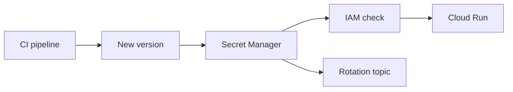

import { ConceptTemplate } from '@/features/kb/components/templates/ConceptTemplate'
import { Callout } from '@/features/kb/components/mdx/Callout'
import { ComparisonTable } from '@/features/kb/components/mdx/ComparisonTable'

export default function Layout({ children }) {
  return (
    <ConceptTemplate title="Google Secret Manager">
      {children}
    </ConceptTemplate>
  )
}

**Secret Manager** stores small secret blobs (API keys, DB passwords, service tokens) as **versions**. Access is IAM on the secret resource, usually `secretmanager.secretAccessor`. Cloud Run, GKE, and Functions can mount or fetch the latest version without baking it into the image.

## 1. Deep Dive and Mechanics

**Versions.** Each add creates a new immutable version. Pin a version in prod if you need rollback; `latest` is convenient and can surprise you mid-deploy. Destroying a version is a separate act from disabling it.

**Replication.** Automatic (Google picks) or user-managed locations. User-managed is for residency. Replication is not a substitute for "never log the payload."

**Encryption.** Google-managed keys by default. CMEK via Cloud KMS when the compliance story requires you to hold the wrapping key. KMS encrypts; Secret Manager stores and versions.

**Rotation.** Rotation topics and Cloud Functions can mint a new version and notify consumers. Consumers that cache forever will miss the rotation.

<Callout icon="error" title="Secrets in Terraform state">
A `google_secret_manager_secret_version` with a plaintext value in config writes the secret to state. Inject at apply from a private store, or use a write-only pattern your pipeline already trusts.
</Callout>

## 2. Mathematical / Theoretical Foundation

Access cost is per secret access operation. A chatty sidecar that fetches on every request is a QPS and latency tax. Cache with a short TTL and refresh on version change.

Least privilege is per secret, not "Accessor on the project." Project-wide Accessor is equivalent to a shared password file.

<ComparisonTable
  headers={['Store', 'What it is', 'Use for']}
  rows={[
    ['Secret Manager', 'Versioned payload + IAM', 'Passwords, API keys'],
    ['Cloud KMS', 'Key encrypt / decrypt / sign', 'Wrapping keys, CMEK'],
    ['Parameter-style config', 'Non-secret settings', 'Feature flags, URLs'],
    ['Workload Identity', 'Short-lived tokens', 'GCP API auth'],
  ]}
/>

## 3. Real-World Implementation

```python
from google.cloud import secretmanager

client = secretmanager.SecretManagerServiceClient()
name = "projects/PROJECT/secrets/db-pass/versions/latest"
payload = client.access_secret_version(name=name).payload.data.decode("utf-8")
```

Grant `roles/secretmanager.secretAccessor` on that secret to the runtime SA only. Admin roles belong to the pipeline that rotates.

## 4. Visualizations



## 5. Interview Prep

**Q: Secret Manager vs KMS?**
**A:** KMS holds keys and performs crypto. Secret Manager holds the secret bytes and versions them. Use CMEK if you must wrap those bytes with a key you control.

**Q: Why versions?**
**A:** Instant rollback and staged rollout. Flip consumers from version 4 to 5 after the DB password change succeeds.

**Q: Can I put a 20 MB cert chain here?**
**A:** Secret size is capped. Large material belongs in a CMEK-encrypted bucket with tight IAM, or in a proper cert store.

## 6. Production Use Cases

- Cloud Run `--set-secrets` mounts for database URLs.
- GKE CSI driver so pods never see a Secret object in etcd if you choose that path.
- Automated rotation of third-party API keys with a Pub/Sub topic.

<Callout icon="tip" title="Prefer identity over long-lived secrets">
If the peer is a GCP API, use a service account and ADC. Secret Manager is for secrets you cannot replace with IAM.
</Callout>
