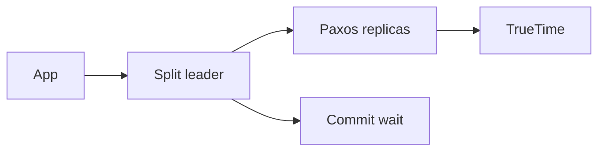

import { ConceptTemplate } from '@/features/kb/components/templates/ConceptTemplate'
import { Callout } from '@/features/kb/components/mdx/Callout'
import { ComparisonTable } from '@/features/kb/components/mdx/ComparisonTable'

export default function Layout({ children }) {
  return (
    <ConceptTemplate title="Google Cloud Spanner">
      {children}
    </ConceptTemplate>
  )
}

**Spanner** is a distributed relational database. You write SQL and get **external consistency** across splits and, if you pay for it, across regions. The trick is **TrueTime** (bounded clock uncertainty) plus Paxos per split — not a single-primary failover story like Cloud SQL.

## 1. Deep Dive and Mechanics

**Splits.** Rows live in key-range splits that move as size and load change. The primary key is the sharding plan. A monotonic `INT64` id dumps writes onto one split.

**Interleaving.** Child tables can be interleaved in a parent so related rows colocate. That is the physical join hint. Secondary indexes are separate tables and can create their own hotspots.

**Transactions.** Read-write transactions take locks; commit waits for TrueTime. Read-only and stale reads (`exact staleness`) avoid much of that wait. Secondary indexes and JOIN still have to respect the commit timestamp.

**Configs.** Regional (one region, replicas in zones) vs multi-region (witness and read replicas). Multi-region lowers RPO/RTO and raises commit latency and price.

<Callout icon="warning" title="Hotspot keys">
`timestamp` or `AUTO_INCREMENT`-shaped keys serialize inserts onto the newest split. Hash or UUID (bit-reversed) the leading key, or use a well-known swap of high bits.
</Callout>

## 2. Mathematical / Theoretical Foundation

TrueTime returns an interval `[earliest, latest]`. Commit wait until `latest` is in the past makes commit timestamps comparable worldwide. That is how Spanner claims external consistency without a global mutex.

CAP: Spanner chooses consistency and partition handling via quorum. On a partition you lose availability for the minority, not silent divergence.

<ComparisonTable
  headers={['DB', 'Consistency', 'Scale story']}
  rows={[
    ['Spanner', 'External', 'Splits + TrueTime'],
    ['Cloud SQL', 'Primary failover', 'Vertical + read replicas'],
    ['Firestore', 'Per-doc / tx group', 'Documents'],
    ['Bigtable', 'Row', 'Wide-column tablets'],
  ]}
/>

## 3. Real-World Implementation

```sql
CREATE TABLE Users (
  UserId STRING(36) NOT NULL,
  Email STRING(256) NOT NULL,
) PRIMARY KEY (UserId);

CREATE TABLE Orders (
  UserId STRING(36) NOT NULL,
  OrderId STRING(36) NOT NULL,
  Amount NUMERIC NOT NULL,
) PRIMARY KEY (UserId, OrderId),
  INTERLEAVE IN PARENT Users ON DELETE CASCADE;
```

Queries that start with `UserId` stay local. Queries that filter only `Amount` will scan or need a secondary index you designed.

## 4. Visualizations



## 5. Interview Prep

**Q: How does Spanner do global ACID?**
**A:** Per-split Paxos plus TrueTime commit wait so timestamps are comparable. Interviews expect TrueTime by name.

**Q: Spanner vs Cloud SQL?**
**A:** Cloud SQL is a managed engine (Postgres/MySQL) with a primary. Spanner is a different engine built to shard. Do not pick Spanner for a 10 GB CRUD app.

**Q: What is interleaved?**
**A:** Physical colocation of child rows with the parent key prefix. It is schema-as-partitioning, not a cosmetic FK.

## 6. Production Use Cases

- Global inventory or ledger where a stale replica read is a business bug.
- Multi-region user directory with interleaved child tables for sessions.
- Financial posting with tight transactions and auditable commit order.

<Callout icon="tip" title="Measure commit latency per config">
A multi-region config that looks "free HA" on a slide can add tens of milliseconds per write. Budget it before you migrate the checkout path.
</Callout>
