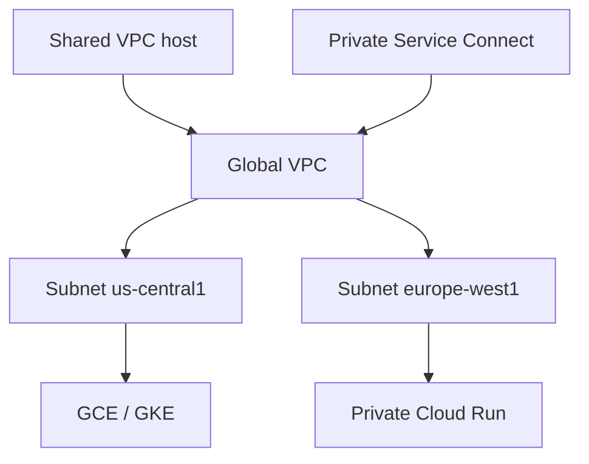

import { ConceptTemplate } from '@/features/kb/components/templates/ConceptTemplate'
import { Callout } from '@/features/kb/components/mdx/Callout'
import { ComparisonTable } from '@/features/kb/components/mdx/ComparisonTable'

export default function Layout({ children }) {
  return (
    <ConceptTemplate title="Google Virtual Private Cloud (VPC)">
      {children}
    </ConceptTemplate>
  )
}

A **GCP VPC** is a global software-defined network. **Subnets are regional** (and can span zones in that region). VMs in `us-central1` and `europe-west1` in the same VPC talk over Google's backbone using private IPs — no VPN between those subnets unless you want one.

## 1. Deep Dive and Mechanics

**Addressing.** You create subnets with primary CIDRs and optional secondary ranges (GKE alias IPs, alias services). Expanding a subnet is possible if the adjacent space is free; shrinking is not a casual op.

**Firewalls.** VPC firewall rules are stateful and project-scoped (plus hierarchical rules at folder/org). Direction, protocol, and tags or service accounts select targets. Implied deny ingress / allow egress exist; do not rely on folklore — read the implied rules.

**Sharing.** Shared VPC: a host project owns the network; service projects attach. VPC Network Peering is non-transitive. **Private Service Connect** publishes and consumes services without peering spaghetti.

**Egress.** Cloud NAT for private VMs. Cloud Router plus HA VPN or Interconnect for hybrid. Private Google Access lets private VMs reach Google APIs without a public IP.

<Callout icon="warning" title="Peering is not transitive">
A peers B, B peers C does not give A a path to C. Hub-and-spoke needs a network virtual appliance, NCC, or PSC — not hope.
</Callout>

## 2. Mathematical / Theoretical Foundation

A global VPC removes the "one VPC per region" tax AWS historically taught. Your blast radius is also global: a bad firewall rule or a wide 0.0.0.0/0 egress applies everywhere that rule matches.

IP planning is a packing problem. GKE secondary ranges are large. Exhaustion shows up as "cannot schedule pods," not as a friendly IPAM ticket.

<ComparisonTable
  headers={['Concept', 'GCP', 'AWS']}
  rows={[
    ['VPC scope', 'Global', 'Regional'],
    ['Subnet scope', 'Regional', 'AZ'],
    ['Private Google APIs', 'Private Google Access / PSC', 'VPC endpoints / PrivateLink'],
    ['Share network', 'Shared VPC', 'RAM / shared subnets'],
  ]}
/>

## 3. Real-World Implementation

```bash
gcloud compute networks create corp --subnet-mode=custom

gcloud compute networks subnets create us-app \
  --network=corp --region=us-central1 --range=10.1.0.0/20 \
  --secondary-range=pods=10.8.0.0/16,services=10.9.0.0/20

gcloud compute firewall-rules create allow-hc \
  --network=corp --allow=tcp:8080 \
  --source-ranges=130.211.0.0/22,35.191.0.0/16
```

Custom mode only. Auto-mode subnets in every region look convenient and wreck IPAM.

## 4. Visualizations



## 5. Interview Prep

**Q: What is special about a GCP VPC?**
**A:** It is global. Subnets are regional. Cross-region private traffic stays on Google's network. AWS VPCs are regional; you connect them.

**Q: Shared VPC vs peering?**
**A:** Shared VPC is one network, many projects, central firewall and IPAM. Peering joins two VPCs and is non-transitive. Use Shared VPC for a company hub.

**Q: How do private GKE nodes reach googleapis.com?**
**A:** Private Google Access or PSC to the restricted/private VIP. Do not give every node a public IP for that.

## 6. Production Use Cases

- Host project Shared VPC with service projects per team.
- GKE alias ranges planned so clusters can grow without a rebuild.
- Hybrid: HA VPN or Interconnect plus Cloud Router advertisements.

<Callout icon="tip" title="Firewall on service accounts, not only tags">
Network tags are mutable and easy to copy. Service-account-based firewall rules track the identity you already use for IAM.
</Callout>
