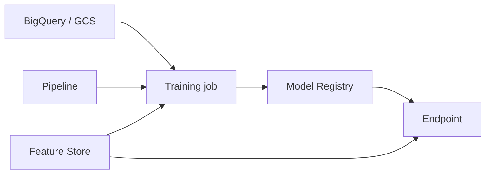

import { ConceptTemplate } from '@/features/kb/components/templates/ConceptTemplate'
import { Callout } from '@/features/kb/components/mdx/Callout'
import { ComparisonTable } from '@/features/kb/components/mdx/ComparisonTable'

export default function Layout({ children }) {
  return (
    <ConceptTemplate title="Google Vertex AI">
      {children}
    </ConceptTemplate>
  )
}

**Vertex AI** is Google Cloud's ML platform. Custom training and AutoML land in a **Model Registry**. **Endpoints** serve with traffic split. **Pipelines** (Kubeflow-shaped) version the DAG. Generative models (Gemini and partners in Model Garden) share the same project IAM, VPC-SC, and audit logs as the rest of GCP.

## 1. Deep Dive and Mechanics

**Training.** Custom jobs run a container on a chosen machine/GPU. You pass a GCS or BigQuery data path and a service account. Preemptible / Spot cuts cost and raises retry math.

**Serving.** Online endpoints autoscale replicas. Batch prediction is a job, cheaper for offline scores. Traffic split lets you canary a new model id without a new URL.

**Features and eval.** Feature Store (or BigQuery as the feature table) stops training/serving skew if you actually use it. Evaluation, model monitoring, and explanation attach to deployed models; they are not automatic just because you clicked Deploy.

**GenAI.** Vertex AI Studio and the Gemini APIs add grounding, safety filters, and provisioned throughput. Treat prompts and system instructions as artifacts you version, same as model ids.

<Callout icon="warning" title="Training-serving skew">
A notebook that engineers features the endpoint never computes will look brilliant in offline AUC and fail in prod. Same code path or Feature Store, not two Python files.
</Callout>

## 2. Mathematical / Theoretical Foundation

Endpoint cost is replica-hours plus tokens or request units for foundation models. Idle GPUs are the classic waste. Batch jobs should not sit on an always-on endpoint.

Pipelines are DAGs: cache hits skip steps when inputs hash equal. That is incremental compute, not a correctness proof if your data has no snapshot id.

<ComparisonTable
  headers={['Platform', 'Strength', 'Default trap']}
  rows={[
    ['Vertex AI', 'GCP data + Gemini + IAM', 'Leaving notebooks as prod'],
    ['SageMaker', 'AWS gravity / breadth', 'Many product names'],
    ['Azure ML', 'Azure DevOps / Fabric', 'Workspace sprawl'],
    ['DIY K8s', 'Full control', 'You own the on-call'],
  ]}
/>

## 3. Real-World Implementation

```python
from google.cloud import aiplatform

aiplatform.init(project="proj", location="us-central1")
endpoint = aiplatform.Endpoint("projects/proj/locations/us-central1/endpoints/123")
pred = endpoint.predict(instances=[{"token_count": 12, "device": "ios"}])
```

The runtime SA needs `aiplatform.endpoints.predict`. The training SA needs data read plus artifact write. Do not reuse Owner.

## 4. Visualizations



## 5. Interview Prep

**Q: Vertex vs training on GKE?**
**A:** Vertex if you want jobs, registry, endpoints, and audit as products. GKE if the team already runs a training operator and needs exotic scheduling. Many shops do both: Vertex for serving, GKE for research.

**Q: How do you canary a model?**
**A:** Deploy a second model to the same endpoint and split traffic 10/90. Watch error rate and a business metric, then flip.

**Q: Where do prompts live?**
**A:** In a versioned store (repo or Vertex prompt management), not in a chat history. Prompt plus model id is the release.

## 6. Production Use Cases

- Tabular credit-risk model: BigQuery features, custom training, endpoint with monitoring.
- RAG over GCS + Vertex embeddings + Gemini with VPC-SC.
- Nightly batch scoring of the full customer table without an online GPU fleet.

<Callout icon="tip" title="Pin model and machine type in code">
"Latest Gemini" is not a release. Pin versions so an upstream change is a deploy you chose.
</Callout>
