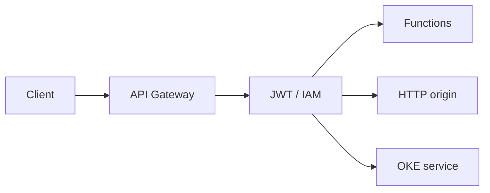

import { ConceptTemplate } from '@/features/kb/components/templates/ConceptTemplate'
import { Callout } from '@/features/kb/components/mdx/Callout'
import { ComparisonTable } from '@/features/kb/components/mdx/ComparisonTable'

export default function Layout({ children }) {
  return (
    <ConceptTemplate title="OCI API Gateway">
      {children}
    </ConceptTemplate>
  )
}

**OCI API Gateway** is a managed HTTP(S) proxy in a VCN. You deploy a **gateway** (public or private) and attach **deployments** that map paths to Functions, HTTP URLs, or stock responses. Auth is JWT, OCI IAM, or custom authorizers. It is the edge contract for APIs, not an east-west mesh.

## 1. Deep Dive and Mechanics

**Placement.** The gateway lives in a subnet. Public gateways need an internet path; private ones serve only VCN or peered clients. NSGs on the gateway NIC are the first firewall.

**Routing.** A deployment is a versioned route table: path, methods, backend, request/response transforms, and CORS. Canarying is a second deployment plus DNS or a path prefix, not a built-in traffic split like some meshes.

**Auth.** JWT validation checks issuer and audience at the edge. IAM auth binds to OCI principals. Mutual TLS is available when you terminate on the gateway.

**Limits.** Payload size, timeout, and burst rate-limits are hard. A 30-minute report job is the wrong backend.

<Callout icon="warning" title="Private backend, public gateway">
If the Function or HTTP origin is private, the gateway subnet still needs routing and NSGs to reach it. A public VIP does not magically pierce a locked-down NSG.
</Callout>

## 2. Mathematical / Theoretical Foundation

Rate limits are token buckets per client key. Burst capacity is not the same as sustained RPS. Design clients with backoff or you invent a thundering herd on 429s.

Auth at the edge cuts unauthenticated work from Functions billed time. That is the cost function of a gateway.

<ComparisonTable
  headers={['Gateway', 'Home', 'Typical backend']}
  rows={[
    ['OCI API Gateway', 'VCN regional', 'Functions / HTTP / OKE'],
    ['API Gateway AWS', 'Regional account', 'Lambda / HTTP'],
    ['APIM Azure', 'SKU-dependent', 'App Service / Functions'],
    ['Apigee', 'GCP / hybrid', 'Any HTTP'],
  ]}
/>

## 3. Real-World Implementation

```json
{
  "routes": [
    {
      "path": "/v1/orders",
      "methods": ["POST"],
      "backend": {
        "type": "ORACLE_FUNCTIONS_BACKEND",
        "functionId": "ocid1.fnfunc.oc1..."
      }
    }
  ]
}
```

Store the spec in git. The console is for debugging, not for the route of record.

## 4. Visualizations



## 5. Interview Prep

**Q: Gateway vs load balancer?**
**A:** A load balancer fans out L4/L7 to a fleet. An API gateway adds auth, quotas, and API-shaped routing. You often use both.

**Q: Public vs private gateway?**
**A:** Public for internet clients. Private for internal APIs. Do not expose admin APIs on the public gateway "for a minute."

**Q: Where do you put mTLS?**
**A:** On the gateway for partner APIs. App-level mTLS is a second layer if the threat model needs it.

## 6. Production Use Cases

- Partner APIs with JWT and per-key rate limits.
- Front door to a set of Functions that should not have public invoke.
- Versioned /v1 and /v2 path routing during a rewrite.

<Callout icon="tip" title="Treat deployments as releases">
A deployment update is a production change. Canary a new path or a second hostname before you replace the default.
</Callout>
