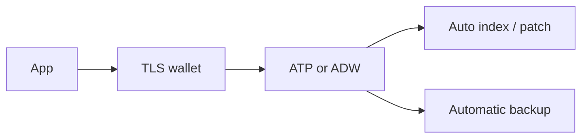

import { ConceptTemplate } from '@/features/kb/components/templates/ConceptTemplate'
import { Callout } from '@/features/kb/components/mdx/Callout'
import { ComparisonTable } from '@/features/kb/components/mdx/ComparisonTable'

export default function Layout({ children }) {
  return (
    <ConceptTemplate title="OCI Autonomous Database">
      {children}
    </ConceptTemplate>
  )
}

**Autonomous Database (ADB)** is Oracle Database as a managed service. **ATP** (Autonomous Transaction Processing) targets OLTP. **ADW** (Autonomous Data Warehouse) targets analytics with columnar habits. Oracle still patches, backups, and indexes more aggressively than a DIY VM. You still design schemas and concurrency.

## 1. Deep Dive and Mechanics

**Compute and storage.** ECPU (or older OCPU) scales independently from storage. Serverless ADB can auto-scale and stop. Dedicated Exadata infrastructure is the isolation SKU for noisy-neighbor or licensing stories.

**Networking.** Public endpoint with ACLs, or private endpoint in a VCN. Private is the default for prod. Wallet-based TLS is the usual client auth story; IAM and mTLS options exist depending on type.

**Autonomy.** Auto-indexing, auto-stats, and patching windows you constrain. You can still force bad SQL. "Autonomous" is not "schema optional."

**Tools.** SQL Developer Web, ORDS, and Data Pump. Migrations from on-prem Oracle are the happy path; from Postgres you are converting dialects.

<Callout icon="warning" title="Wallet files are credentials">
A stolen wallet plus password is the database. Store wallets in a vault, rotate, and never commit them next to the app Dockerfile.
</Callout>

## 2. Mathematical / Theoretical Foundation

OLTP vs warehouse: ATP keeps row-friendly indexes and concurrency. ADW leans on scans and clustering. Picking the wrong workload type is a CPU bill, not a rename.

Cost is ECPU-hours plus storage plus backup. Always-on ATP for a nightly batch is the classic overpay.

<ComparisonTable
  headers={['Service', 'Workload', 'You still do']}
  rows={[
    ['ATP', 'OLTP / mixed', 'Schema, SQL, IAM'],
    ['ADW', 'Analytics', 'Partition / load design'],
    ['BaseDB / VM DB', 'Full control', 'Patch and backup'],
    ['Cloud SQL analog', 'Engine-specific', 'Not Oracle RAC'],
  ]}
/>

## 3. Real-World Implementation

```sql
ALTER DATABASE PROPERTY SET auto_index_mode = 'IMPLEMENT';

SELECT /*+ MONITOR */ customer_id, SUM(amount)
FROM sales
WHERE sale_ts >= TIMESTAMP '2026-01-01 00:00:00'
GROUP BY customer_id;
```

Watch SQL Monitor before you add another index by hand. The automatics are not psychic about bad predicates.

## 4. Visualizations



## 5. Interview Prep

**Q: ATP vs ADW?**
**A:** ATP for lots of small writes and lookups. ADW for scans and BI. Same Oracle family, different defaults.

**Q: Autonomous vs self-managed Oracle on OCI?**
**A:** Autonomous if you want Oracle to own patching and tuning loops. Self-managed if you need exotic parameters, old versions, or custom agents.

**Q: How do apps connect privately?**
**A:** Private endpoint in the VCN plus NSGs. Do not punch 0.0.0.0/0 on a public ADB "just for the demo."

## 6. Production Use Cases

- ERP-adjacent OLTP that must stay on Oracle SQL.
- Department warehouse that should not be a full Exadata project.
- Lift of on-prem Oracle with Data Pump and a private endpoint.

<Callout icon="tip" title="Stop compute when the batch is done">
Serverless ADB can shrink to zero-ish. Schedule it. A forgotten always-on ADB is a monthly surprise.
</Callout>
