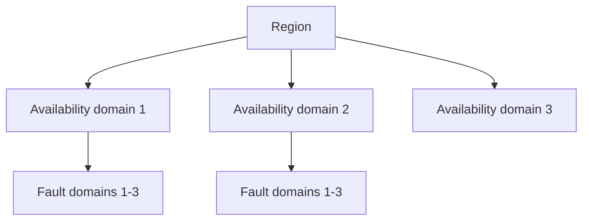

import { ConceptTemplate } from '@/features/kb/components/templates/ConceptTemplate'
import { Callout } from '@/features/kb/components/mdx/Callout'
import { ComparisonTable } from '@/features/kb/components/mdx/ComparisonTable'

export default function Layout({ children }) {
  return (
    <ConceptTemplate title="OCI Availability Domains">
      {children}
    </ConceptTemplate>
  )
}

An **availability domain (AD)** is a stand-alone data center (or equivalent isolation unit) inside an OCI **region**. Some regions have three ADs; many newer regions have one AD and lean on **fault domains** plus a second region for disaster recovery. ADs do not share a single point of power or cooling.

## 1. Deep Dive and Mechanics

**Isolation.** Oracle documents ADs as isolated from each other for failure. Cross-AD latency in a 3-AD region is low but not LAN-zero. Sync replication across ADs has a cost.

**Resources.** Some resources are AD-specific (compute instances, block volumes in a given AD). Others are regional (VCN, object storage, IAM). You cannot attach an AD-1 volume to an AD-2 instance without a copy or a regional volume feature.

**Single-AD regions.** Most new regions ship with one AD. HA inside that region is fault domains (separate racks/power). Region-loss still needs a second region.

**Placement.** Spread stateful pairs (primary/standby) across ADs when you have them. Spread stateless pools too — a load balancer can hide it.

<Callout icon="warning" title="Do not assume three ADs">
Home-region muscle memory from early Ashburn/Phoenix docs lies. Check the region map. One-AD regions are normal.
</Callout>

## 2. Mathematical / Theoretical Foundation

Independent failure: P(both ADs down) ≈ P(AD1) × P(AD2) only if the failure is not a regional control-plane or a bad Terraform apply you pushed everywhere.

Capacity: instance shapes can be AD-constrained. A shape that exists in AD-1 may be sold out in AD-2. Placement is also a supply problem.

<ComparisonTable
  headers={['Unit', 'OCI', 'AWS analog']}
  rows={[
    ['Region', 'Metro + ADs', 'Region'],
    ['AD', 'Isolated DC', 'AZ'],
    ['Fault domain', 'Rack-level inside AD', 'No exact 1:1'],
    ['Home region', 'Tenancy metadata', 'N/A'],
  ]}
/>

## 3. Real-World Implementation

```bash
oci iam availability-domain list --compartment-id $TENANCY

oci compute instance launch \
  --availability-domain "Uocm:PHX-AD-1" \
  --compartment-id $COMP \
  --shape VM.Standard.E5.Flex \
  --subnet-id $SUBNET
```

Pin ADs in Terraform per replica, or use a placement that spreads. Random launch can stack both nodes in one AD.

## 4. Visualizations



## 5. Interview Prep

**Q: AD vs fault domain?**
**A:** AD is a data center isolation. Fault domain is a grouping inside an AD so two instances are less likely to share a rack. Use both.

**Q: How do you HA in a 1-AD region?**
**A:** Fault domains plus a second region for DR. Do not pretend rack-level isolation is a meteorite plan.

**Q: Are VCNs per AD?**
**A:** No. A VCN is regional. Subnets are AD-specific or regional depending on how you create them — prefer regional subnets.

## 6. Production Use Cases

- Three-node quorum (etcd, RAC-like, Consul) mapped one-per-AD in a 3-AD region.
- Block volume and instance pairs that must survive a building loss.
- Capacity planning that checks shape stock in each AD.

<Callout icon="tip" title="Name ADs in code, not in tribal knowledge">
AD names are tenancy-prefixed strings. Look them up; do not hardcode a neighbor's AD name from a blog.
</Callout>
