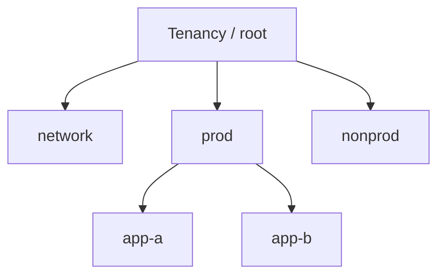

import { ConceptTemplate } from '@/features/kb/components/templates/ConceptTemplate'
import { Callout } from '@/features/kb/components/mdx/Callout'
import { ComparisonTable } from '@/features/kb/components/mdx/ComparisonTable'

export default function Layout({ children }) {
  return (
    <ConceptTemplate title="OCI Compartments">
      {children}
    </ConceptTemplate>
  )
}

A **compartment** is a logical collection of OCI resources inside a tenancy. Policies grant `verb` + `resource-type` **in compartment X**. Nesting is a tree. The root compartment is the tenancy. Almost every create call takes a compartment OCID.

## 1. Deep Dive and Mechanics

**Tree.** Typical layout: `network`, `prod`, `nonprod`, `shared-security`, maybe per-app children. Resources do not wander; you move them with an API that not everything supports.

**Policy scope.** `allow group AppAdmins to manage instance-family in compartment prod` does not grant the same in `network`. This is how you stop app teams from rewriting the VCN.

**Quotas and budgets.** Compartment quotas cap how many GPUs or public IPs a sandbox can mint. Budgets alert on the same boundary.

**Visibility.** Console "list in subtree" vs "this compartment only" is a frequent support ticket. APIs default to the compartment you pass, not the whole tenancy.

<Callout icon="warning" title="Root is not a junk drawer">
Resources in the root compartment inherit the widest policy mistakes. Create children on day one and deny casual create at root.
</Callout>

## 2. Mathematical / Theoretical Foundation

Authorization is path-scoped. A policy on a parent can include children depending on how you write `compartment` vs `compartment id`. Inheritance is powerful and easy to over-grant.

Blast radius of a leaked user in `dev` should be `dev`. If your policy said `tenancy`, the math failed.

<ComparisonTable
  headers={['Boundary', 'OCI', 'AWS / GCP']}
  rows={[
    ['Account-like', 'Tenancy', 'Account / project'],
    ['IAM folder', 'Compartment', 'OU / folder'],
    ['Resource home', 'Compartment OCID', 'Account + tags / project'],
    ['Quota unit', 'Compartment quota', 'Quota + budgets'],
  ]}
/>

## 3. Real-World Implementation

```text
allow group NetAdmins to manage virtual-network-family in compartment network
allow group AppAdmins to manage instance-family in compartment prod
allow group AppAdmins to use virtual-network-family in compartment network
allow group Auditors to read all-resources in tenancy
```

App teams `use` the subnet; they do not `manage` the VCN.

## 4. Visualizations



## 5. Interview Prep

**Q: Compartment vs tag?**
**A:** Compartment is the IAM and quota boundary. Tags are for cost and automation. You need both. Tags do not replace policies.

**Q: Can a resource be in two compartments?**
**A:** No. One home. Share via policy, not dual citizenship.

**Q: How do you isolate prod IAM?**
**A:** Separate compartments, separate groups, no `manage all-resources in tenancy` for humans who ship apps.

## 6. Production Use Cases

- Landing zone: network + security + workload compartments.
- Sandbox compartments with hard quotas for experiments.
- Break-glass compartment for logging sinks nobody else can delete.

<Callout icon="tip" title="Name compartments for policy, not for org charts">
Org charts change quarterly. `prod` and `network` stay. If you must map a business unit, nest it under prod, do not explode the root.
</Callout>
